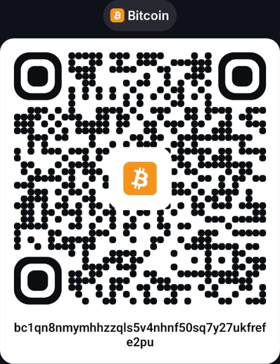
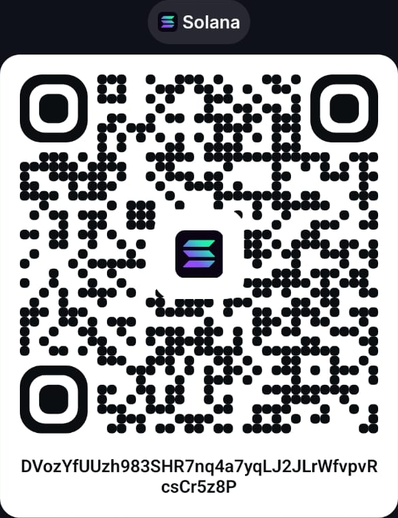
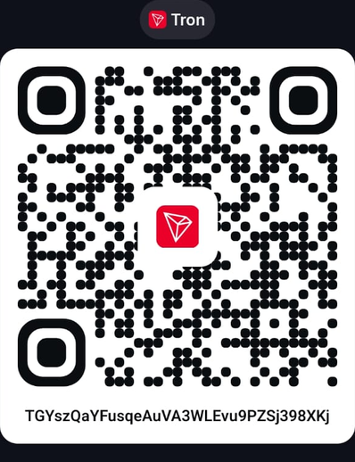

# Support the author

SlothArchiver is free, open source, and will stay that way — no paywall, no
locked features, no plan to change that. This is a solo project built and
maintained in spare time by one person, so if it's saved you from Docker, a
subscription, or just a pile of unorganized downloads, and you'd like to
support the work directly, a donation is very much appreciated. It's never
required to use any part of the app.

Donations are accepted in crypto only, at the addresses below. Scan the QR
code with your wallet's app, or copy the address directly.

| Bitcoin (BTC) | USDC (Solana) | USDT (Tron / TRC-20) |
|:---:|:---:|:---:|
|  |  |  |
| `bc1qn8nmymhhzzqls5v4nhnf50sq7y27ukfrefe2pu` | `DVozYfUUzh983SHR7nq4a7yqLJ2JLrWfvpvRcsCr5z8P` | `TGYszQaYFusqeAuVA3WLEvu9PZSj398XKj` |
| Network: Bitcoin | Network: Solana | Network: Tron (TRC-20) |

---

Double-check the network matches before sending (Bitcoin mainnet, Solana,
Tron/TRC-20 respectively) — sending on the wrong network can permanently
lose funds, and that's on the sender, not something SlothArchiver can
recover or reverse.

Thank you, genuinely, for using SlothArchiver and for supporting the author.
