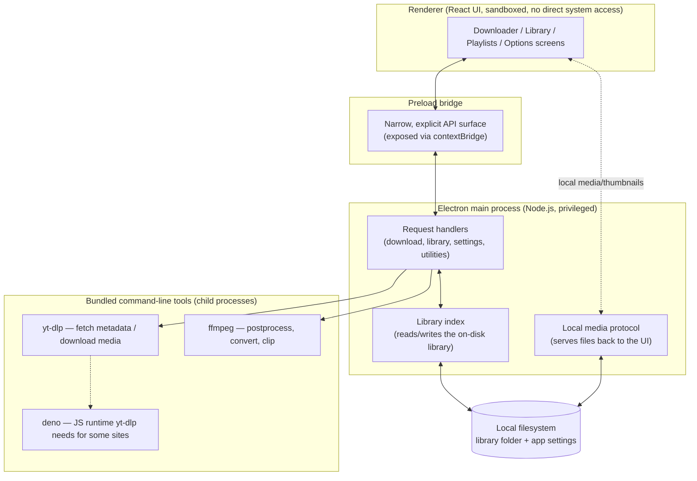

# sloth-archiver — Architecture Overview

sloth-archiver is a desktop application (built on Electron, with a React/TypeScript
interface) for downloading and archiving video and audio content — primarily from
YouTube, with support for several other platforms — into a personal, local library
on the user's own machine. It wraps the well-known `yt-dlp` tool for the actual
extraction/download work and `ffmpeg` for local media processing, and adds a
persistent, browsable library on top: versioned entries, playlists, search, and a
built-in player.

This document explains how the pieces fit together and how data moves through the
system for its main features. It is written for a technical reader who wants to
understand the software before using or evaluating it — it intentionally stays at
the level of processes and data flow, not source code.

## Index

1. [High-level architecture](#high-level-architecture)
2. [Process model](#process-model)
3. [Downloading](#downloading)
4. [Library storage and management](#library-storage-and-management)
5. [Playback](#playback)
6. [Smaller features](#smaller-features)
7. [Distribution](#distribution)

## High-level architecture

At the broadest level, the application is a thin, sandboxed user interface sitting
in front of a privileged local process that does all the real work: talking to
the filesystem, and driving a small set of bundled command-line tools.

The renderer is an ordinary web page — it never touches the filesystem, spawns
processes, or reads settings directly. Everything it needs happens by asking the
main process to do it and getting a result back. The main process is the only part
of the app with real system access, and it's also the only part that knows how to
talk to `yt-dlp` and `ffmpeg`.

## Process model

Electron apps are split into two kinds of process, and this app leans on that split
deliberately for safety and simplicity:

- **The main process** is a Node.js process with full access to the filesystem,
  the network, and the ability to launch other programs. It owns the library
  folder, owns application settings, and is the only place that ever spawns
  `yt-dlp` or `ffmpeg`.
- **The renderer process** is the actual window the user sees — a normal, sandboxed
  web page (built with React) with no Node.js access at all. It cannot read a file,
  open a folder, or start a download on its own.

Between them sits a small **preload bridge**: a fixed, explicit set of functions the
renderer is allowed to call (e.g. "fetch metadata for this URL," "list my library,"
"start this download"), each of which is relayed to the main process and handled
there. The renderer never gets a general-purpose way to reach into the system — only
this specific, reviewable menu of operations. This is the standard security boundary
for an Electron app that deals with user data and external content, and it matters
here specifically because the app renders titles, descriptions, and thumbnails
sourced from third-party sites.

The interface itself isn't loaded from disk directly (`file://`); the main process
runs a small local web server bound only to the machine's own loopback address and
loads the interface from there. This keeps the renderer's environment consistent
with how a normal, secure web page behaves.

One more piece of plumbing worth naming: local video/audio files and cached
thumbnails living in the library folder are served back into the renderer through a
custom, purpose-built local protocol, rather than exposing the filesystem to it
directly. That protocol is what makes the built-in player and thumbnails work at
all despite the renderer having no filesystem access — see [Playback](#playback).

## Downloading

Downloading is the app's core feature, and the same underlying flow powers both a
single pasted link and a bulk/playlist import.

**A single download**, end to end:

1. The user pastes a URL. The interface does a lightweight check to recognize
   whether it's a YouTube link or something else, which decides how much detail the
   UI can offer up front — but the actual fetch works the same way either way.
2. The main process invokes `yt-dlp` to fetch metadata only (title, uploader,
   thumbnail, duration, and the list of available quality/format options). No media
   is downloaded at this stage. This step also detects "dead" content — a private,
   deleted, or otherwise unavailable video — and reports back a clear reason rather
   than a generic failure.
3. The user picks a quality (where one is offered) and starts the download. The
   main process builds the right `yt-dlp` invocation for that choice and runs it as
   a child process, streaming progress back to the interface in real time.
4. If the chosen output needs something `yt-dlp` doesn't do well on its own —
   extracting just the audio as a real MP3, or converting to a different container —
   the app runs its own direct `ffmpeg` pass afterward, again with live progress.
   This is a deliberate second step rather than asking `yt-dlp` to do it internally,
   because `yt-dlp`'s own postprocessing can't report meaningful progress for that
   kind of conversion.
5. Once the file lands on disk, if the user chose to add it to their library, its
   metadata and the file's location are recorded there (see the next section).

**Bulk / playlist downloads** run the same fetch → select → download → postprocess
sequence per item, but through a managed queue instead of one at a time: the user
pastes a playlist link or a list of URLs, the app resolves each into a queued item,
and a configurable number of them download concurrently. Each item tracks its own
status (queued, fetching, downloading, done, failed) and progress independently, the
queue can be paused and resumed, and failed items can be retried without restarting
the whole batch. A playlist import additionally produces a saved *playlist* entry in
the library (see below) tying its member videos together, independent of whether
each one has actually been downloaded yet.

## Library storage and management

The library is not a database in the traditional sense — it's a structured folder
tree on disk, and the app treats that folder tree as the single source of truth.
There is no separate index file that could drift out of sync with reality; the app
reads the folder structure itself to know what's in the library.

The general shape:

- Each **channel** (or equivalent uploader/source) gets its own folder.
- Each **video** gets its own folder inside its channel's folder.
- Inside a video's folder, each **version** — an "epoch" — gets its own
  subfolder, holding that version's metadata and, once downloaded, its media file.
  Versions exist because a video the user re-fetches or manually flags as
  re-uploaded may legitimately need to be tracked more than once over time, without
  losing the earlier copy's data.
- **Playlists** are tracked as their own, separate concept alongside channels
  rather than folded into them: a saved snapshot of a playlist's membership and
  order, which can later be refreshed against the live playlist (picking up
  additions, removals, and reorders) without needing every member video to already
  be downloaded.

When the interface needs to show the library — the channel list, a video's version
history, a playlist's contents — the main process walks this folder tree and builds
an in-memory picture of it on demand. Any action that changes the library (adding a
video, recording a completed download, deleting an entry) causes that in-memory
picture to be rebuilt afterward, so the interface is always looking at an
up-to-date view rather than something that could silently go stale.

This filesystem-first design is also what makes the library portable: it's just a
folder a user can back up, move, or inspect directly with no proprietary format
involved.

## Playback

Downloaded video files are played back inside the app itself using a standard HTML5
player, not an external application. Because the renderer has no filesystem access,
it can't simply be pointed at a local file path the way a native desktop app could;
instead, the main process serves the requested file back to the player through the
same custom local protocol mentioned earlier, complete with support for partial
("range") requests — the mechanism a browser's video player relies on to seek
around inside a file, rather than only being able to play it start to finish.

Not every downloaded file can play in an embedded web-based player, though — some
container formats simply aren't supported by the underlying browser engine. When
that's the case, the app detects it and offers to open the file in the user's
default external media player instead of showing a broken player.

## Smaller features

A few additional pieces round out the app, each fitting into the flows above rather
than introducing a new one:

- **Cookie-based authentication** lets the user supply their own YouTube session
  (either pasted directly or read live from an installed browser's cookie store) so
  that downloads can authenticate as them — useful for content that would otherwise
  be blocked by anti-bot checks or that requires being signed in.
- **A self-updating `yt-dlp`** — because video platforms change frequently and
  break older extraction logic, the app can rebuild its bundled copy of `yt-dlp` to
  the latest version on demand, entirely on the user's own machine.
- **Library-side `ffmpeg` utilities** — once a video is in the library, the app
  offers direct local tools for extracting an MP3, converting to a different
  format, trimming a clip, and embedding metadata/cover art into the file — all
  running through the same local `ffmpeg` process the download pipeline uses.
- **Search and sorting** across the library and playlist views, and small
  quality-of-life touches like copy-link buttons and version-freshness indicators,
  make an otherwise large, flat collection of archived media easier to navigate.

## Distribution

The app is packaged per-platform into a standalone installer (via Electron's
standard packaging tooling), bundling its own copies of `yt-dlp`, `ffmpeg`, and the
small JS runtime `yt-dlp` needs for certain sites — nothing beyond the installer
itself needs to be present on a user's machine. Because those bundled tools are
native, platform-specific binaries rather than portable scripts, a build produced on
one operating system can only ever ship that same operating system's binaries; a
release for a different platform has to actually be built on (or for) that
platform's toolchain, which is a build-pipeline detail tracked separately in the
project's own technical debt log rather than covered here.
