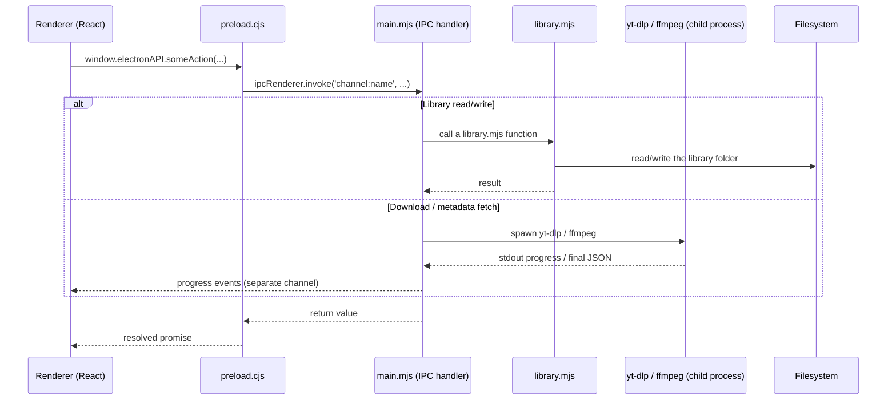

# Project Structure & Internals

This document explains how the codebase is put together: where each part of the
app lives, what each of the main files is responsible for, and how those pieces
call into each other at runtime. It's aimed at anyone about to work on the code —
the goal is to help you find the right place to start, not to document every
function. For a plainer, non-file-level explanation of the app's overall design,
see [ARCHITECTURE.md](ARCHITECTURE.md).

## Index

1. [Top-level layout](#top-level-layout)
2. [The renderer (`src/ui`)](#the-renderer-srcui)
3. [The Electron main process (`src/electron`)](#the-electron-main-process-srcelectron)
4. [How the pieces talk to each other](#how-the-pieces-talk-to-each-other)
5. [Bundled low-level dependencies and the build pipeline](#bundled-low-level-dependencies-and-the-build-pipeline)
6. [Where to look for common things](#where-to-look-for-common-things)

## Top-level layout

| Path | What it is |
|---|---|
| `src/ui/` | The renderer — the React interface. |
| `src/electron/` | The Electron main process — all privileged logic (filesystem, subprocesses, IPC). |
| `src/types/` | Shared TypeScript type declarations for the renderer, notably the full type contract for the preload bridge. |
| `src/utils/` | Small renderer-side helper modules with no Electron/Node dependency (URL parsing, formatting, a debounce hook). |
| `scripts/` | Node scripts that assemble the pieces needed for a working build/install (see [below](#bundled-low-level-dependencies-and-the-build-pipeline)). |
| `testing/` | Shared mock data used across the test suite. |
| `docs/` | This file and the broader architecture overview. |

Test files live directly beside the file they test (`main.mjs` / `main.test.mjs`,
`LibraryScreen.tsx` / `LibraryScreen.test.tsx`, etc.), run with Vitest.

## The renderer (`src/ui`)

The renderer is intentionally not the focus of this document — it's ordinary React
and doesn't need much explanation to navigate. Broadly:

- **`screens/`** — one file per top-level view (Downloader, Library, a video's
  detail view, Options, etc.).
- **`components/`** — smaller, reused or self-contained UI pieces (the bulk-add
  panel, the local video player, the playlist section, and similar).
- **`hooks/`** — shared stateful logic pulled out of components (the download
  queue, the download-progress hook, search, theme, etc.).
- **`MainPage.tsx`** / **`App.tsx`** — the tab shell and the app's root component.

The renderer never imports anything from `src/electron/` and has no filesystem or
subprocess access at all — its only way to do anything real is through
`window.electronAPI`, described next.

## The Electron main process (`src/electron`)

This is where essentially all of the app's actual logic lives. Six files:

### `main.mjs`

The largest file, and the app's entry point — it creates the application window,
registers every IPC handler the renderer can call, and directly drives the
external tools (`yt-dlp`, `ffmpeg`, `ffprobe`). It's easiest to think of it as
several loosely-grouped areas rather than one thing:

- **Startup/runtime plumbing** — resolving where the bundled `yt-dlp`/`ffmpeg`/
  `ffprobe` binaries actually live (this differs between a local dev run
  and a packaged install — see [below](#bundled-low-level-dependencies-and-the-build-pipeline)),
  starting a small local HTTP server the browser window loads its UI from instead
  of a `file://` load, and registering the custom `app-video://` protocol used to
  stream local media/thumbnails back into the sandboxed renderer.
- **Settings** — small persisted key/value state (library folder, download
  folder, theme, max simultaneous downloads, custom conversion formats, etc.),
  read from and written to a JSON file in the app's user-data directory.
- **Video info & downloading** — fetching metadata for a URL, shaping `yt-dlp`'s
  raw output into what the UI expects, classifying a video as genuinely
  unavailable vs. blocked, building the actual `yt-dlp` command line for a
  download, running it as a child process and streaming its progress back to the
  renderer, and the follow-up direct `ffmpeg` pass used for MP3 extraction/format
  recoding (kept separate from `yt-dlp`'s own postprocessing specifically so real
  progress can be reported for it).
- **Library & playlist IPC handlers** — thin wrappers around `library.mjs` (see
  below): the main process handles the IPC plumbing and settings lookup, and
  delegates the actual read/write logic to that module.
- **Cookies** — parsing/validating pasted cookie text, persisting it, and
  building the `--cookies` / `--cookies-from-browser` arguments passed to every
  `yt-dlp` invocation.
- **ffmpeg utilities** — the library view's extract-MP3/convert/clip/embed-metadata
  actions, each a fairly direct `ffmpeg` invocation with progress parsing.
- **Misc system/dialog handlers** — file/folder pickers, opening a file in its
  folder or in the OS default app, error-log read/write, app version/quit.

### `preload.cjs`

The bridge between the renderer and everything above. It runs in a special,
privileged-but-limited context and does exactly one thing: expose two fixed
objects — `window.electronAPI` and `window.electronAPIPythonDownload` — onto the
renderer's `window`, where every property is a thin function that forwards to a
named IPC channel in `main.mjs`. Nothing else is exposed. If you're adding a new
capability the UI needs, this is the second file you touch (after adding the
handler in `main.mjs`) — and `src/types/electron-api.d.ts` is the third, since
that's the TypeScript type declaration for this exact same surface that the
renderer code actually gets checked against.

### `library.mjs`

All of the logic for reading and writing the on-disk library — the part of the
app that behaves like its database. This covers: building a channel/video
folder's expected path and name, writing a new video or a new version ("epoch")
of one, updating a version's metadata once its file finishes downloading,
deleting entries, and the equivalent set of operations for playlists (saving a
snapshot, refreshing/reconciling it against a fresh fetch, undoing a refresh,
deleting one). It also owns scanning the whole library folder tree into the
in-memory structure the UI actually renders from, and a small cache of that scan
so repeated reads don't re-walk the filesystem every time.

Nothing in this file talks to `yt-dlp`/`ffmpeg` or does any IPC itself — it's
pure filesystem logic, called *by* `main.mjs`'s handlers.

### `updater.mjs`

The self-updater for the bundled `yt-dlp` binary, kept separate from `main.mjs`
because it's a genuinely distinct pipeline: resolving the latest release,
fetching and verifying it (via `ytdlpRelease.mjs`, below), sanity-checking the
result actually runs, and atomically swapping it into place. This is
effectively a smaller, on-device rerun of the same fetch process
`scripts/fetch-ytdlp-bin.mjs` does at build time (see below) — the two share
`ytdlpRelease.mjs` directly rather than being kept manually in sync.

### `ytdlpRelease.mjs`

The actual fetch/verify logic `updater.mjs` and `scripts/fetch-ytdlp-bin.mjs`
both call into: resolving a release from GitHub, downloading the right
platform asset, checking its SHA-256 against yt-dlp's published
`SHA2-256SUMS`, verifying that file's own GPG signature against a vendored
copy of yt-dlp's public key, and unzipping the result. Deliberately zero third-party dependencies — the packaged app ships with no
`node_modules` at all — so this hand-rolls just enough of a ZIP reader and an
OpenPGP-signature parser to do the job, delegating all actual cryptography to
Node's built-in `crypto` module.

### `utils/constants.mjs`

A couple of small, static values shared by a few handlers in `main.mjs` (the
supported recode formats and the Save-dialog file-type filters built from them).
Small enough that it doesn't need its own section beyond this mention.

## How the pieces talk to each other

Every real action starts in the renderer and ends up back there, but always
through the same narrow path — there's no direct route:

A few things worth internalizing from this:

- **The renderer never calls `library.mjs` or a subprocess directly** — it always
  goes through a named IPC channel, handled in `main.mjs`.
- **`main.mjs` is the only file that spawns `yt-dlp`/`ffmpeg`.** `library.mjs`
  never does; it's pure filesystem logic that `main.mjs`'s handlers call into.
- **Long-running work (downloads, ffmpeg passes, the updater) reports progress
  over its own separate channel**, not as part of the original request/response —
  the initial call just kicks the work off.
- **A mutation to the library is always followed by refreshing the in-memory
  index** (`library.mjs`'s own cache) before the UI is told it can re-read — this
  is what keeps the library view from ever showing stale data after an add,
  download, or delete.

## Bundled low-level dependencies and the build pipeline

The app depends on two external tools it never assumes the user already has
installed: `yt-dlp` and `ffmpeg`/`ffprobe`. The JS runtime `yt-dlp` needs to
solve certain sites' anti-bot challenges is Electron's own bundled Node
runtime (`--js-runtimes node:<process.execPath>`, see `main.mjs`'s
`jsRuntimeArgs`) rather than a separately bundled binary. Both remaining
tools are bundled inside the packaged app rather than downloaded at runtime,
assembled by scripts run as part of the build:

| Script | What it produces |
|---|---|
| `scripts/fetch-ytdlp-bin.mjs` | Downloads yt-dlp's own official prebuilt release binary and GPG-verifies it (via `ytdlpRelease.mjs`, see above) before unpacking it into `dist/ytdlp-bin/` — not a build from source. This is the same fetch/verify path `updater.mjs` reruns later for in-app self-updates. |
| `scripts/copy-ffmpeg.mjs` | Copies the `ffmpeg`/`ffprobe` binaries already fetched by their own npm packages into the build output, preserving the right executable name/extension per platform. |
| `scripts/copy-electron.mjs` | Copies the main-process source (`src/electron/`) into the build output as-is — it's plain JS, so this is a copy, not a compile. |

These are chained together by `package.json`'s own `build:*` npm scripts (renderer
build, then each of the fetch/copy steps above, in order), and the final packaging
step (`electron-builder`) bundles the resulting `dist/ytdlp-bin/` and `dist/ffmpeg/`
folders into the installed app as extra, read-only resources.

At runtime, `main.mjs` resolves the real path to each of these differently
depending on whether it's running from a local dev checkout or an installed,
packaged app, since the packaged layout is different from the source tree. The
`yt-dlp` binary specifically gets copied once more, out of that read-only
resources location into the app's own per-user data directory, the first time the
app ever runs — because self-updating means overwriting it later, and the
resources location a packaged app ships from generally isn't writable without
elevated permissions.

## Where to look for common things

| If you're... | Start in |
|---|---|
| Changing what a download button does, or adding a resolution/format option | `main.mjs` (the video-info/download handlers) |
| Changing how a video/version/playlist is stored or read back | `library.mjs` |
| Adding a brand-new capability the UI needs from the main process | `main.mjs` (add the handler) → `preload.cjs` (expose it) → `src/types/electron-api.d.ts` (type it) |
| Changing a screen or adding a new one | `src/ui/screens/` |
| Changing shared, stateful UI logic (the bulk queue, download progress, search) | `src/ui/hooks/` |
| Touching the self-update flow | `updater.mjs`, or `ytdlpRelease.mjs` for the fetch/verify logic itself |
| Changing how `yt-dlp`/`ffmpeg` get bundled at build time | the relevant `scripts/*.mjs` file |
| Adjusting persisted settings (a new Options-tab toggle, etc.) | the settings handlers in `main.mjs`, plus wherever it's read in `src/ui/screens/OptionsScreen.tsx` |
