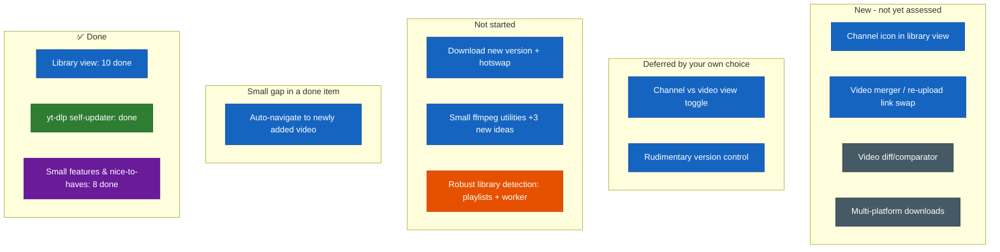

# Future Specs — Difficulty Feedback

Read-only assessment of the specs in `futureSpecs.md`, ranked against the current
state of the codebase. Doesn't modify that file — just notes here.

## Index
- [Status at a glance](#status-glance) (the diagram)
- [Long shot ideas — need planning](#long-shot-ideas)
  - [Video diff/comparator](#video-diff-comparator)
  - [Multi-platform downloads](#multi-platform-downloads)
- [1. Library view](#library-view)
- [2. yt-dlp updater](#ytdlp-updater) — ✅ done
- [3. Robust library detection](#robust-library-detection) (playlist bulk-add + background worker)
- [Small features and corrections](#small-features)
- [Nice to haves](#nice-to-haves)

## Status at a glance

You added a few new items to `futureSpecs.md` (the "Long shot ideas/Need planning"
section, plus small-features #8/#9 and three new ffmpeg sub-items) that aren't
individually difficulty-rated below yet — they're in the blue "new" column below.
Say the word if you want a full assessment on any of them.

Color = which spec an item belongs to (same color wherever it shows up, regardless
of status); position = status (done/partial/todo/deferred/new). Legend:
🔵 Library view · 🟢 yt-dlp updater · 🟠 Robust library detection (playlists) ·
🟣 App-wide small features & nice-to-haves · ⚫ Long-shot ideas (unassessed)

## Long shot ideas — need planning

### Video diff/comparator

**Overall: Very High / exploratory** — this is a research problem before it's an
engineering one, and it has a hard prerequisite that doesn't exist yet: comparing
"versions" of a video presupposes the still-unbuilt multi-version tracking (this
file's own "Download new version"/hotswap item below, already rated Very High on
its own). Nothing here can be scoped independently of that landing first.

Breaking down the actual comparison mechanism, once versioning exists:

| Piece | Difficulty | Why |
|---|---|---|
| Transcript/caption-based diff | Medium | yt-dlp can already fetch auto-generated or manual captions (`--write-auto-sub`/`--write-subs`, VTT/SRT) where available, and a text diff (Myers algorithm — bounded, well-understood, no new dependency needed) over two transcripts is a real, buildable feature. But it's a real approximation: not every video has captions, auto-generated ones vary between fetches even for identical audio (ASR noise), and this only ever detects *spoken/captioned wording* differences — it says nothing about visual re-edits, added b-roll, or trimmed silent sections. |
| True content-level diff (frame/audio fingerprinting) | Very High | What "look up if there's any algorithmic way to search through video content" actually implies. Needs frame extraction (ffmpeg, already bundled) plus perceptual hashing per interval, or audio fingerprinting (chromaprint/AcoustID-style) — none of which exist in this project today, and pulling them in means new dependencies this project has otherwise deliberately avoided (replacing `cpx` with a zero-dependency script earlier this session is the exact opposite instinct). This is genuinely open-ended multimedia-analysis territory, not a bounded engineering task. |
| Timestamped report UI | Low-Medium | Once *some* diff data exists in either form above, presenting it as a timestamped list is straightforward composition — the hard part is entirely upstream of this. |

**Recommendation if this ever gets picked up:** scope a v1 to transcript-only diffing and be explicit that it's an approximation, rather than attempting true content-level comparison first — that piece alone could be its own multi-week research spike, not a normal feature-sized task.

### Multi-platform downloads (SoundCloud/TikTok/Instagram/Twitter)

**Overall: Medium-High for the mechanical part, High end-to-end once per-platform reliability is factored in.** The encouraging news: yt-dlp already supports all four of these sites (and 1800+ others) natively — the app doesn't need new extraction logic, since every download call already just shells out to yt-dlp with a URL. Also checked: `isValidUrl` (`src/utils/utils.ts`) is already a fully generic `new URL(...)` syntax check, not YouTube-specific — one less thing to change than I first assumed.

| Piece | Difficulty | Why |
|---|---|---|
| URL validation | None needed | Already generic, confirmed above — no change required here at all. |
| Generalizing metadata reshaping | Medium | `reshapeVideoInfo` (`main.js`) currently assumes fields exist in the shapes yt-dlp's YouTube extractor happens to populate. Other extractors return the same *info-dict contract* but with different null/missing-field patterns (e.g. TikTok/Instagram often have thinner `resolutions` lists, different `channel`/`uploader` semantics) — needs defensive fallbacks, not a rewrite. |
| YouTube iframe embed fallback | Doesn't generalize | The not-yet-downloaded preview (`YouTubeEmbed`) is hardcoded to `youtube-nocookie.com/embed/{videoId}` — TikTok/Instagram/Twitter don't offer an equivalent simple embed-by-ID scheme. Realistic options: drop the live preview for non-YouTube platforms (simplest), or investigate each platform's own oEmbed support separately later — not a small addition either way. |
| Bot-detection/auth reliability | High, and ongoing not one-time | TikTok and Instagram in particular are known for aggressive, frequently-changing bot detection, often stricter than YouTube's. The existing cookie-paste feature (and the not-yet-built `--cookies-from-browser` idea, TD-006) is framed entirely around YouTube's specific "sign in to confirm you're not a bot" message; other platforms would need their own auth handling and will likely need continued maintenance as they change detection methods, not just an initial implementation. |
| Branding/scope | Not code | The app is named "yt-archiver"/"YouTube Archiver" throughout (window title, Options-tab copy, `package.json`'s `productName`). Broadening scope is as much a product decision as an engineering one. |

**Recommendation:** if this is wanted, scope it as "best-effort support via yt-dlp's own multi-site capability — YouTube gets the full experience (embed preview, reliable auth), other platforms get download-only with no live preview" rather than promising parity across all four platforms from day one.

## 1. Library view

**Overall: Very High** — this isn't one feature, it's a second subsystem. Today the
app has no persistence layer at all beyond the single cookie file main.js writes to
disk, no cross-tab shared state (Downloader/Library/Options are siloed local
`useState`), and no file-versioning concept anywhere. Everything below has to be
built from zero, not extended from something that exists.

Breaking the spec into its actual sub-problems and ranking those individually
(this is the useful part for prioritizing):

| Piece | Difficulty | Why |
|---|---|---|
| Library base-directory setting (Options tab) | **Low** — ✅ done | Reuses the folder-picker IPC that already exists; persisting one path follows the same "write a file to userData" pattern the cookie feature already established. |
| Per-video metadata persistence (`<base>/<channel>/<title> [<videoId>]/<epoch>/metadata.json`) | **Medium-High** — ✅ done | Straightforward to write, but channel names and video titles are attacker-adjacent, uncontrolled strings — needed real sanitization for illegal filesystem characters, unicode, and Windows' reserved device names (found and fixed a real bug here — bare `channelFolderName('CON')` was unsafe) and MAX_PATH risk (logged as **TD-005**, video-folder names capped at 50 chars total as a partial mitigation, not a full fix). Duplicate-title collisions handled via the `[videoId]` suffix on video folders. |
| Library mapping function (startup scan + reusable refresh) | **Medium** — ✅ done | Recursive walk of the 3-level structure (`channel/video/epoch`), tolerant of partial/corrupt folders (skips missing/broken `metadata.json` rather than crashing the scan), run async at startup and re-callable on demand (`refreshLibraryIndex`). In-memory index only — no persisted `.index.json` cache; not needed at current library sizes, worth revisiting only if a very large library makes the full re-walk on launch noticeably slow. |
| Channel-folder browsing UI (list → mini cards → full card) | **Medium** — ✅ done | Channel list → video grid → full detail view, all rendering off the in-memory index rather than doing their own filesystem reads. |
| Cross-tab "add to library" wiring | **Medium** — ✅ done | Add-to-library button on the Downloader tab, with a duplicate-detection dialog (Cancel / Override / "Add as new version" — the last one still disabled, versioning isn't built) when the video's already tracked. **Auto-navigate to the newly added video is still not built** — today a successful add just clears the Downloader form and shows a success toast; the notification badge (small-feature #7 below) is the interim substitute for "you should go check the Library tab," not a replacement for actually jumping there. |
| Download video from the Library tab | **Medium** *(not in the original table — this is the piece that turns "browse-only" into "actually usable")* — ✅ done | Reuses the existing download pipeline (`useDownloadVideo`) unchanged, writing into the video's own deterministic folder instead of a Save-dialog path. Required persisting a `resolutions` array into `metadata.json` at add-time (schema bumped to v2, non-breaking for older entries — they just show a "no quality info saved, re-add it" message instead of offering downloads). |
| Local file playback (`<video>` pointed at a downloaded file) | **Medium-High** — ✅ done *(2026-08-02)* | Turned out considerably harder than "register a custom protocol" — three real attempts before landing on a working one. First (manual `fs.createReadStream` + `Readable.toWeb()` Range-parsing) produced unfixable `AbortError`s, a known open Electron bug (`electron/electron#38749`). Second (delegate everything to `net.fetch(pathToFileURL(...))`) fixed playback but broke seeking — Chromium treats a `protocol.handle` response as a genuine network response and needs `Accept-Ranges`/`Content-Range`/206 spelled out explicitly on *every* response (including the first, un-ranged one) or `video.seekable.end()` stays 0. Final, working version: Range math done explicitly in `handleAppVideoRequest` (`main.js`), `net.fetch` used only as the byte-stream source for the exact range already decided. MP3-only downloads also get an `<audio>` element via the same protocol, and MKV downloads (which Chromium's `<video>` element can't play in any container regardless of delivery mechanism) fall back to the static thumbnail — see "Open in default player" below, which exists specifically to cover that gap. |
| Embedded YouTube fallback player (not-yet-downloaded case) | **Low-Medium** — ✅ done *(2026-08-02)* | Also harder than expected: the raw `<iframe>` hit Error 153 ("Video player configuration error") because this app's renderer loaded via `file://`, which sends no `Referer` header at all, and YouTube's embed player has required one since late 2025. A custom `app://` protocol (tried first, since it gives the renderer a "real" origin) turned out **not** to fix this either — confirmed both by precedent (Tauri apps hit the identical issue serving from `tauri://`) and empirically here via a captured Network request showing no `referer` header even under `app://`. Chromium's Referer-generation gate checks the document's scheme against a hardcoded http(s)-family allowlist, entirely separate from the `standard`/`secure` privileged-scheme flags — custom schemes never clear it. The fix that actually works: the renderer now loads from a genuine loopback `http://127.0.0.1:<ephemeral-port>` server (`startRendererServer()` in `main.js`, plain Node `http`, no new dependency) plus `youtube-nocookie.com` + an explicit `referrerPolicy` on the iframe. Extracted into a shared `YouTubeEmbed` component, reused in both the Library tab and the Downloader tab's own preview card (which previously just had a hyperlink to view on YouTube externally). |
| Download-status/quality badge on cards | **Low** — ✅ done | Pure rendering off persisted metadata (`downloadedResolution`/`downloadedFormat`), shown on both the mini grid cards and the full detail view. |
| Burger menu shell | **Low** | Deliberately **not** built as a menu, by your explicit choice — small standalone icon buttons in the header instead (matching the existing delete-icon placement), same pattern "download different quality" below now uses. Simpler than a menu and no worse for two actions; only worth revisiting as an actual menu if a third/fourth secondary action shows up later. |
| "Download different quality" (safe swap: download-as-temp → verify → delete old → rename) | **High** — ✅ done *(2026-08-03)* | A new `CloudDownloadIcon` button in the header (next to delete) re-enters the resolution-picker UI with the currently-downloaded quality disabled/labeled "(current)" instead of hidden. Downloads to a distinct `video.new.<ext>` path first — new `swapLibraryDownload()` (`library.mjs`, guard-railed like `deleteLibraryEntry`) only deletes the old file and renames the new one into the deterministic `video.<ext>` slot *after* the download is confirmed complete, so a failed/interrupted swap never touches the working file, exactly the safety rule the spec called for. Handles a format/extension change cleanly (e.g. swapping mp4→webm) since the rename target is derived from the new file's own resolved extension, not a literal reuse of the old filename. One non-obvious bug caught before it shipped: a swap that lands on the *same* file path+extension left the `<video>` element showing stale cached bytes since nothing about its `src` string changed — fixed with a `cacheBustKey` counter appended as a query param, bumped on every successful swap. |
| "Download new version" (new epoch folder + version hotswap) | **Very High** | Still not built. This needs a metadata schema that supports *multiple* versions per video (not just one), plus UI to swap the active version and hot-reload the card without a full remount. This is the most architecturally open-ended piece in the whole spec. |
| "Delete video entry" | **Low-Medium** — ✅ done | Guard-railed recursive delete (`deleteLibraryEntry`, rejects any path that doesn't resolve as a descendant of the configured library base directory) plus a confirmation dialog in the UI. One follow-up bug already found-and-fixed post-ship: deleting a channel's only video left a "ghost" card behind until the user manually round-tripped through the channel list — fixed by always returning to the root channel list on delete rather than attempting an in-place refresh. |
| Channel-based vs. video-based view toggle *(you already deferred this)* | **Medium** | Still deferred, as agreed — it's a second navigation model on top of the first, not worth building until the first is proven out. |
| Rudimentary version control *(you already deferred this)* | **Very High** | Still deferred, as agreed — same problem as "Download new version" above, generalized. |
| Small ffmpeg utilities on already-downloaded library files (extract MP3, convert format, embed thumbnail, embed metadata, extract clip) | **Low**, per original two items — see below for the three new sub-items | Still not built. The infrastructure it needs already exists and is proven: `runFfmpegWithProgress()` and the ffprobe-duration helper (`main.js`, built for TD-004) already do exactly "run ffmpeg on a local file with real progress," today applied to a freshly-downloaded raw file. Pointing that same helper at an *already-downloaded library file* instead — no yt-dlp involved at all — is a small, low-risk reuse, not new plumbing. The "where does the output live" question this row used to flag as open now has a real precedent to reuse: "download different quality" landed on delete-old-and-rename-into-the-deterministic-slot — worth applying verbatim here rather than inventing a third rule. |

**The three new ffmpeg sub-items you added**, assessed individually:
- **Embed metadata** (title/channel/date/description via ffmpeg's `-metadata` flags): **Low** — a pure remux, no re-encode needed, and all the data's already sitting in `metadata.json` waiting to be mapped onto `-metadata key=value` pairs. The easiest of the three.
- **Embed thumbnail into MP3**: **Low-Medium** — same ffmpeg mechanics (attach an image stream as MP3 cover art), but `metadata.thumbnail` is only ever a hotlinked URL today, never downloaded to disk (the same pattern the app already uses for video thumbnails everywhere else) — needs one new small step, fetching and caching the image locally, before ffmpeg can attach it.
- **Extract clip** (start/stop trim): **Medium** — the most involved of the three. Needs a start/end-timestamp picker UI — could elegantly reuse the video player's own scrubber/`currentTime` via "mark in"/"mark out" buttons, cheap given the player already exists and works — plus a real UX tradeoff to surface to the user: fast stream-copy trimming (`-c copy`) snaps to the nearest keyframe rather than an exact frame, versus a slower full re-encode for frame-accurate cuts. Worth deciding which is the default before building, not an afterthought.

**Build order followed so far** (base-directory setting → metadata persistence → mapping
function → browsing UI → add-to-library wiring → download-from-library → status badges →
delete → error log/notification badge → local/YouTube playback) matches the order originally
suggested here, with local/YouTube playback deliberately pushed to last (after small-features
#6/#7) at your explicit request, since those were quick, self-contained, and closed out
"phase 2" first. With playback now done ("phase 3"), plus a follow-on pass fixing widescreen
aspect-ratio/resizable player containers (not in the original spec text, added after you
noticed the fixed-height container looked wrong at wide window sizes) and matching the Library
detail view's responsive layout to `VideoDetailCard.tsx`'s 70/30 split — **the core single-video
loop (browse → add → download → play → delete) is feature-complete.**

**Still remaining, in the order originally suggested:** burger menu shell → safe quality-swap →
new-version/hotswap → the two deferred items last, exactly where you already put them. The
ffmpeg-utilities item doesn't depend on anything else in this list and could be slotted in
wherever it's convenient. One small gap inside an already-"done" row, not yet closed: auto-
navigate to the newly added video after a successful "add to library" (see the cross-tab
wiring row above) — the notification badge remains an interim substitute, not a replacement.

**On your open question** (files vs. something else for metadata): given this project has
zero infra for a database today and archival/portability is a stated goal, one JSON file
per video-folder is a reasonable call — no new dependency, human-readable, greppable, and
trivially portable if someone copies the folder tree elsewhere. In the previous pass I
flagged that this only gets expensive if you ever need to *query* across videos, since a
flat per-folder JSON store means scanning the whole tree every time — the mapping function
you just added is exactly the fix for that (scan once, keep an in-memory index, refresh on
demand instead of on every read), so that concern is already covered as long as the rest of
the UI is built to consume the map rather than re-reading the filesystem on its own. The
one thing worth deciding when you get there: whether the mapping function's output also
gets persisted to a single cache file (e.g. `<base>/.index.json`) so a very large library
doesn't have to re-walk and re-parse every folder's `metadata.json` on every app launch —
not needed at small scale, but cheap to build in now versus retrofitting later.

## 2. yt-dlp updater — ✅ done

**Resolved — 2026-08-02:** Went with a fourth option this original analysis didn't have on the table — you proposed fusing the "bundle our own Python" idea with an on-device rebuild: ship a standalone Python runtime purely as an on-demand build tool (not a new way of running yt-dlp day-to-day), fetched lazily only on first actual update. It pip-installs the latest `yt-dlp` from PyPI and re-runs the exact same PyInstaller onedir freeze recipe this project already had, on the user's own machine. This sidesteps every option below — no CI, no hosting, no reintroducing TD-002's onefile problem, no permanent Python dependency for normal use. `ytdlp-bin` was relocated to `userData` exactly as this analysis flagged was necessary. Full write-up of the shipped design lives in git history / the plan that was approved for it; not reproduced here since this section is a record of the *original* analysis, not the final implementation.

**Overall (original analysis, kept for the record): Very High** — and this one is worth flagging as a design conversation before
implementation, not just a build task. The reason is a direct conflict with a decision this
project already made and tested on both platforms: yt-dlp isn't a live dependency the app
calls out to, it's a frozen PyInstaller onedir binary built at package time by
`build-ytdlp-bin.mjs` and shipped inside the app bundle. There's no pip/Python runtime on
the end user's machine to point an "update" at.

The check-for-update half is easy — ping yt-dlp's GitHub releases API and compare against
the bundled version, show a dialog. The *actually updating* half runs into one of three
options, none of them free:

- **Download yt-dlp's official prebuilt release binary and swap it in at runtime.** This
  re-introduces the exact problem TD-002 already fixed and closed — yt-dlp's official
  releases are PyInstaller `--onefile` builds, which is what caused the ~15s Gatekeeper-scan
  delay this project moved away from on purpose. Reversing that for the sake of live updates
  would trade one solved problem for another.
- **Re-run the onedir freeze on the user's machine.** Not viable — it needs Python, pip, and
  PyInstaller present, which is precisely what the original "make it shippable" work was
  trying to avoid requiring on end-user machines in the first place.
- **Ship yt-dlp updates as full app releases via `electron-updater`.** Architecturally the
  cleanest and most consistent with what's already built, but it means yt-dlp can only update
  as often as the whole app does — which cuts against your own note that yt-dlp "updates
  constantly."

There's also a quieter structural issue underneath whichever option you pick: `ytdlp-bin` is
currently placed under `extraResources` inside the app bundle (`Contents/Resources` on
macOS, the installed `resources` dir on Windows) — a location that's not reliably writable
without elevation, especially on a `Program Files` Windows install. Any true self-update
scheme needs the binary living somewhere user-writable (e.g. copied to `userData` on first
run) before it can safely overwrite itself. That's a real restructuring of how the app locates
`ytdlpPath`, not an add-on.

I'd treat this the same way the original bundling approach was handled — worth a short,
dedicated planning pass to pick one of the three paths above deliberately, rather than
starting to code against an assumption that turns out to conflict with TD-002 or the
no-preinstall-required goal.

## 3. Robust library detection (playlist bulk-add + background worker)

**Overall: Very High** — comparable in scope to the original Library view estimate, not an
incremental feature on top of it. The reason isn't any single hard algorithm, it's that this
is the first feature in the app that needs a job that keeps running and reporting progress
*independent of whichever tab/screen happens to be mounted* — nothing built so far does that.
Today's "live progress" patterns (`progressUpdate` for a single download, `ytdlpUpdateProgress`
for the updater) are all one-shot broadcasts tied to a component that's on-screen while it
happens. A multi-item queue that the user can start, walk away from, come back to, and stop
partway through is a different, bigger kind of state to own — the natural place for it is the
main process (it already owns the actual child processes), broadcasting a queue snapshot over
IPC to whatever's listening, closer to the `useYtdlpUpdaterState`/`useLibraryNotificationState`
provider pattern already established, but for a stateful list instead of a flag or a counter.

Breaking it into sub-problems:

| Piece | Difficulty | Why |
|---|---|---|
| Playlist link → flat entry listing | **Medium** | A genuinely new yt-dlp invocation (`--flat-playlist`), separate from the existing single-video `getVideoInfoPython` path — flat-playlist entries are a much thinner JSON shape (basically id/title/url per entry, no formats/resolutions), so this needs its own parsing, not a reuse of the existing video-info shape. |
| Add-playlist dialog (link, "download on load" toggle, quality picker) | **Low** | Standard composition, same pattern as the existing cookie dialog and the duplicate-match dialog from the add-to-library flow. |
| Background job manager (queue state, sequential processing, survives tab navigation) | **Very High** | The architectural core of this feature, and the piece everything else depends on. Needs to live somewhere that isn't a mounted React component's local state — realistically the main process, with the renderer subscribing via IPC events to a queue snapshot (index, per-item status, current progress). This is new territory, not an extension of an existing pattern; closest analogue in difficulty is "new-version/hotswap" from the Library view spec. |
| Per-video metadata fetch inside the worker loop | **Medium** | Can reuse `getVideoInfoPython`'s existing fetch logic and the video-info cache (helps a lot here — see rate-limiting note below), but needs to run sequentially/throttled rather than firing all at once, and needs per-item error isolation so one broken/private/region-locked video doesn't abort the whole batch. |
| Quality-matching (hardcoded preferred quality → closest available per video) | **Low-Medium** | Bounded and well-defined: sort a video's actual `resolutions` list (the same array now persisted at add-time for the Library tab's own download feature), pick the closest to the requested target. Only real open question is tie-breaking direction when the exact quality isn't available (round up or down) — worth deciding once. |
| Add-to-library + download orchestration per queue item | **Low** | Reuses the exact primitives already built for downloading from the Library tab (`writeLibraryEntry`, the download pipeline, `recordLibraryDownload`) — the worker just calls them in a loop instead of a user click firing them once. |
| Cancel an in-flight yt-dlp process ("stop the entire worker") | **High** | Doesn't exist anywhere today — `downloadVideoWithProgressUpdates` spawns yt-dlp but never retains a reference to the child process for later killing, and no download in this app has ever been cancellable mid-flight. Needs tracking "the currently active spawned process" and calling `.kill()` on it, plus a decision on what happens to the partial file yt-dlp leaves behind (same `.part`-file territory the existing resume feature already deals with). |
| Post-stop cleanup ("delete everything this run created?") | **Medium** | Builds directly on `deleteLibraryEntry`'s existing guard-railed recursive delete — the worker just needs to keep an in-memory list of `videoDir`s it created *during this specific run* (not the whole library) and offer to delete exactly those. One wrinkle: the video that was mid-download when stopped will have a folder with metadata but a partial/missing file — needs an explicit decision that this still counts as "created by this run" for cleanup purposes. |
| Side panel UI (queue list, per-item progress bars, stop button) | **Medium** | Composition work once the job manager's IPC events exist to drive it — same spirit as the notification badge just shipped, but a list of live progress bars instead of a single counter. |
| System notification on completion | **Low** | Electron's built-in `Notification` API, no new dependency — fire it once the queue empties out. |
| Bot-detection / rate-limiting risk while looping over many videos | **Cross-cutting risk, not a discrete piece** | Worth calling out since you flagged it yourself — fetching a whole playlist's metadata back-to-back is exactly the burst pattern that trips detection. The existing video-info cache (1-week TTL) helps on re-runs of the same playlist, and the existing cookie auth helps generally, but the worker likely needs a deliberate delay/backoff between per-video fetches as an explicit parameter, not something left implicit. |

**Open questions worth deciding before building** (same spirit as the metadata-format question
on the original Library view entry):
1. **Per-item failure handling** — skip-and-continue, or abort the whole batch? The spec doesn't say, and it changes how much error-isolation the worker loop needs.
2. **Rate-limiting parameter** — what's the actual delay/backoff between per-video fetches? Needs a real number, not "be careful."
3. **Cancel semantics** — does "stop" kill the in-flight yt-dlp process immediately, or let the current video finish and stop before the next one starts? The spec's wording ("stop the entire worker process") reads like an immediate kill, which is the harder of the two to build — worth confirming, since letting the current item finish first would drop the cancellation piece from High to essentially free.
4. **Quality tie-breaking** — round up or down when the exact requested quality isn't available for a given video.

**Suggested build order**: playlist flat-listing → add-playlist dialog (metadata-only, no
auto-download yet, so the "fetch and list many videos" half is visible and testable in
isolation) → job manager skeleton (queue + sequential add-to-library only, still no download)
→ wire in download-on-load using the existing download primitives → quality-matching → side
panel UI → cancellation plumbing → stop+cleanup flow → system notification. Reasoning: the
lower-risk, mostly-composition half (listing, dialog, per-item library writes) should land and
get proven out first; the genuinely new pieces (cancellation, live per-item progress surviving
navigation, cleanup) are easier to build correctly against a job manager that's already known
to work than to build all at once from scratch. Matches how the original Library view spec was
sequenced — browsing UI proven out before delete/download were layered on top.

### Small features and corrections

| Item | Difficulty | Why |
|---|---|---|
| 1. "Base download directory" option, used as the save-dialog's suggested folder | **Low** — ✅ done | Same settings-persistence pattern already established by the cookie feature; just needs passing through as `defaultPath` on Electron's existing save dialog call. |
| 2. Filter the file selector to video files on mac/Windows | **Low** — ✅ done | Turned out to be an actual bug, not just a missing feature: `getSupportedVideoFilters()` used `for...in` on an array, which walks indices instead of values, so the filter was silently broken. Fixed alongside the rest of this pass. |
| 3. Detect existing file, ask to replace, adjust the yt-dlp request | **Medium** — ✅ done | The mechanics (an `fs.existsSync` check + a confirm dialog) are simple, but this is the actual fix for **TD-001** (`reports/TechnicalDebt.md`), now marked resolved — the code used to hardcode `--force-overwrites` with no user choice at all. Implemented as an Overwrite/Resume dialog. |
| 4. Download buttons morph into progress indicator in place, revert on error | **Medium** — ✅ done | Pure `VideoDetailCard.tsx` state-driven rendering — `useDownloadVideo` already exposes `downloadStatus`/`isDone`/`isError`, so no new backend work, just conditionally swapping what renders in the same layout slot. |
| 5. Local cache for fetched video-info, 1-week TTL | **Low-Medium** — ✅ done | This is one of the easiest items in the whole spec — it's the exact same "write a JSON file to `userData`" pattern already used three times now (cookies, settings, and the overwrite work above), wrapped around the existing `getVideoInfoPython` handler with a plain epoch comparison for the TTL. Two things worth deciding, neither a blocker: (1) **cache key** — keying by the raw input URL is simplest, but different URL forms for the same video (`youtu.be/...` vs `youtube.com/watch?v=...`, extra `&t=`/playlist params) won't match each other and will just cause a harmless re-fetch, not incorrect data; keying by yt-dlp's own extracted `info.id` after the first fetch would be more robust but needs a small URL→id lookup layer on top. Fine to ship with raw-URL keying first and revisit only if it turns out to matter in practice. (2) **Unbounded growth** — expired entries are naturally overwritten on their next real fetch, but entries for URLs you never revisit just sit in the file forever; worth a periodic prune-expired-entries pass eventually, not needed for a first version. Also directly helps the thing you called out — fewer live yt-dlp calls during your own repeated testing means less chance of tripping YouTube's bot detection again. |
| 6. Dump uncaught error logs to a file the user can read | **Low** — ✅ done *(2026-08-02)* | Turned out `main.js` already had a dormant, never-wired-up `log()`/`main.log` helper from earlier in the project — this just connected `process.on('uncaughtException'/'unhandledRejection')` to it, added a matching `window.onerror`/`unhandledrejection` capture on the renderer side (forwarded to main via a new `errorLog:report` IPC, since the renderer has no filesystem access to write its own log), and an "Open error log" button in the Options tab (`shell.openPath`, same pattern as "Open library folder"). |
| 7. Notification badge on the Library tab | **Low** — ✅ done *(2026-08-02)* | A small React Context (`useLibraryNotifications.tsx`, mirrors the existing `useYtdlpUpdater` provider pattern) holds an in-memory counter — incremented on a successful library add/override in the Downloader tab, reset when the Library tab is selected. Session-only by design (no persistence to disk); the spec didn't call for surviving a restart and adding that would've been unrequested scope. Rendered as an MUI `Badge` wrapping the tab label. |
| 8. Real channel icon instead of the generic folder icon in the Library view | **Medium-High** — ✅ done *(2026-08-03)* | The unverified assumption this row originally flagged resolved the harder way: a single-video yt-dlp fetch does **not** include the channel avatar — it only shows up when yt-dlp extracts the channel page itself (confirmed directly against yt-dlp's own extractor source, `_tab.py`: avatar/banner parsing is a separate code path from per-video resolution, keyed off a `thumbnails[]` entry tagged `id: "avatar_uncropped"`). So a second yt-dlp call was genuinely required, exactly the Medium-High case this row called out as the risk. Implemented as `fetchChannelAvatarUrl()` (`main.js`, `--flat-playlist --playlist-end 1` so it doesn't enumerate the channel's video list) + a plain `https` GET to actually download the image (no new dependency) into `<channelDir>/channel-icon.<ext>`, so it works fully offline per the original ask. Fires once per channel (not per video) at add-time, fire-and-forget so it never adds latency to "add to library." Reused the existing `app-video://` protocol to serve the cached file to the renderer (it was already a generic guard-railed file server despite the video-specific name, not something needing a new protocol). Also added a manual "refresh channel icon" button (`FaceRetouchingNaturalIcon`) in the channel video-grid view, for when a creator changes their avatar later — this one hit the exact same `selectedChannel`-is-a-stale-snapshot bug already on record in `LibraryScreen.tsx` from the earlier delete-navigation fix, fixed the same way (update both the root `channels` list and the stale snapshot in place, this time refreshing in place rather than bouncing back to root since there's no reason to lose the user's spot just to see a new icon). |
| 9. Video merger (re-uploaded/re-edited video → swap primary link, keep the old one as a legacy version) | **Very High — bottlenecked entirely by the still-unbuilt version-control system** | Explicitly gated on multi-version tracking existing first ("Download new version"/hotswap above, already the single hardest unbuilt piece in the whole Library view). Can't be scoped independently: relabeling an old entry "legacy" and making a new URL the "active" one *is* the version-control schema, not something layered on top of it. Once versioning exists, the incremental delta here is genuinely small — a "link a replacement URL" dialog plus a status label — but there's no way to build that delta before the prerequisite lands. |

### Nice to haves

| Item | Difficulty | Why |
|---|---|---|
| 1. Resume a failed download instead of restarting from scratch | **Medium** — ✅ done | Good instinct — yt-dlp already resumes partial downloads by default (via `.part` files + range requests) when given the same output path, so the yt-dlp-level mechanics are essentially free. The catch: this app's current `--force-overwrites` flag (the same TD-001 flag from small-feature #3 above) unconditionally wipes any partial file before yt-dlp gets a chance to resume it — so today, resume can't actually be working even though yt-dlp supports it natively. This item, small-feature #3, and TD-001 are the same underlying flag; worth solving all three together in one pass instead of three separate times. |
