# Future Specs — Difficulty Feedback

Read-only assessment of the specs in `futureSpecs.md`, ranked against the current
state of the codebase. Doesn't modify that file — just notes here.

This file mirrors `futureSpecs.md`'s own section structure (Long shot ideas, Big
features, QoL features, Small features and corrections) so the two stay easy to
compare side by side. Items that are fully shipped get removed from `futureSpecs.md`
directly rather than kept there as a "done" marker — this file is where their
completion is recorded instead, down in [Archived](#archived), so that history isn't
lost when the backlog gets trimmed. The sections above Archived are meant to stay
short and scannable: only what's still actually open.

**2026-08-30 pass (continued):** the two Player items still open after the pass
below — [Player customization](#player-customization) and
[Embed clip controls into a custom player](#custom-player-clip-controls), genuinely
the same underlying UI as that pass's own note predicted — shipped together this
same session as **Embedded Clip Range Controls on the Player**: Set Start/Set
End/Clip/Clear buttons live directly in `LibraryVideoPlayerControls.tsx`'s control
bar, with draggable bracket-shaped (`[`/`]`) start/end markers overlaid on the scrub
bar (end wins on pixel overlap, `Start`/mirrored-`Start` icons), kept bidirectionally
in sync with the instrument panel's existing clip fields via the same underlying
state, no new sync mechanism needed. Both items removed from `futureSpecs.md`
directly. Also shipped this same session:
- **`LibraryVideoPlayerWithTools.tsx`**, a self-contained wrapper owning the entire
  clip-creation flow (state, buttons, `SaveClipDialog`, the IPC calls) — proven out
  first as a parallel "Player 2" experiment, then promoted to **replace** the old
  ad-hoc player + instrument-panel clip wiring everywhere (`LibraryVideoDetail.tsx`'s
  main video view, and `ClipCollectionView.tsx`'s per-clip player). The old "Clip"
  row (start/end fields, Extract Clip button) is gone from `FfmpegUtilitiesPanel.tsx`
  entirely — clipping now lives only in the player's own controls.
- A `standaloneClipping` mode on that wrapper for future player mounts with no
  library video to attach a clip to (used today by `ClipCollectionView`, clipping a
  clip): saving always prompts for a file location instead of touching `clips.json`.
  `SaveClipDialog` gained a matching "Save as file" checkbox for the normal
  library-mode case, diverting one save to a file export instead of the library —
  both share the same export path (`library:extractClip`, upgraded from a
  copy-only, actually-dead-code relic to the same `clipAndConvert` pipeline
  `library:createClip` already used). A success toast ("Clip saved · View") opens
  the saved file's location.
- Click-anywhere-on-the-video-to-toggle-play/pause — deliberately *not* Vidstack's
  own `<Gesture>` primitive, traced directly into its source to unconditionally wait
  250ms before firing (`Gesture#acceptEvent`, disambiguating from a double-tap
  gesture this player doesn't have) — a plain `onClick` calling the player directly
  removes that latency entirely.
- Clip markers now theme-aware (`warning.main` via MUI's `alpha()`, chosen over
  `primary.main` to stay visually distinct from the playback-position fill) instead
  of a hardcoded amber hex.
- A frame-accurate clipping fix for the keyframe-rounding tradeoff `clipAndConvert`'s
  lossless `-c copy` path always accepted (a clip can only start at the keyframe *at
  or before* the requested point — negligible on a long clip, can eat most of a
  short one). Cheaply predicts that risk via a no-decode `ffprobe -skip_frame nokey`
  keyframe lookup before committing to the fast path, and only auto-upgrades to a
  real re-encode (matching the source's own codec, not a fixed target) for the
  minority of clips actually at risk. Verified against real files: a safe clip
  stayed a 263ms stream copy at the source's own bitrate; a risky one correctly
  re-encoded in ~1s instead.

**2026-08-30 pass:** two things. First, a re-org, not new assessment work: the four
player-related items that were scattered across three different `futureSpecs.md`
sections (Player customization and MKV support under Big features, Embed clip
controls under QoL, Player UX under Small features) are now grouped into one
[Player](#player) section, since all four converge on the same underlying player and
reviewing them separately was getting harder as more of them shipped. Second, real
shipped work: the [personalized video player foundation](#player-foundation) — a
custom Vidstack-based player replacing the native `<video controls>` element
everywhere, closing MKV support and (as a side effect) Player UX's parked
buffered-look item; see that section for the full writeup, including several real
bugs found via live testing. Also fixed and removed from `futureSpecs.md` directly:
both remaining **Bugs found** entries — the downloader search bar failing on a
video+playlist URL (now strips to just the video via `--no-playlist`), and bulk-add
treating a playlist mixed with plain video links as one opaque unexpanded entry
(now classifies each pasted line independently) — see
[Archived](#archived) for both.

**2026-08-20 pass:** three new `futureSpecs.md` items assessed this pass — **Clip
collection** and **Playlist mode** (both Big features), and **Customizable thumbnail
sizes** (Small features). None have any code behind them yet; see their own sections
below. Also logged (not a tracked spec item, came up as a direct bug report):
**yt-dlp self-update reliability** — the update flow had no timeout anywhere and
never wrote to `main.log`, so a real reported hang ("stuck at Setting up build
tools") left zero trail on either the working or non-working machine. Fixed with a
bounded timeout on every network/subprocess step plus logging threaded through all
of them, and an "Open error log" button added directly to the update-failed screen.
See [Archived](#archived) for the full writeup.

**2026-08-15 cleanup:** `futureSpecs.md` was carrying five stale entries this file
had already flagged shipped across earlier passes — **Multi-platform downloads**,
**Playlist refresh/versioning**, and all three **Bugs found** entries. All five are
now removed from `futureSpecs.md` directly (this pass, per the user's explicit
"review and keep it lean" request). Their write-ups stay below/in
[Archived](#archived) as the durable record; the "still present, safe to remove"
caveats that used to sit on them are gone now that the removal actually happened.
Also logged this pass: Dailymotion download support (`curl_cffi` impersonation
bundled into the frozen yt-dlp binary) and a per-resolution quality picker for it —
neither was ever a tracked `futureSpecs.md` item (came up as a direct question, not
a backlog pick), but it's real shipped work worth the same durable record — see
[Archived](#archived).

**Prior updates, for context:** 2026-08-12 shipped the cookie-picker "Clear" quirk,
metadata schema versioning, and the copy-link button (all removed from
`futureSpecs.md` that same day). 2026-08-13/14 shipped playlist delete, playlist
thumbnail, the ordering/"order by" filter, and the "pick timestamp" half of
[Player customization](#player-customization) (the other half, click-to-select
directly on the scrub bar, is still genuinely open — see that section). All of
these are detailed in the dated log under [Archived](#archived).

## Index
- [Status at a glance](#status-glance) (diagram)
- [Player (custom video player project)](#player) — grouped out of section order, see note there
  - [~~Personalized video player foundation~~ — shipped](#player-foundation)
  - [~~More resilient embedded player / MKV support~~ — shipped](#resilient-player)
  - [~~Player customization (scrub-bar range selection)~~ — shipped](#player-customization)
  - [~~Embed clip controls into a custom player~~ — shipped](#custom-player-clip-controls)
  - [~~Player UX~~ — shipped](#player-ux)
- [Long shot ideas — need planning](#long-shot-ideas)
  - [Video diff/comparator](#video-diff-comparator)
  - [~~Multi-platform downloads~~ — shipped](#multi-platform-downloads)
  - [~~Playlist refresh/versioning~~ — shipped](#playlist-refresh)
- [Big features](#big-features)
  - [Export/Import library JSON](#export-import-json)
  - [~~Bulk select + download/delete~~ — shipped](#bulk-select)
  - [~~Clip collection~~ — shipped](#clip-collection)
  - [Playlist mode (internal queue playback)](#playlist-mode)
  - [Local files library support](#local-files-library)
- [QoL features](#qol-features)
  - [Language support](#language-support)
  - [~~Cookie browser-picker "Clear" quirk~~ — shipped](#cookie-picker-quirk)
  - [~~Delete feature for playlists~~ — shipped](#playlist-delete)
- [Small features and corrections](#small-features)
  - [Video merger](#video-merger)
  - [~~Customizable thumbnail sizes~~ — shipped](#thumbnail-sizes)
  - [~~Metadata schema versioning~~ — shipped](#schema-versioning)
  - [~~Copy-link button~~ — shipped](#copy-link)
  - [~~Ordering/"order by" filter~~ — shipped](#ordering-filter)
  - [~~Playlist thumbnail~~ — shipped](#playlist-thumbnail)
- [Archived — shipped work, dated log](#archived)

## Status at a glance

Color = which section of `futureSpecs.md` an item belongs to (or belonged to,
before shipping). Position = status. Legend:
🔵 Library view · 🟢 yt-dlp updater · 🟠 Playlists/bulk-add · 🟣 Small features ·
🟡 QoL · ⚫ Long-shot ideas · 🔴 Big features (player)

```mermaid
flowchart LR
    classDef library fill:#1565c0,stroke:#0d47a1,color:#fff
    classDef updater fill:#2e7d32,stroke:#1b5e20,color:#fff
    classDef playlist fill:#e65100,stroke:#bf360c,color:#fff
    classDef smallfeat fill:#6a1b9a,stroke:#4a148c,color:#fff
    classDef qol fill:#f9a825,stroke:#f57f17,color:#000
    classDef longshot fill:#455a64,stroke:#263238,color:#fff
    classDef player fill:#c62828,stroke:#8e0000,color:#fff

    subgraph DONE["Shipped"]
        direction LR
        d1["Library view core (browse/add/download/play/version/MP3)"]
        d1b["Library view: ffmpeg utilities (extract MP3, convert, clip, embed metadata+cover art)"]
        d2["yt-dlp self-updater"]
        d3["Bulk add + playlist snapshot (no worker)"]
        d4["11 small features (see Archived)"]
        d5["Theme support (dark/light selector, persisted)"]
        d6["Options UX grouping (Media/General)"]
        d7["Auto-navigate + internal router/hyperlinks to library videos"]
        d8["Bulk download concurrency (configurable) + per-item progress bars"]
        d9["Multi-platform downloads (SoundCloud/Instagram/Facebook/etc, download-only)"]
        d10["Playlist refresh: in-place reconciliation + undo + unavailable-video tagging"]
        d11["Refresh-from-YouTube (in-place, single version) button"]
        d12["Bulk-add stuck-spinner bugs (2 root causes) + playlist go-to-library live lookup"]
        d13["Pre-beta security analysis report"]
        d14["Cookie browser-picker Clear/reset fix"]
        d15["Metadata schema versioning (outdated-data notice)"]
        d16["Copy-link button (video + playlist)"]
        d17["Playlist delete"]
        d18["Ordering/'order by' filter (video list)"]
        d19["Playlist thumbnail"]
        d20["Player: pick-timestamp buttons for clip tool"]
        d21["Dailymotion support (curl_cffi) + quality picker"]
        d22["yt-dlp self-update: timeout + logging + Open error log button"]
        d23["Customizable thumbnail sizes (continuous slider + bottom options bar)"]
        d24["Bulk select + download/delete-from-library/delete-local-files (video grids + Playlist view)"]
        d25["Clip collection (saved clips/videoDir/clips + Clip Collection view + file-location/extract-MP3 options), incl. a lossless clip-trim freeze-frame fix"]
        d26["Personalized player foundation: Vidstack custom shell + MUI-themed controls, MKV/broad-format preview pipeline, poster+faststart fixes"]
        d27["Player UX (play icon + hide download + buffered-ahead look, resolved as a side effect of the custom scrub bar)"]
        d28["Embedded clip range controls: Set Start/End/Clip/Clear buttons + draggable scrub-bar markers in the player's own chrome"]
        d29["LibraryVideoPlayerWithTools: self-contained clip flow, now the only clipping UI (old instrument-panel Clip row removed) + standaloneClipping mode + SaveClipDialog 'Save as file'"]
        d30["Player polish: click-anywhere play/pause (no Vidstack Gesture delay), theme-aware clip markers, frame-accurate clip re-encode auto-upgrade"]
    end

    subgraph TODO["Not started"]
        direction LR
        t1["Video merger / re-upload link swap"]
        t6["Language support"]
        t7["Video diff/comparator"]
        t9["Export/Import library JSON"]
        t14["Playlist mode (internal queue playback)"]
        t16["Local files library support"]
    end

    DONE ~~~ TODO

    class d1,d1b,d24,d25,t9,t16 library
    class d2,d22 updater
    class d3,d8,d9,d10,d11,d12,d17,d19,d21,t14 playlist
    class d4,d7,d15,d16,d18,d23,t1 smallfeat
    class d5,d6,d13,d14,t6 qol
    class t7 longshot
    class d20,d26,d27,d28,d29,d30 player
```

## Player (custom video player project)

Grouped here, out of `futureSpecs.md`'s own section order, for easier review — four
backlog items that all converged on the same underlying player:
[Player customization](#player-customization) and
[More resilient embedded player / MKV support](#resilient-player) (both Big
features in `futureSpecs.md`), [Embed clip controls into a custom player](#custom-player-clip-controls)
(QoL), and [Player UX](#player-ux) (Small features). Every one of them had
independently arrived at "this needs a custom player shell" across earlier passes —
see [the foundation entry](#player-foundation) immediately below for why they were
grouped instead of scored separately. All four are now fully shipped; each
subsection below records what actually landed for it.

### ~~Personalized video player foundation~~ — SHIPPED

Landed 2026-08-30. Replaces the native `<video controls>` element
`LibraryVideoPlayer.tsx` used everywhere (main video detail view, Clip Collection)
with a fully custom, MUI-themed player built on **Vidstack** (`@vidstack/react`) —
a deliberate, one-time exception to this project's otherwise consistent
no-new-dependencies norm (see the [MKV support](#resilient-player) section's own
prior assessment for that norm's track record: dropped `cpx`, rejected
ffmpeg.wasm, rejected `react-i18next`, all for the same reason). Justified here
because Vidstack only wraps the native `<video>` element (zero decode/WASM weight,
purely a controls/UI layer) and three separate backlog items had already
independently converged on needing exactly this shell.

What shipped:
- A custom control bar (`LibraryVideoPlayerControls.tsx`) — play/pause,
  current/duration time, seek slider, mute + volume slider, fullscreen — built from
  Vidstack's headless primitives (`PlayButton`, `TimeSlider`, `VolumeSlider`, etc.)
  rendered via MUI's `Box component={...}` pattern (the same idiom
  `LibraryVideoPlayer.tsx` already used for `Box component="video"`), so every pixel
  of paint comes from the app's own theme, not Vidstack's own CSS.
- **MKV (and other non-native-container) playback** — closes
  [More resilient embedded player / MKV support](#resilient-player) below: a cached,
  playback-only preview pipeline (`previewCache.mjs`) that fast-remuxes (`-c copy`,
  no quality loss, near-instant) when the source's codecs are already
  Chromium-compatible (h264/vp8/vp9/av1 video, aac/opus/vorbis/mp3 audio), or falls
  back to a real re-encode only when they genuinely aren't. Generated once per file
  into a `.preview/` sibling folder next to whichever epoch/clip file it's derived
  from, mtime-invalidated (correctly regenerates after a re-download), and never
  touches the original downloaded file. Reuses the app's already-bundled ffmpeg —
  zero new runtime dependencies for this half either.
- An expanded player ref API (`getDuration`/`seekTo`/`play`/`pause` alongside the
  existing `getCurrentTime`) — unused by any current caller, added specifically so
  [Playlist mode](#playlist-mode) and the still-open scrub-bar range-selection piece
  in [Player customization](#player-customization) can be built later as pure
  consumers of this surface, with no further rework of the player itself.

Real bugs found and fixed along the way, all from actual manual/live testing against
the real running app, not just the unit-test suite:
- Vidstack's own src-type auto-detection doesn't recognize the app's custom
  `app-video://` protocol and silently falls back to rendering an empty YouTube
  iframe (no error) — fixed by always passing `src` as an explicit `{ src, type }`
  object rather than a bare string.
- Vidstack's `<Poster>` component hard-rejects any `src` scheme outside
  http/https/data/blob, throwing at render time — broke the poster for *every*
  local thumbnail, not just MKV/remuxed videos, since `app-video://` was rejected
  outright. Fixed by rendering the poster as a plain `` instead (shown only
  until playback starts), bypassing Vidstack's media-loading pipeline entirely —
  exactly what the native `<video poster>` attribute did before the swap. A
  same-day follow-up switched it from `object-fit: contain` to `cover` so it fills
  the frame edge-to-edge instead of letterboxing against a mismatched aspect ratio.
- A remuxed/re-encoded preview's `moov` atom (the container's duration/index
  metadata) was left wherever the source had it — typically the end of the file —
  leaving Chromium unable to show a first-frame poster or a real duration until it
  had read the *entire* file, rendering as a black frame in the meantime. Fixed with
  `-movflags +faststart` on both the remux and re-encode paths (a fast rewrite pass,
  zero quality impact).
- Clicking Play before Vidstack considers the media genuinely ready throws/rejects
  (a real scenario on a slow-loading source, not just a test artifact) — was
  surfacing as an unhandled promise rejection, which the app's own renderer-error
  reporter (`App.tsx`'s `unhandledrejection` listener) would log as a spurious
  crash. Now silently swallowed, since there's nothing more useful to do than let
  the player's own UI invite a retry.
- A jsdom-only gap, not a runtime bug: Vidstack's default "visible" load strategy
  gates on `IntersectionObserver` actually firing before it ever assigns a
  playable source, which jsdom's total absence of that API left permanently
  un-fired — every player-touching test was silently stuck with no `<video>`
  mounted at all until `vitest.setup.ts` got a stub that fires back synchronously
  with a fully-intersecting entry.

Verified end-to-end against real files in the real running app: a genuine 1-hour
`.mkv` that could previously only be downloaded (never previewed) now
auto-generates its preview and plays correctly with the full custom control bar, in
both the main video detail view and Clip Collection — confirmed via real Playwright
driving of the packaged Electron app, not just the test suite.

### ~~More resilient embedded player / MKV support~~ — SHIPPED

Landed 2026-08-30 as part of the [player foundation](#player-foundation) above —
this was one of the two prior assessment's own recommended options (Option C:
scope to MKV specifically via a remux pipeline) generalized slightly into "any
non-native container/codec, not just MKV specifically," since the mechanism
(`previewCache.mjs`) is identical either way and costs nothing extra to leave
general. Removed from `futureSpecs.md` directly.

### ~~Player customization (pick-timestamp + scrub-bar range selection)~~ — SHIPPED

The "Set as start/end" pick-timestamp buttons landed 2026-08-14 (see
[Archived](#archived)); the [player foundation](#player-foundation) landed
2026-08-30, with its ref-API expansion (`seekTo`/`play`/`pause`/`getDuration`)
deliberately added unused to leave room for this piece; the remaining
scrub-bar drag/click-to-select piece landed the same day, together with
[Embed clip controls into a custom player](#custom-player-clip-controls) directly
below (genuinely the same UI, exactly as this section's own prior note predicted) —
see the "2026-08-30 pass (continued)" note at the top of this file for
the full writeup: draggable bracket-shaped start/end markers on
`LibraryVideoPlayerControls.tsx`'s `TimeSlider`. (Initially kept in sync with the
instrument panel's own clip fields via shared state; that instrument-panel UI was
itself removed later the same session once `LibraryVideoPlayerWithTools.tsx`
took over clipping entirely — see directly below.) Removed from `futureSpecs.md`
directly.

### ~~Embed clip controls into a custom player~~ — SHIPPED

Landed 2026-08-30, alongside [Player customization](#player-customization)
directly above exactly as this section's own prior recommendation suggested (same
underlying UI, one build covered both). Both pieces this section had flagged
shipped: start/end range selection embedded on the scrub bar (draggable markers),
and an embedded Clip button in `LibraryVideoPlayerControls.tsx`'s own chrome
triggering the existing `SaveClipDialog` flow, now further generalized into
`LibraryVideoPlayerWithTools.tsx` — a fully self-contained wrapper that went on to
**replace** the old ad-hoc player + instrument-panel clip wiring everywhere, not
just add a button alongside it. See the "2026-08-30 pass (continued)" note at the
top of this file for the full writeup. Removed from `futureSpecs.md` directly.

### ~~Player UX~~ — SHIPPED

Play-icon overlay and hiding the native "Download" option shipped earlier (see
[Archived](#archived)). The one item that had been tried-and-reverted —
removing the native "buffered ahead" look on the scrub bar, since a CSS-only
attempt against `::-webkit-media-controls-timeline` couldn't touch it (Chromium
paints that distinction natively, not as an overridable layer) — is now resolved
as a side effect of the [player foundation](#player-foundation): the custom
`TimeSlider` in `LibraryVideoPlayerControls.tsx` only ever paints a `TrackFill`
for played position, with no separate buffered-range element at all, so there's
nothing left to show. Removed from `futureSpecs.md` directly.

## Long shot ideas — need planning

### Video diff/comparator

**Overall: Very High / exploratory** — a research problem before it's an engineering
one. Its prerequisite (multi-version tracking) is built, so nothing blocks starting
this, but the rating doesn't change: the hard part was always the comparison
mechanism itself, not the versioning scaffolding around it. **Unchanged this pass** —
no code in this area since the last assessment.

| Piece | Difficulty | Why |
|---|---|---|
| Transcript/caption-based diff | Medium | yt-dlp can already fetch auto-generated or manual captions (`--write-auto-sub`/`--write-subs`, VTT/SRT) where available, and a text diff (Myers algorithm — bounded, well-understood, no new dependency needed) over two transcripts is buildable. But it's a real approximation: not every video has captions, auto-generated ones vary between fetches even for identical audio, and it only ever detects *spoken/captioned wording* differences. |
| True content-level diff (frame/audio fingerprinting) | Very High | Needs frame extraction (ffmpeg, already bundled) plus perceptual hashing per interval, or audio fingerprinting (chromaprint/AcoustID-style) — none of which exist in this project today, and pulling them in means new dependencies this project has otherwise deliberately avoided. Genuinely open-ended multimedia-analysis territory. |
| Timestamped report UI | Low-Medium | Once *some* diff data exists in either form above, presenting it as a timestamped list is straightforward composition. |

**Recommendation if this ever gets picked up:** scope a v1 to transcript-only diffing and be explicit it's an approximation, rather than attempting true content-level comparison first.

### ~~Multi-platform downloads (SoundCloud/TikTok/Instagram/Twitter)~~ — SHIPPED

Landed 2026-08-08 (single commit) as scoped, matching the prior assessment's own
recommendation almost exactly: YouTube keeps the full experience, other platforms
get a simplified download-only card, no live preview. See
[Archived](#archived) for what actually shipped, incl. two follow-up refinements
(platform tag, SoundCloud MP3-default + embed-metadata) done the same pass, and
Dailymotion added as a fifth supported platform on 2026-08-15. Removed from
`futureSpecs.md` directly 2026-08-15.

### ~~Playlist refresh/versioning~~ — SHIPPED (different shape than assessed)

Landed 2026-08-08. Worth flagging that the *actual* design diverged from this file's
prior recommendation ("land refresh creates a new epoch, old ones kept, matches how
video versioning already works") — the real implementation instead reconciles
**in place** with a single undo step (`reconcilePlaylistSnapshot` backs up the prior
`metadata.json` to a sibling `previousMetadata.json` before overwriting, and
`undoPlaylistRefresh` reverts once). This was a deliberate scope call made during
that session (documented directly in `reconcilePlaylistSnapshot`'s own comment:
"versioning was explicitly ruled out in favor of reconciling in place with a single
undo step"), not an oversight — multi-epoch playlist versioning (the "compare a
playlist's membership/order over time" idea from the original assessment) is still
genuinely not built, so treat that specific sub-idea as still open if it ever comes
back up, distinct from "refresh" itself which is done. See
[Archived](#archived) for the full shipped scope (added/removed/updated counts,
per-entry "Not on YouTube" tagging on top of the reconciliation itself). Removed
from `futureSpecs.md` directly 2026-08-15.

## Big features

Export/Import JSON is unchanged. Player customization and More resilient embedded
player / MKV support have both moved into the grouped [Player](#player) section
above. Playlist mode remains assessed-but-not-built. Bulk select and Clip
collection both shipped 2026-08-25 — see below. **New this pass:** Local files
library support, assessed for the first time below.

### Export/Import library JSON

**Overall: Medium** — export is a near-trivial reuse of what already exists; import's
mechanics are also mostly reuse, but importing into a library that already has data
raises real, unresolved design questions. **Unchanged this pass.**

| Piece | Difficulty | Why |
|---|---|---|
| Export itself | Low | `scanLibrary()`/`getLibraryIndex()` (`library.mjs`) already walk the entire library tree and build exactly the JSON-serializable shape this needs (every channel → video → epoch → `metadata.json` contents). Export is "call that, write it to a file the user picks" — same save-dialog pattern already used for downloads. Including playlist snapshots too (`playlists/<id>/<epoch>/metadata.json`) is the same reuse, just a second tree walk. |
| Import — recreating the folder/metadata structure | Medium | Needs a new `library.mjs` write path that reconstructs `<channel>/<video>/<epoch>/metadata.json` directly from provided metadata, bypassing the normal "fetch from yt-dlp then write" flow every existing write path (`writeLibraryEntry`, `addLibraryVersion`, etc.) assumes. Not hard, but genuinely new code, not a reuse. |
| Import — local file paths don't transfer | Medium, real decision needed | `downloadedFilePath`/`downloadedAudioFilePath` in each `metadata.json` are absolute paths on the machine that downloaded them — meaningless (and possibly misleading, if a same-named path happens to exist) on the importing machine. These need to be explicitly nulled out on import so the UI correctly shows "not downloaded" and offers a real download button, rather than trying to preserve a reference to a file that was never actually transferred. This is a one-line fix once decided, but it's a decision, not an implementation detail — worth confirming "metadata-only, not a full file backup" is really the intent before building. |
| Import — collisions with an existing library | Medium-High | The real open question: importing into a library that already has some of the same videos. Skip duplicates by videoId? Overwrite? Add as a new version, same as the existing per-video versioning model? This is the same class of question already resolved for playlist refresh (in-place reconciliation, see above) — worth deciding whether whole-library import should follow that same "reconcile in place" precedent or a different one. |
| Thumbnails/channel icons | Low | Not part of `metadata.json`, so not part of the export by default — but this is actually fine as-is: `ensureVideoThumbnail`/`ensureChannelIcon` (`main.js`) already fire-and-forget re-fetch any missing thumbnail/icon on the next scan, so an imported library just self-heals its images on first load rather than needing them bundled into the export. |

**Recommendation:** nail down the two open decisions first (local-path handling, collision policy — the playlist-refresh precedent above is a reasonable default to point to for the second one) before writing any code. Once decided, land export alone first (it's genuinely low-risk and useful on its own as a backup/audit tool even before import exists), then import as a separate pass.

### ~~Select bulk controllers and download/download all~~ — SHIPPED

Landed 2026-08-25, broader than originally scoped — the assessment above correctly
predicted the shape (multi-select UI + `download: boolean`/resume-at-download reuse +
a generalized delete-confirm dialog), and the actual build followed exactly that
plan, but grew twice along the way: the Playlist view got the same three actions
(not in the original spec's scope, added as a same-pass follow-up), and a fourth
action — **Delete local files** — was added beyond the original two ("download
selected"/"delete all selected"), letting a selection of already-downloaded videos
have just their media files removed (every version, via a new `deleteLocalFiles`
library.mjs primitive) while keeping the tracked library entries. See
[Archived](#archived) for the full writeup. Removed from `futureSpecs.md` directly.

### ~~Clip collection~~ — SHIPPED

Landed 2026-08-25, resolving this section's own open scope question in favor of
the cheaper option it flagged: a per-video "Clip Collection" view (not a new
library-wide top-level tab), swapping in for the whole normal player+instrument-panel
layout on a `ToggleButtonGroup`, rather than a separate cross-video scan/aggregation.

Clips save into `<videoDir>/clips/<name>.<ext>` (video-ID level, sibling of the epoch
folders, exactly as scoped) via a new `SaveClipDialog` replacing the old save-file-dialog
flow entirely — name + fine-tunable start/end + a format selector defaulting to "Same as
source," trimming and any format conversion done in one ffmpeg pass
(`clipAndConvert`, `ffmpegUtils.mjs`). A `clips.json` manifest per video
(`recordClip`/`listClips`/`deleteClip`, `library.mjs`) tracks id/fileName/title/
createdAt/durationSeconds; `scanLibrary` explicitly excludes the new `clips/`
directory from its epoch-folder scan (same reserved-name pattern as
`PLAYLISTS_DIR_NAME`) and surfaces a cheap `clipCount` per video for an "N clips"
grid badge. Delete was included in this pass (not deferred), using the same
containment-checked delete pattern as every other destructive library op, and a
duplicate clip name is blocked with an inline dialog error rather than
auto-renamed — both decided directly with the user before building.

Three same-session follow-up rounds, all from real usage after the initial build:
1. **A real ffmpeg quirk, not a bug in this app's own logic**: the first ~3 seconds
   of every clip played back as a frozen frame with audio only. Root cause:
   `-ss`/`-to` were output-side options (placed after `-i`) — combined with `-c copy`,
   a copied (non-decoded) video stream can only resume at the next keyframe *after*
   the cut point, while audio has no such restriction and starts exactly on time.
   Fixed losslessly: `-ss` moved to an input-side seek (before `-i`, via a new
   `preInputArgs` parameter on `runFfmpegWithProgress`) so the demuxer seeks to the
   keyframe *at or before* the cut point instead, and `-to <absolute end>` replaced
   with `-t <duration>` since `-to`'s absolute-timestamp meaning breaks once the
   input's been seeked/PTS-rebased. Zero re-encoding, zero quality loss on the
   `-c copy` path — the only tradeoff is a clip may start up to one GOP length
   *earlier* than the exact requested timestamp, never later, never missing frames.
2. A progress bar (`LinearProgressWithLabel`, already used elsewhere) added to
   `SaveClipDialog` itself — no new IPC needed, since `LibraryVideoDetail.tsx`
   already had a global, action-agnostic ffmpeg-progress listener; just needed
   resetting to 0 before each save and threading through as a prop.
3. Two polish fixes from manual testing: the clip player was showing the *parent
   video's* stored thumbnail as its poster (misleading, since a clip is a different
   piece of media) — fixed by not passing a `thumbnailPath` at all, so the browser's
   own natural first-frame poster shows instead. And deleting the last remaining
   clip left an empty `clips/` folder + an empty `clips.json` behind while the
   "Clip Collection" tab kept showing (an empty view) — `deleteClip` now removes the
   whole `clips/` directory when it empties out, and the tab's visibility now trusts
   the actually-loaded `clips` array once fetched, not the possibly-stale `clipCount`
   from the library index.

A same-day final round added a small "Clip options" card below the clip player
itself: **Open file location** (opens the video's `clips/` folder directly via the
existing `system:openDirectory` IPC) and **Extract audio as MP3** (reuses the
existing `extractMp3FromFile` pipeline unchanged, pointed at the active clip's own
file instead of the video's).

See [Archived](#archived) for the dated log entry. Removed from `futureSpecs.md`
directly.

### Playlist mode (internal queue playback)

**New this pass.** **Overall: Medium-High** — no genuinely hard algorithmic piece,
but it's a new cross-cutting concept (an ordered "now playing" queue) that today's
video detail view has no notion of at all, plus real UX design work (autoplay
timing, what "next" means when the next video isn't downloaded yet).

**Confirmed directly:** `LibraryVideoPlayer.tsx` has no `onEnded`/playback-completion
callback today (its `useImperativeHandle` only exposes `getCurrentTime()`), and
`LibraryScreen.tsx`'s `selectedVideo` is plain local component state with no
surrounding "queue" concept — navigating to a different video today always means
returning to the grid and picking again (or a one-directional deep link from
elsewhere in the app). There is nothing to build on here directly, but two of the
spec's own sub-features each point at data that already exists in the right shape:

| Piece | Difficulty | Why |
|---|---|---|
| Queue data structure + next/prev navigation UI | Medium | A new piece of state (an ordered `videoId[]` + current index) held somewhere above the video detail view, plus small arrow-button UI on that screen to move through it. Standard, well-understood pattern, just net-new here. |
| Autoplay-next once a video finishes | Medium | Needs `LibraryVideoPlayer.tsx` to actually expose an `onEnded` callback (it exposes nothing playback-lifecycle-related today) — a real, if small, addition to that component's own ref API. The harder part is UX, not code: what "autoplay next" means when the next queued video *isn't downloaded yet* needs a decision (skip it? prompt to download? block autoplay until it's local?) — the spec's own toggle ("enable/disable autoplay") only covers whether it happens at all, not what happens when the next item isn't ready. |
| "Play" playlist button (queue a whole saved playlist back-to-back) | Low, once the queue mechanism exists | A saved playlist snapshot's `entries` array (`library.mjs`) is already an ordered `videoId` list, produced by `--flat-playlist` in the exact order YouTube returns — this is already the right shape for a queue source, no new data needed. The only real gap: not every entry in a saved playlist is necessarily *in the library* yet (`localFiles[videoId]` can be null, per the earlier playlist-linking fix) — queuing needs to skip or otherwise handle entries with nothing local to play. |
| Context-based playlist from the current search/filter view | Low, once the queue mechanism exists | `LibraryScreen.tsx`'s flat video list already computes a `filtered`/sorted array reflecting exactly whatever's currently on screen (search query + sort field/direction) — handing that same ordered list to the queue as "play this search as a playlist" is direct reuse of state that already exists, not a new computation. |

**Open questions worth deciding before building:**
1. Where does "now playing" state live — global (survives navigating away and back, visible from anywhere) or scoped to the video detail view (reset if you leave it)? This affects whether next/prev controls need to be reachable from outside the detail screen itself.
2. Autoplay-next's behavior when the next item isn't downloaded, per above — this is a real product decision, not an implementation detail.
3. Does skipping to the next video re-navigate via the existing `/library/video/:videoId` route (consistent with how deep-linking already works, but changes the URL/back-button history on every "next" click) or update in place without touching the router?

**Recommendation:** decide the three questions above first — this is a case where the
"what should this actually do" design work is bigger than the mechanical
implementation once decided. The two sub-features (Play-playlist, context-playlist)
are both cheap once the core queue+next/prev mechanism exists, since both already
have their ordered-list data sitting ready to reuse.

### Local files library support

**New this pass.** **Overall: Medium** — no single hard piece, but it's a real
design decision (how local entries fit into a channel/YouTube-shaped data model)
stacked on top of several small, genuinely new mechanisms, not a repackaging of
existing ones.

**Confirmed directly against the current code:** `writeLibraryEntry` (`library.mjs`)
takes a `videoMetaData` shape assumed to come straight from a yt-dlp fetch (`id`,
`title`, `channelId`, `uploader`, `resolutions`, etc.) — there's no path today that
constructs this shape from anything but a real fetch. There's also no single-file
picker anywhere in the app: `dialog:openFolder` (`main.mjs`) is the only
`dialog.showOpenDialog` call, used exclusively for picking the library's root
folder. One real point in this feature's favor, confirmed directly:
`metadata.originalUrl` is already used as a live disable-gate on both "Refresh from
YouTube" and "Download new version" in `LibraryVideoDetail.tsx` (`!metadata.originalUrl`
in each button's `disabled`) — a local entry with `originalUrl: null` would already,
for free, correctly disable both of those without any new gating code.

| Piece | Difficulty | Why |
|---|---|---|
| A file picker + copy-into-library write path | Medium | Needs a new `dialog.showOpenDialog` call (file mode, video/audio filters — no precedent to copy, but a small, well-understood addition next to the existing folder picker) plus a new `library.mjs` primitive (e.g. `addLocalVideoEntry`) that copies the picked file into a new `<video>/<epoch>/` structure and writes its own `metadata.json` — same folder-layout conventions `writeLibraryEntry` already uses, just skipping the yt-dlp fetch step entirely. |
| Metadata shape for a file with no YouTube data | Low-Medium | `LibraryVideoMetadata` assumes fields a local file simply doesn't have (`uploadDate`, `resolutions`, a real `thumbnail`, etc.). These need sensible, explicit fallbacks (title defaults to the filename, `resolutions: []`, `thumbnail: null`) rather than fetch failures — mechanical once decided, but every field needs an explicit call, not a generic default. |
| Suppressing YouTube-only controls in the UI | Low for two controls, Medium overall | The "Refresh from YouTube"/"Download new version" buttons already gate on `originalUrl` (see above) — free. The resolution/quality picker (`VideoQualityDownload.tsx`) does not: it assumes a populated `resolutions` array driving real UI branches (tier buttons, quality-swap flow), so a local entry needs an explicit "just play/convert/clip the one file, no quality picker at all" branch — this doesn't fall out of the existing `resolutions.length === 0` cases for free, since those currently mean "not downloaded yet," not "there is no quality concept here." |
| ffmpeg utilities (Extract MP3/Convert/Clip/Embed metadata) | Low | Every one of these already operates purely on `metadata.downloadedFilePath` regardless of how that file got there — confirmed directly, none of `handleExtractMp3`/`handleConvertFormat`/`handleOpenSaveClipDialog`/embed-metadata read `originalUrl` or `resolutions` at all. Once a local file is copied in as `downloadedFilePath`, these all work with zero changes. |
| A "Local" filter in the Video/Playlist selector | Low-Medium | `librarySection` (`LibraryScreen.tsx`) is a strict two-value type (`'videos' \| 'playlists'`) today. Adding a third top-level mode means a new read path and its own empty/loading states; a client-side filter within the existing flat video list (`originalUrl === null`), reusing the exact same list/search/sort UI already built for Ordering, is meaningfully cheaper and likely satisfies the actual want just as well. |
| Where local entries live in the channel/video tree | Medium, real decision needed | Every video today is written under a real YouTube channel folder (`channelFolderName`, derived from `uploader`/`channelId`). Local files have no channel — this needs an explicit decision: a single synthetic "Local files" pseudo-channel bucket (simplest, fits the existing channel-grid view unchanged), or a genuinely channel-less flat area (cleaner conceptually, but a new code path the channel-grid view doesn't have today). |

**Recommendation:** decide the two open design questions first — the pseudo-channel
bucket vs. channel-less placement, and whether "Local" is a new top-level
`librarySection` or a filter within the existing video list (the filter route is
cheaper and reuses more) — before writing any code. Once decided, the actual
mechanics are low-risk: the ffmpeg tooling this feature most wants to reuse
(clip/convert/extract MP3) already works on any `downloadedFilePath` with zero
YouTube-specific assumptions baked in.

## QoL features

Language support carries over unchanged. Embed clip controls into a custom player
has moved into the grouped [Player](#player) section above. The cookie
browser-picker quirk and playlist delete have both shipped, see below.

### Language support (i18n / "strings" file)

**Overall: Medium-High.** Not conceptually hard, but it's a wide pass over the UI,
not a contained module — and it's the first feature in this app that creates an
ongoing tax on every future PR that adds user-facing text. **Unchanged this pass.**

| Piece | Difficulty | Why |
|---|---|---|
| Choosing a format/mechanism | Low | No need for a heavy library (`react-i18next` etc.) at this app's scale — a flat `{ key: string }` JSON file per language plus a small lookup hook (e.g. `useStrings()` returning a `t(key)` function) is enough, and matches this project's consistent preference for zero new dependencies where one can be avoided (see `copy-electron.mjs`'s own comment about dropping `cpx` for exactly this reason). |
| Extracting existing strings | Medium-High, mechanical but wide | User-facing text (`Typography`, `Button` labels, `Tooltip` titles, `placeholder`s) is hardcoded straight into JSX across every screen and dialog today. Not hard per-string, but it's a real pass over most of the UI tree, not something that stays contained to one module — and the UI surface has only grown since the last assessment (multi-platform download card, playlist view, "Not on YouTube" tags, etc.), so the pass is wider now than it was last time this was scored. |
| Language switcher + persistence | Low | Same settings pattern as every other persisted option in this app — a new `settings:getLanguage`/`settings:setLanguage` pair and a dropdown in Options. |
| Ongoing maintenance cost | Real, ongoing, not a one-time cost | Every future PR that adds or changes user-facing text now needs a key added to the strings file(s) too — a standing discipline cost this project doesn't pay today, worth being explicit about before committing to it. |

**Recommendation:** scope v1 to English + exactly one second language, to prove the
extraction mechanism and lookup hook end-to-end without committing to full parity
across many languages immediately — expanding language coverage afterward is just
adding more JSON files, not more engineering.

### ~~Cookie browser-picker "Clear" quirk~~ — SHIPPED

Landed 2026-08-12, same day it was assessed — exactly as scoped: `handleModeChange`
now clears `cookiesBrowser` (state + persisted config) when switching away from
browser mode, and a new "Clear" button reverts the selection to none without leaving
browser mode. See [Archived](#archived) for the one real backend wrinkle this
surfaced (`cookies:setConfig`'s validation had to allow an empty `cookiesBrowser` as
the explicit "cleared" state). Removed from `futureSpecs.md` directly.

### ~~Delete feature for playlists~~ — SHIPPED

Landed 2026-08-13/14, exactly as scoped: `deletePlaylistSnapshot({ libraryDir, playlistId })`
in `library.mjs` (the same `path.resolve`/`path.relative` containment check every
other destructive library operation uses), a `library:deletePlaylist` IPC round-trip,
and a delete button + confirm dialog in `PlaylistsSection.tsx`'s detail header
stating the videos themselves aren't removed. Removed from `futureSpecs.md` directly.

## Small features and corrections

Video merger carries over unchanged. Player UX has moved into the grouped
[Player](#player) section above (and is now fully shipped there, including the
previously-parked "buffered ahead" look — see that section for why). The other
five — metadata schema versioning, copy-link button, ordering/"order by" filter,
playlist thumbnail, and customizable thumbnail sizes — have all shipped, see below.

### 1. Video merger

Re-uploaded/re-edited video → swap the primary link, keep the old one as a legacy
version. **Overall: Medium**, now that its prerequisite (version control) is built.
**Unchanged this pass.**

The remaining delta is small — a "link a replacement URL" dialog that fetches the new
video and adds it as a new epoch under the existing entry, plus a status label
distinguishing "current" from "legacy." Version control landed, so the schema this
item needed is no longer a blocker. One new, relevant precedent since the last
assessment: `refreshLibraryEntryMetadata` (shipped 2026-08-08, see
[Archived](#archived)) already demonstrates the "re-fetch and write into a specific
epoch" mechanics this feature would reuse, just for the same URL rather than a
replacement one.

### ~~3. Customizable thumbnail sizes~~ — SHIPPED

Landed 2026-08-24, in a different shape than originally assessed: a continuous
pixel-based slider rather than the 4-discrete-size (Large/Medium/Small/Miniature)
idea scoped above — decided directly with the user as a better fit for a slider
control and for the "customizable" framing, at no real extra implementation cost
over discrete presets. Scoped to video thumbnails only, per the same open question
this section originally flagged: the flat by-video list and the per-channel drill-in
grid both resize; the root channel-icon grid does not. See
[Archived](#archived) for the full writeup, including two same-day layout follow-ups
(the bar not staying pinned when a channel had too little content to scroll, and the
bar being inset instead of full-width). Removed from `futureSpecs.md` directly.

### ~~3. Metadata schema versioning~~ — SHIPPED

Landed 2026-08-12, same day it was assessed. `CURRENT_VIDEO_SCHEMA_VERSION`/
`CURRENT_PLAYLIST_SCHEMA_VERSION` constants added in `library.mjs` (replacing the
hardcoded `3`/`1` literals `buildEpochMetadata`/`writePlaylistSnapshot` already had),
with a duplicated copy in the renderer per this codebase's usual main/renderer
no-cross-import convention. `LibraryVideoDetail.tsx` and `PlaylistsSection.tsx` both
now show an "Outdated data" warning `Chip` (tooltip pointing at "Refresh from
YouTube") whenever an entry's stored `schemaVersion` is behind current — detection +
notice only, exactly as scoped, no migration machinery added. Removed from
`futureSpecs.md` directly.

### ~~4. Copy-link button~~ — SHIPPED

Landed 2026-08-12, same day it was assessed. A `Link`-icon (MUI's `@mui/icons-material/Link`,
swapped in from an initial `ContentCopy` icon per a same-day follow-up request)
`IconButton` added to both `LibraryVideoDetail.tsx` and `PlaylistsSection.tsx`,
positioned to the left of the title (grouped with the basic video/playlist info)
rather than in the right-aligned action-button cluster, per a same-day layout
follow-up — `navigator.clipboard.writeText(originalUrl)` plus a "Link copied"
`Snackbar`, exactly as scoped. Removed from `futureSpecs.md` directly.

### ~~5. Ordering / "order by" filter (video list view)~~ — SHIPPED

Landed 2026-08-13, close to exactly as scoped: an "Order by" dropdown (Title, Date
published, Date added, Channel, Downloaded status, Quality) plus a direction-toggle
button, in the flat by-video list's toolbar. Default stays Title/ascending (the
prior always-alphabetical behavior), so nothing changes unless the control is
touched. Two field definitions worth recording since they weren't fully obvious from
the spec text: **Date added** uses the *earliest* epoch's timestamp (when a video was
first tracked), not the latest version's, so re-downloading a new version doesn't
bump a video up the "recently added" order; **Quality** reuses the exact same
"best downloaded so far across all versions" rank the grid's own quality badge
already computes (`getBestDownloadedQuality`), resolving the ambiguity the original
assessment flagged. A same-day follow-up regrouped the header: the search bar now
sits left-aligned next to the "Library" title, and the sort field + direction toggle
are wrapped in one outlined `Paper` so they read as a single instrument rather than
two loose controls. Removed from `futureSpecs.md` directly.

### ~~6. Playlist thumbnail~~ — SHIPPED

Landed 2026-08-13, exactly as scoped, including the two-tier fallback design this
file recommended: display always prefers the **live** first entry's `thumbnailUrl`
(zero extra fetch, always current); `ensurePlaylistThumbnail(playlistDir, thumbnailUrl)`
(`main.js`) caches a local fallback copy — force-refetching on every playlist
save/refresh (unlike the video/channel thumbnail helpers, which fetch once and skip)
since "the playlist's thumbnail" is explicitly whichever video is first *right now*,
not a fixed image chosen once. That fallback only actually matters once there's no
live one to show, i.e. the "playlist went empty, later filled back up" case the spec
called out. Rendered as an `Avatar` in both the playlist list rows and the detail
header. Removed from `futureSpecs.md` directly.

## Archived — shipped work, dated log

Everything below this line is done. Kept as a durable record (not a full changelog —
see git history for line-by-line detail) so completed work doesn't need to be
re-researched or re-explained later, and so the sections above can stay focused on
what's actually still open.

### Bugs found — all fixed, kept for reference

Originally `futureSpecs.md`'s "Bugs found" section; all three checked directly
against the codebase and confirmed fixed, landed across two commits on 2026-08-08.
Removed from `futureSpecs.md` directly 2026-08-15.

| Bug (as written in `futureSpecs.md`) | Status | Where it was actually fixed |
|---|---|---|
| "Stop after current item" spinner never stops, Resume buttons never reappear | **Fixed — two separate root causes** | (1) `recordLibraryDownload`'s IPC call could reject uncaught, throwing out of `handleSlotDone` before `freeSlot`/`sleep` ever ran — permanently wedging that slot busy, which meant `isRunning`/`stopRequested` could never reset (fixed in commit `0353b7e`, wrapped in try/catch). (2) Independently, `fillFreeSlots()` returned early on `stopRequestedRef.current` *before* ever calling `maybeFinishRun()` — so even once every slot legitimately freed up after a stop, nothing ever flipped `isRunning`/`stopRequested` back. Found and fixed directly in this project's own test-repair pass — present in the current `fillFreeSlots` as a `stopRequestedRef.current` branch that still calls `maybeFinishRun()` before returning. |
| Bulk-added videos' "go to library" playlist icon doesn't appear until a manual playlist-view refresh | **Fixed** | `getPlaylistSnapshot` (`library.mjs`) used to trust whatever `localFiles` mapping was last written to disk by the bulk-add loop — stale by construction, since the playlist snapshot is written *before* the bulk-add loop has actually added anything. Commit `0353b7e` changed it to recompute `localFiles` fresh against the live library index on every read (`findVideoInIndex` per entry), a cheap, purely local lookup — no more dependency on an explicit refresh to notice videos that were already added. |
| No way to refresh a single video's metadata in place (only "add as new version" existed) | **Fixed** | Commit `0353b7e` added `refreshLibraryEntryMetadata` (`library.mjs`) — re-fetches live yt-dlp data and writes it into the *same* epoch (preserving `downloadedFilePath`/`downloadedResolution`/etc., unlike a brand-new epoch which would reset them to null) — plus a "Refresh from YouTube" button in `LibraryVideoDetail.tsx` (`handleRefreshFromYouTube`), exactly the reverted-then-re-added feature the spec asked for. |

### Shipped — no longer tracked in futureSpecs.md

| Feature | Landed |
|---|---|
| Auto-navigate to a video via an internal router + real hyperlinks (add-success toast, finished bulk-add items) | 2026-08-07 |
| Bulk download concurrency: configurable "Maximum Simultaneous Downloads" (Options), per-item progress bars in the side panel | 2026-08-08 |
| Library view (browse → add → download → play → delete → version → MP3-as-separate-download, channel-vs-video toggle, real channel icons, offline thumbnails) | 2026-08-02 → 2026-08-04 |
| Library view ffmpeg utilities (extract MP3, convert format, extract clip, embed metadata + cover art into video and/or audio) | 2026-08-05 |
| Theme support (dark/light selector, persisted) | 2026-08-05 |
| Options UX grouping (Media Options / General Options) | 2026-08-05 |
| yt-dlp self-updater (on-device PyInstaller rebuild, `userData`-relocated binary) | 2026-08-02 |
| Bulk add + playlist snapshot, no background worker | 2026-08-04 |
| Real, continuous postprocessing progress via direct ffmpeg pass (TD-004) | 2026-08-02 |
| Overwrite/resume choice on download (replaces hardcoded `--force-overwrites`) + resume-a-failed-download (TD-001) | 2026-08-02 |
| `--cookies-from-browser` support alongside paste-cookie-text (TD-006) | 2026-08-04 |
| Scoped per-download progress -- fixes a real stuck-spinner bug in bulk downloads (TD-008) | 2026-08-07 |
| Base download directory setting, video-file-only save dialog filters | pre-2026-08-03 |
| Video-info cache (7-day TTL) | pre-2026-08-03 |
| Error log dump/viewer for uncaught errors | pre-2026-08-03 |
| Library tab notification badge on new adds | pre-2026-08-03 |
| Download buttons ↔ progress-bar swap with error-state recovery | pre-2026-08-03 |
| Hide native "Download" option + play-icon overlay on the local player | 2026-08-05 |
| Multi-platform downloads (SoundCloud/TikTok/Instagram/Facebook/etc.), download-only, no live preview | 2026-08-08 |
| Playlist refresh: in-place reconciliation (added/removed/updated counts) + one-step undo | 2026-08-08 |
| Playlist "Not on YouTube" tagging for entries a refresh finds dead (private/deleted) | 2026-08-08 |
| SoundCloud-specific polish: platform-name tag/Chip, always-MP3 default (no video-quality picker), "Embed metadata" (incl. remote-thumbnail-as-cover-art) offered post-download | 2026-08-08 |
| Private/deleted-video detection distinguished from generic bot-check failures, for both new-video fetches and "Download new version" (which now also rolls back a partially-created version on a dead/failed re-fetch) | 2026-08-08 |
| Bulk-add "stuck stop spinner" bug fixed (two independent root causes) | 2026-08-08 |
| Playlist "go to library" icon now appears immediately for bulk-added videos, no manual refresh needed | 2026-08-08 |
| "Refresh from YouTube" (in-place, single-version metadata refresh, distinct from "add as new version") re-added to the video detail view | 2026-08-08 |
| Pre-public-beta security analysis (`reports/SecurityAnalysis.md`, 16 findings, prioritized P0/P1/P2) | 2026-08-10 |
| Cookie browser-picker "Clear" quirk fixed (stale label on mode switch + explicit Clear button) | 2026-08-12 |
| Metadata schema versioning: "Outdated data" notice on video/playlist entries whose stored `schemaVersion` predates current | 2026-08-12 |
| Copy-link button (video + playlist detail views) | 2026-08-12 |
| Playlist delete (snapshot only, videos untouched, with notice) | 2026-08-13 |
| Playlist thumbnail (live first-entry preferred, locally-cached fallback) | 2026-08-13 |
| Ordering/"order by" filter for the flat video list (Title/Date published/Date added/Channel/Downloaded status/Quality) | 2026-08-13 |
| Player "pick timestamp" -- Set-as-start/Set-as-end buttons next to the clip fields | 2026-08-14 |
| Dailymotion added as a supported download platform (bundled `curl_cffi` browser-impersonation) + a per-resolution quality picker for it | 2026-08-15 |
| yt-dlp self-update reliability: bounded timeout on every step (was previously unbounded, could hang forever) + logging threaded through the whole flow to `main.log` + an "Open error log" button on the update-failed screen | 2026-08-20 |
| Customizable thumbnail sizes: continuous slider resizing video-grid thumbnails (video thumbnails only, not channel icons), in a new Library-tab-only bottom options bar built as an extensible container for future display controls, persisted setting | 2026-08-24 |
| Bulk select: checkbox multi-select in the flat video list, a channel's video grid, and the Playlist view, with "Download selected" (quality-picker dialog, resume-at-download queuing), "Delete local files" (media only, every version, entry stays), and "Delete from library" (whole entry) actions in the bottom options bar | 2026-08-25 |
| Clip collection: permanent named clips saved into `<videoDir>/clips/` (+ manifest, "N clips" grid badge, per-video Clip Collection view with delete), a lossless clip-trim freeze-frame fix (input-side `-ss`/`-t` replacing output-side `-ss`/`-to`), a save-progress bar, a natural-first-frame clip poster fix, self-cleanup of an emptied clips folder, and per-clip "Open file location"/"Extract audio as MP3" options | 2026-08-25 |
| Personalized video player foundation (custom Vidstack-based player + MUI control bar, MKV/broad-format preview pipeline, Player UX buffered-look item resolved as a side effect) — see [Player](#player) | 2026-08-30 |
| Embedded clip range controls (Set Start/End/Clip/Clear buttons + draggable scrub-bar markers, closing Player customization and Embed clip controls into a custom player), `LibraryVideoPlayerWithTools.tsx` (self-contained clip flow, now replacing the old ad-hoc player + instrument-panel clip wiring everywhere) + `standaloneClipping` mode + SaveClipDialog "Save as file", click-anywhere play/pause (no Vidstack Gesture delay), theme-aware clip markers, frame-accurate clip re-encode auto-upgrade via keyframe-risk probing — see [Player](#player) | 2026-08-30 |
| Downloader search bar failing on a video+playlist URL (now strips to the video via `--no-playlist`) | 2026-08-30 |
| Bulk-add mis-handling a playlist mixed with plain video links (now expands each pasted line independently) | 2026-08-30 |

### Recently shipped, dated log

**2026-08-30:**
- **Personalized video player foundation** — the biggest single item since Clip
  collection. Full writeup kept above Archived (not the usual direction) in the new
  grouped [Player](#player) section's [foundation entry](#player-foundation),
  since three sibling items there are still open and reviewing them together was
  the whole point of the regroup — short version: native `<video controls>`
  replaced everywhere with a custom Vidstack-based player (MUI-themed control bar,
  zero new decode/WASM weight), closing MKV/broad-format support via a cached
  ffmpeg remux-or-reencode preview pipeline (`previewCache.mjs`) and, as a side
  effect, Player UX's long-parked "buffered ahead" scrub-bar item. Several real
  bugs found via live testing against the packaged app, not just unit tests — see
  the foundation entry for all of them (the `app-video://` scheme rejections in
  both Vidstack's src-detection and its `<Poster>` component were the two
  non-obvious ones).
- **Two long-standing `futureSpecs.md` "Bugs found" entries, fixed and removed**
  (distinct from the three older ones already archived above under "Bugs found —
  all fixed"): (1) the downloader search bar failed outright on a
  `watch?v=X&list=Y` URL, because `fetchVideoInfo` (`videoInfo.mjs`) never passed
  `--no-playlist` to yt-dlp, so it resolved the *playlist* instead of the video —
  fixed by adding that flag to both single-video yt-dlp calls in that file. (2)
  Bulk-add treated a playlist link mixed in with plain video links as one
  unexpanded literal entry, since `BulkAddDialog.tsx`'s old `isSinglePlaylist`
  gate only ever expanded a playlist when it was the *entire* pasted input —
  fixed by classifying and expanding each pasted line independently, merging
  playlist entries with standalone video entries into one batch.
    (`playlistId` moved from a single batch-wide option to a per-entry field
    in `useBulkAddQueue.tsx`, since one batch can now genuinely span multiple
    playlists.)

**2026-08-25:**
- **Bulk select**, built directly on top of the thumbnail-size bottom bar shipped the
  day before, and following this section's own prior assessment closely for the
  video-grid half: checkbox multi-select (hidden by default, hover-reveals, forced
  visible on every card once any selection exists, selected cards get the theme's
  `action.selected` tint) added to `VideoCard`'s two grid call sites
  (`FlatVideoList`, `VideoGrid`) via a `Set<videoDir>` lifted into `LibraryScreen`.
  "Download selected" opens a small quality-picker dialog (one resolution for the
  whole batch, reusing `BulkAddDialog`'s `QUALITY_TIERS`) rather than silently
  picking "best available," then queues through `useBulkAddQueue.start()` — required
  one small, additive change there: `BulkAddEntry` gained optional
  `videoDir`/`epoch`/`resolution`/`kind` fields so a freshly-built entry can carry
  them straight in, letting the queue's existing (previously retry-only)
  `getRetryStage` "resume straight at download" fast path fire on the very first
  attempt — no new branching logic in the queue itself. Gating is symmetric and
  all-or-nothing: "Download selected" shows only when every selected video is
  undownloaded, and (see below) "Delete local files" only when every selected video
  is downloaded — a mixed selection just hides both, no partial option.
- **Extended to the Playlist view same-day**, per direct request: every playlist
  entry not marked "Not on YouTube" got a checkbox (including entries never added to
  the library, not just archived ones) at the right of the row, before the existing
  "Go to library" button. Selection state and its confirm dialogs stay owned by
  `PlaylistsSection` itself (which already has its own data-loading lifecycle); only
  a small summary + the three trigger closures are reported upward to `LibraryScreen`
  via a new `onBulkBarUpdate` callback prop, since the bottom bar itself has to live
  outside this component's own scrollable region to stay pinned (same structural
  split the thumbnail-size bar already established). A not-yet-added entry queues
  through the plain fetch/add/download path (exactly like pasting the playlist fresh)
  while an in-library one uses the same resume-at-download path as the grid views —
  both kinds can be queued in one mixed batch. Also added a quality-status chip
  (`"1080p"`/`"MP3"`/`"Not downloaded"`) to each playlist row as a same-day follow-up
  gap fix, reusing the exact `getBestDownloadedQuality` logic the video grids already
  render — this function was promoted from a `LibraryScreen.tsx`-local helper into
  `src/utils/utils.ts` so both places share one implementation.
- **Delete local files**, a fourth action added beyond the original two-action scope,
  per direct request: removes just the downloaded video/audio files for a selection
  of already-downloaded videos — across every saved version of each, not only the
  latest — while leaving the tracked library entries and their metadata untouched
  (re-downloadable afterward). New `deleteLocalFiles({ libraryDir, videoDir })`
  primitive in `library.mjs` (walks every epoch, deletes `downloadedFilePath`/
  `downloadedAudioFilePath` wherever present, nulls the corresponding metadata
  fields) plus a batched `library:deleteLocalFiles` IPC mirroring the existing
  `deleteEntries` shape (one index refresh, per-item success/failure so a partial
  failure can be retried without redoing the whole batch). `BulkDeleteConfirmDialog`
  was generalized to take `title`/`description` props instead of a hardcoded
  count-based body, since it's now shared by two meaningfully different warnings —
  the local-files one explicitly states the deletion spans every version and that a
  single version can only be targeted from that video's own detail view. Icons
  differentiate the two delete actions (`FolderDeleteIcon` for local files,
  `DeleteForeverIcon` for the whole entry), with "Delete from library" placed
  rightmost in the button group as the more destructive of the two.
- Verified with `tsc -b` (zero new errors beyond a pre-existing, unrelated baseline),
  `eslint` (clean), and the full `npm test` suite (320 passing, including new
  coverage in `library.test.mjs`, `LibraryScreen.test.tsx`, and a from-scratch
  `PlaylistsSection.test.tsx` — that file had no tests at all before this pass).
- **Clip collection**, built the same day as a separate follow-on feature: "Extract
  clip" no longer exports to an arbitrary disk location — a new `SaveClipDialog`
  collects a name, a fine-tunable start/end, and a format selector (defaulting to
  "Same as source," otherwise the same option list "Convert to" already offers),
  and `clipAndConvert` (`ffmpegUtils.mjs`) trims + optionally converts in one ffmpeg
  pass. Clips land in a new `<videoDir>/clips/` folder — video-ID level, sibling of
  the epoch folders, not inside any one of them, so every version of a video shares
  one clip collection — tracked in a `clips.json` manifest (`recordClip`/`listClips`/
  `deleteClip`, `library.mjs`); `scanLibrary` excludes `clips/` from its epoch scan
  (same reserved-name pattern as `PLAYLISTS_DIR_NAME`) and now surfaces a `clipCount`
  per video for an "N clips" grid badge. A new "Clip Collection" `ToggleButtonGroup`
  on the video detail view (shown only once a video actually has clips) swaps the
  whole normal player+instrument-panel layout for `ClipCollectionView`: player on the
  left (pointed at the active clip's file via a new `overrideFilePath` prop on
  `LibraryVideoPlayer`, bypassing the YouTube-embed fallback entirely since a clip
  has no remote identity), a scrollable clip list on the right showing title/date/
  duration with click-to-swap and an `action.selected` highlight, and delete
  (included in this pass, not deferred) reusing the generic `BulkDeleteConfirmDialog`.
  A duplicate clip name is blocked with an inline dialog error rather than
  auto-renamed — both decisions confirmed directly with the user via clarifying
  questions before building, alongside the per-video-not-library-wide "Clips tab"
  scope call this section's own prior assessment had flagged as the open question.
- Same-day polish, all from real usage against the finished feature:
  1. **Progress bar** for `SaveClipDialog` — reused the existing
     `LinearProgressWithLabel` component and the ffmpeg-progress channel
     `LibraryVideoDetail.tsx` already listened to globally; only needed resetting to
     0 before each save and threading through as a new prop, no new IPC.
  2. **A real ffmpeg quirk, reported as "the first ~3 seconds of every clip have no
     video, just a frozen frame + audio."** Root cause: `-ss`/`-to` were output-side
     options (after `-i`) — combined with `-c copy`, a copied (non-decoded) video
     stream can only resume at the next keyframe *after* the cut point, while audio
     has no such restriction and starts exactly on time, producing exactly that
     symptom. Fixed losslessly, not by re-encoding: `-ss` moved to an input-side seek
     (a new `preInputArgs` parameter on `runFfmpegWithProgress`, placed before `-i`)
     so the demuxer seeks to the keyframe *at or before* the cut point instead, and
     `-to <absolute end>` replaced with `-t <duration>` since `-to`'s
     absolute-timestamp meaning breaks once the input's been seeked/PTS-rebased.
     Zero re-encoding and zero quality loss on the `-c copy` path — the only
     tradeoff is a clip may start up to one GOP length *earlier* than the exact
     requested timestamp, never later, never with missing frames.
  3. The clip player was showing the **parent video's** stored thumbnail as its
     poster — misleading, since a clip is different media entirely. Fixed by not
     passing a `thumbnailPath` into the clip's `LibraryVideoPlayer` at all, so the
     browser's own natural first-frame poster renders instead.
  4. Deleting the last remaining clip left an empty `clips/` folder + an empty
     `clips.json` behind, and the "Clip Collection" tab kept showing an empty view.
     `deleteClip` now removes the whole `clips/` directory once it empties out, and
     the tab's visibility now trusts the actually-loaded `clips` array once fetched
     (falling back to the possibly-stale `clipCount` only before that fetch lands),
     rather than trusting `clipCount` unconditionally.
  5. A final small round added a "Clip options" card below the clip player: **Open
     file location** (the existing `system:openDirectory` IPC, pointed at the
     video's `clips/` folder) and **Extract audio as MP3** (the existing
     `extractMp3FromFile` pipeline, completely unchanged, pointed at the active
     clip's own file instead of the video's).
- Verified with `tsc -b` (zero new errors beyond the same pre-existing baseline),
  `eslint` (clean), and the full `npm test` suite (355 passing by the end of this
  feature's last round, up from 320 before it started).

**2026-08-24:**
- **Customizable thumbnail sizes**, landed in a different shape than originally
  assessed above: a continuous pixel-based slider (min-card-width driven, `Slider`'s
  `onChange` for live resize + `onChangeCommitted` for the single persisted write)
  rather than 4 discrete size presets — decided directly with the user, since a
  slider that only ever snaps to a few stops reads oddly as a control, and continuous
  sizing wasn't meaningfully harder to build (one CSS property templated by the
  slider value). Scoped to video thumbnails only: `FlatVideoList`'s flat list and
  `VideoGrid` (inside a selected channel) both switched from MUI's fixed
  `Grid size={{xs,sm,md}}` breakpoints to a CSS `repeat(auto-fill, minmax(Npx, 1fr))`
  grid; the root `ChannelList` channel-icon grid is untouched, exactly per the scope
  question this section originally raised. New `LibraryBottomBar.tsx` component,
  explicitly built as an extensible container (slider on the right, left side
  reserved) rather than a single-purpose widget, per the user's own framing of "this
  and future design related options." Persisted via the standard settings round-trip
  (`settings.mjs`/`main.mjs`/`preload.mjs`/`electron-api.d.ts`, mirroring
  `libraryViewMode`), and shown only on the Library tab, only while a video-thumbnail
  grid is actually on screen (hidden during loading, no-library-dir, Playlists,
  video detail, and the root channel list).
- Two same-day layout follow-ups from manual testing, both about the bar not
  actually reading as static chrome: (1) it stayed put via `position: sticky`
  initially, which only pins once there's enough content to scroll — a channel with
  too few videos left it looking like a normal in-page element instead of pinned to
  the bottom. Fixed structurally instead: `MainPage.tsx`'s `CustomTabPanel` gained an
  opt-in `fill` prop (Library tab only) giving it a full-height flex column, with the
  grid content in a scrollable inner region and the bar as a non-scrolling sibling
  outside it — the same mechanism that already keeps the top tab bar pinned above
  `.tabContainer`'s own scroll region, rather than a CSS positioning trick.
  (2) the bar was inset by the tab's own `p:3` padding, unlike the edge-to-edge top
  tab bar; moved that padding down onto just the scrollable content region so the bar
  spans the tab's full width. `LibraryScreen.test.tsx` updated with the new mock
  methods and coverage for the bar's visibility/persistence, but the suite wasn't run
  this pass, per explicit instruction to defer that until after manual testing.

**2026-08-20:**
- **yt-dlp self-update reliability**, from a real bug report: the installed app got stuck at "Setting up build tools..." during a self-update while the same update ran fine via `dev:electron` on the same machine, and there was no way to tell why on either one. Confirmed directly: `updater.mjs`'s `run()`/`probe()` (subprocess) and `fetchJson()`/`downloadFile()` (HTTPS) had no timeout at all — a stalled connection or wedged process left the promise pending forever, no resolve/reject, nothing logged, and the update overlay has no cancel button by design (yt-dlp is a required dependency). Fixed: every one of those four helpers now takes a bounded `timeoutMs` (10 minutes, generous on purpose — meant to catch "actually stuck," not "slower than usual") and kills/destroys the stalled operation, turning a silent hang into a real, retryable error. Also threaded an optional `onLog` through the entire call chain (`performYtdlpUpdate` → `ensurePythonRuntime`/`ensurePyinstaller`/`rebuildYtdlp`/`verifyAndSwap` → every `run`/`probe`/`fetchJson`/`downloadFile` call), wired to `main.js`'s existing `log()` (`userData/main.log`) — every step now logs what it's running and how it ended (success, failure with stderr, or an explicit `TIMED OUT` line). Separately, added an "Open error log" button directly to `YtdlpUpdateDialog.tsx`'s "Update failed" screen (reuses the exact same `openErrorLog`/`shell.openPath` handler Options' own button already used) — previously the only options there were Quit or Retry, with no way to see why without leaving the app. Verified with lint + `tsc -b` only, per explicit instruction not to run the test suite this pass.

**2026-08-15:**
- **Dailymotion support**: wasn't a tracked `futureSpecs.md` item, came up as a direct question ("how difficult would it be to add Dailymotion?"). The app's multi-platform architecture already handled it generically (`isYouTubeUrl`/`getPlatformLabel` already routed any non-YouTube URL through `OtherPlatformDownloadCard`, and `getPlatformLabel` already fell back to "Dailymotion" from the hostname) — but a live test against the real bundled yt-dlp binary found Dailymotion now requires browser-TLS-fingerprint "impersonation" (`curl_cffi`) to get past bot detection, which wasn't bundled. Fixed by pinning `curl_cffi>=0.10,<0.16` in `src/python/requirements-build.txt` (yt-dlp's own compat shim hard-rejects anything outside `0.5.10`/`0.10.x`-`0.15.x` — confirmed live, 0.16.0 is explicitly rejected) and adding `--collect-all curl_cffi` to both PyInstaller invocations (`scripts/build-ytdlp-bin.mjs` and `updater.mjs`'s self-update rebuild, so a self-updated binary doesn't regress). Verified end-to-end against the actual rebuilt frozen binary, not a throwaway venv: a real Dailymotion video went from 0 formats to 6 (up to 4K), and a full real download completed through the app's own format selector. Also checked (from yt-dlp's own source, not a live test) that this same dependency is used unconditionally in Instagram's and TikTok's real request paths too — likely a reliability improvement for those, not just a Dailymotion fix.
- **Dailymotion quality picker**: since `buildResolutions`/`reshapeVideoInfo` (`main.js`) already compute a real per-height resolution list generically for every platform (not YouTube-specific), this needed zero backend changes — `OtherPlatformDownloadCard.tsx` now renders the same resolution-grid pattern `VideoDetailCard.tsx` uses for YouTube, gated to `isDailymotion && resolutions.length > 0`; every other platform keeps the single "Download" button unchanged. One bug caught and fixed same-day: the MP3 entry `buildResolutions` always appends (for the "download audio instead" option) was rendering as "MP3p" with default button styling — fixed to render as bare "MP3" with the same `color="secondary"`/`variant="contained"` treatment the YouTube grid already gives its own MP3 button, in both the button label and the "Downloading (…)" status text.
- Per explicit user instruction this pass, the test suite was **not** run for either change — verification was lint + `tsc -b` + build + live manual testing only. Noted here since every entry before this one in this log includes a passing-test-suite claim; this is a deliberate change in verification approach going forward, not an oversight.

**2026-08-13/14:**
- **Playlist delete**: `deletePlaylistSnapshot({ libraryDir, playlistId })` (`library.mjs`, same containment-check pattern as every other destructive library operation) + `library:deletePlaylist` IPC + a delete button/confirm dialog in `PlaylistsSection.tsx` stating the videos themselves are untouched.
- **Playlist thumbnail**: display prefers the live first entry's `thumbnailUrl`; `ensurePlaylistThumbnail()` (`main.js`) force-refetches a local fallback copy on every playlist save/refresh (tracks "whichever video is first right now," not a fixed image), used only once there's no live one to show. `listPlaylistSnapshots`/`getPlaylistSnapshot` (`library.mjs`) now expose `thumbnailUrl`/`thumbnailPath`; rendered via `Avatar` in both the list and detail views.
- **Ordering/"order by" filter**: a sort-field dropdown (Title/Date published/Date added/Channel/Downloaded status/Quality) + direction toggle in the flat by-video list. Date added uses each video's *earliest* epoch, not its latest; Quality reuses the grid card's own existing `getBestDownloadedQuality` ranking. Same-day follow-up: search bar moved left-aligned next to the "Library" title, and the sort controls grouped into one outlined `Paper` container.
- **Player "pick timestamp"**: `LibraryVideoPlayer.tsx` converted to `forwardRef`, exposing `getCurrentTime(): number | null` off the underlying `<video>` element; `LibraryVideoDetail.tsx` added a clock-icon button before each clip Start/End field that reads it and formats it in via the existing `formatSecondsAsClipTimestamp` helper. The other half of that spec item (click-to-select directly on the scrub bar) was deliberately left open at the time — it later shipped 2026-08-30, see [Player customization](#player-customization).
- All four shipped the same short sequence each time: implement → lint/`tsc -b`/`npm test` (289 passing throughout)/`npm run build:nolint` → user manual-tested and confirmed → move on to the next.

**2026-08-12:**
- Three of the same-day reassessment's own "quick" items shipped: **Metadata schema versioning** — `CURRENT_VIDEO_SCHEMA_VERSION`/`CURRENT_PLAYLIST_SCHEMA_VERSION` constants (`library.mjs`, replacing the previously-hardcoded `3`/`1` literals), plus an "Outdated data" warning `Chip` in `LibraryVideoDetail.tsx`/`PlaylistsSection.tsx` for any entry whose stored `schemaVersion` is behind current. **Copy-link button** — a `Link`-icon button (video + playlist detail views, `navigator.clipboard.writeText` + a "Link copied" toast), positioned to the left of the title alongside the basic info rather than in the right-aligned action-button group, so it doesn't crowd that cluster. **Cookie browser-picker "Clear" quirk** — `handleModeChange` (`OptionsScreen.tsx`) now clears `cookiesBrowser` (both component state and persisted config) when switching away from browser mode, plus a new explicit "Clear" button; required loosening `cookies:setConfig`'s validation in `main.js` to allow an empty `cookiesBrowser` as the deliberate "cleared" state (`cookiesArgs()` already handled that gracefully, falling back to file-mode cookies). All three removed from `futureSpecs.md` directly. Full lint/typecheck/test/build pass clean after each.
- Also assessed (not built): confirmed producing a working Linux dist isn't currently possible from this macOS dev machine — `electron-builder` itself can emit a Linux package fine, but the bundled yt-dlp (PyInstaller-frozen)/ffmpeg/ffprobe/deno binaries are all resolved for whatever OS runs the build scripts, so a Mac-built "Linux" package would embed non-executable macOS binaries. Logged as **TD-011** (`reports/TechnicalDebt.md`) with the discussed fix (a Mac-only Docker-based driver script, not an npm script) — flagged as important before a public release that ships Linux, not yet built.

**2026-08-08:**
- Multi-platform downloads shipped end-to-end: `isYouTubeUrl`/`getPlatformLabel` (`utils/utils.ts`) drive a Downloader-tab branch between the full `VideoDetailCard` (YouTube) and a new, deliberately simplified `OtherPlatformDownloadCard` (everything else) — basic info, one Download button, no resolution picker, no add-to-library, matching the prior assessment's own recommended scope exactly. Along the way, fixed a real backend bug found during testing: `isDeadVideoInfo` used to wrongly hard-reject every SoundCloud fetch (it has zero height-having formats, being audio-only — that's normal, not a dead-video signal), live-verified against a real SoundCloud track. Two same-day follow-ups from the user's own manual testing: a platform-name `Chip` shown during download, and SoundCloud specifically defaulting to MP3-highest-quality (there's no sensible "video" download for an audio-only source) plus an "Embed metadata" option reusing the existing (already-generic) `library:embedMetadata` IPC handler, extended to fetch a remote thumbnail URL to a temp file first when no local one exists (Downloader-tab flows never have a cached library thumbnail the way Library-view flows do).
- Playlist versioning shipped as "refresh in place, single undo step" rather than the multi-epoch model originally scoped — a deliberate call made mid-session, documented directly in `reconcilePlaylistSnapshot`'s own comment. Reconciliation rules: a fresh dead placeholder never clobbers already-saved real data; real fresh data always wins over stale saved data; an entry entirely absent from a fresh fetch (not just dead-but-present) is treated as removed by the playlist owner and dropped. Backed by a real, explicit `unavailable` flag per entry (not just an inferred null title) so the UI can show a "Not on YouTube" tag — set on refresh, cleared automatically once an entry's data comes back real again.
- Diagnosed and fixed a real, user-reported flow: "Download new version" showed a misleading "YouTube blocked the request" message for a private/deleted video, because the bot-check-swallowing `--ignore-no-formats-error` flag also swallows the *real* yt-dlp error for a genuinely dead video, and both cases look identical from the primary fetch's own output. Added a second, short-lived classification call (only fires on the already-rare "empty formats" path) that reads yt-dlp's real error string and pattern-matches known dead-video phrasing ("Private video", "has been removed", etc.) to pick the accurate message. Also hardened "Download new version" itself: a defense-in-depth dead-check before ever writing a new version, and a rollback (deleting the just-created epoch) if anything fails after that point — so a failed re-fetch can never leave a broken/orphaned version behind.
- Fixed the two bulk-add bugs and re-added the missing refresh button from `futureSpecs.md`'s "Bugs found" list (see [Bugs found — all fixed, kept for reference](#archived) for the detailed before/after on each) — `recordLibraryDownload`'s uncaught-rejection wedge, `getPlaylistSnapshot`'s stale `localFiles` lookup, and a new `refreshLibraryEntryMetadata` + "Refresh from YouTube" button.
- Bulk downloads can now run several at once instead of strictly one-at-a-time: a new "Maximum Simultaneous Downloads" setting (Options → Media Options, 1-5, with an explicit warning about the bot-flagging risk of setting it too high) backs a fixed pool of 5 `useDownloadVideo()` "slots" in `useBulkAddQueue.tsx` (hooks can't be called a variable number of times, so unused slots beyond the configured max just sit idle). `fillFreeSlots()` hands pending items to however many slots the current setting allows, and each slot independently frees and refills itself as its own item finishes -- this only worked cleanly because of the TD-008 fix below (each slot's progress is genuinely its own, not shared/global state).
- Added a real per-item progress bar to the bulk-add side panel (previously just a spinner) -- each download slot now also reports its `downloadProgress`/`postprocessProgress` up to its assigned item, rendered as a compact `LinearProgress variant="buffer"` + percentage, same value/valueBuffer semantics as the existing Library-view download progress bar.

**2026-08-10:**
- Full-codebase security analysis ahead of the public beta (`reports/SecurityAnalysis.md`) — 16 findings, threat-modeled around an untrusted renderer. Two flagged as P0-before-public: no `--` end-of-options separator before URLs passed to yt-dlp (SEC-001), and the yt-dlp self-updater fetching/executing unpinned, unverified code (SEC-012). Also documents what's already done right (contextIsolation/nodeIntegration correctly configured, no shell:true anywhere, no eval/innerHTML, an existing reusable path-containment pattern, cookie contents never exposed back over IPC).

**2026-08-07:**
- Diagnosed and fixed a real bug: bulk downloads got permanently stuck showing "downloading" forever. Root cause (TD-008, already logged as a theoretical limitation, now a real reproduced bug): `useDownloadVideo.tsx`'s cleanup called `ipcRenderer.removeAllListeners('progressUpdate')` -- global, not scoped to its own listener -- so any *other* component using the same hook (`VideoDetailCard.tsx`, `LibraryVideoDetail.tsx`) unmounting during a bulk run silently killed the permanently-mounted bulk queue's own listener too. Fixed by tagging every download with a `requestId` (renderer-generated, echoed on every progress/done/error message, filtered on before touching state) and by having `preload.mjs` return the actual listener reference so it can be removed with the scoped `ipcRenderer.removeListener` instead of the global one.
- Added an internal navigation system: `react-router` (already an unused dependency, `HashRouter` already wrapping the app) now actually does something. A toast/button click can navigate to `/library/video/:videoId`, which `LibraryScreen.tsx` reads via `useMatch` and resolves straight to that video's detail screen (skipping the channel grid), consuming the link once (`navigate(..., { replace: true })`). Wired into the add-success toast (`DownloaderScreen.tsx`, all three add paths) and finished bulk-add items (`BulkAddSidePanel.tsx`). Scoped deliberately to one-directional deep links only (manual browsing still doesn't push URLs) -- confirmed with the user as sufficient, since a future playlist-autoplay feature would just reuse the same "navigate to video X" mechanism regardless.
- Polish pass on the ffmpeg utilities from real-usage feedback: clip start/end fields are now digit-only, auto-formatting into `HH:MM:SS` as you type, with up/down spinner arrows nudging by 1 second; a client-side check blocks extraction unless the end timestamp is at least 1 second past the start (previously reached ffmpeg and produced a crash-length raw error); and ffmpeg failure messages are now summarized (`summarizeFfmpegError()`: strips banner/build-config noise, extracts the first real-error line as the root cause, translates known causes into plain language) instead of dumped raw.

**2026-08-06:**
- Dependency-freshness pass, prompted by bumping the dev Node version to 24.19.0 LTS for the new Vitest suite. Applied every safe bump within existing semver ranges, each verified with lint + `tsc -b` + `npm test` + build before keeping it -- including two full majors (`vite` 6→8, `@vitejs/plugin-react` 4→6) that turned out clean. Caught and fixed one real regression along the way: MUI's `Switch` component's rendered ARIA role changed from `checkbox` to `switch` in a *minor* version bump, breaking one test -- found by diffing test results before/after via `git stash`, not by trusting the version bump was safe just because semver said so.
- Individually tried and reverted three further major bumps (`@mui/material`/`@mui/icons-material` v9, `typescript` 7, `eslint` 10) after each produced real, reproduced breakage -- logged in full with exact evidence as **TD-009** (`reports/TechnicalDebt.md`), including the specific re-check command to use before trying again later rather than trusting the changelog alone.

**2026-08-05:**
- Options UX grouping: `OptionsScreen.tsx`'s sections split under two headers, "Media Options" and "General Options", matching the spec's own grouping exactly.
- Theme support: dark/light selector in Options, persisted via `settings:getThemeMode`/`setThemeMode`, `App.tsx`'s `ThemeProvider` driven by a `useMemo`'d theme.
- Library view ffmpeg utilities shipped end-to-end (visual pass → wiring → polish): Extract MP3 (save-dialog export or one-click local extraction into the library's own audio slot), Convert to a different format, Extract clip, Embed metadata (including thumbnail-as-cover-art, applies to whichever of video/audio are downloaded, with a success toast). Save-dialog default location changed to the source file's own folder.
- Play-icon overlay + hidden native "Download" option on the local player (`LibraryVideoPlayer.tsx`).

**2026-08-04:**
- Bulk add and playlist detection: a renderer-side sequential queue (`useBulkAddQueue.tsx`) fed by a playlist link or a comma/newline list, an always-available side panel with per-item status/retry/skip/cancel, closest-available-quality matching, dedup against the existing library, and a system notification when the queue empties.
- Playlist saving in a one-time-snapshot scope: `library.mjs`'s `writePlaylistSnapshot`/`enrichPlaylistEntry` persist a playlist's id/title/uploader/order on fetch, backfilled with real per-video data as the queue processes it. Re-fetching an already-saved playlist is still a no-op at this point -- see the 2026-08-08 entry above for when this stopped being a no-op.
- TD-006 resolved: `--cookies-from-browser` wired up alongside paste-cookie-text.
- Fixed a real-world bug pair: `getVideoInfoPython` silently saving degraded metadata on an empty-formats bot-check response (now hard-errors), and downloads landing in a non-MP4 container the player couldn't play (now forces `--merge-output-format mp4`, with a clear in-player error if it still happens).

**2026-08-03:**
- MP3 downloads became a separate, coexisting artifact per video version (own file slot, own metadata field, own instrument-panel controls/player).
- Video thumbnails cached locally (video-level, shared across every version), used as the player's poster and every thumbnail spot, so they work offline.
- Fixed three tester-reported bugs: MP3 downloads failing outright in the Library view, MP3 sometimes saving with a wrong file extension (Windows), and inaccurate filesize estimates (duration-math bug, MP3 bitrate mismatch, missing audio-track size on video estimates, a dead estimate function).
- Fixed a channel-icon/thumbnail staleness gap: an already-open Library tab now resyncs on its own once a fire-and-forget background fetch finishes, instead of only picking it up on next manual refresh.
- Library-view UI polish: instrument panel restructured into one grouped Card, version selector relocated there with a per-version downloaded-file indicator, description moved into a bounded/scrollable container, upload date moved into the header as a Chip.

**Pre-2026-08-03:** Base download directory setting, video-file-only save dialog filters, video-info cache (7-day TTL), error log dump/viewer, library tab notification badge, download buttons ↔ progress-bar swap with error-state recovery.

**Housekeeping note:** finished work is dropped down to a one-line mention in this
dated log instead of keeping its full original write-up around forever. The detailed
reasoning for anything marked done still lives in git history/commit messages if it's
ever needed again.
