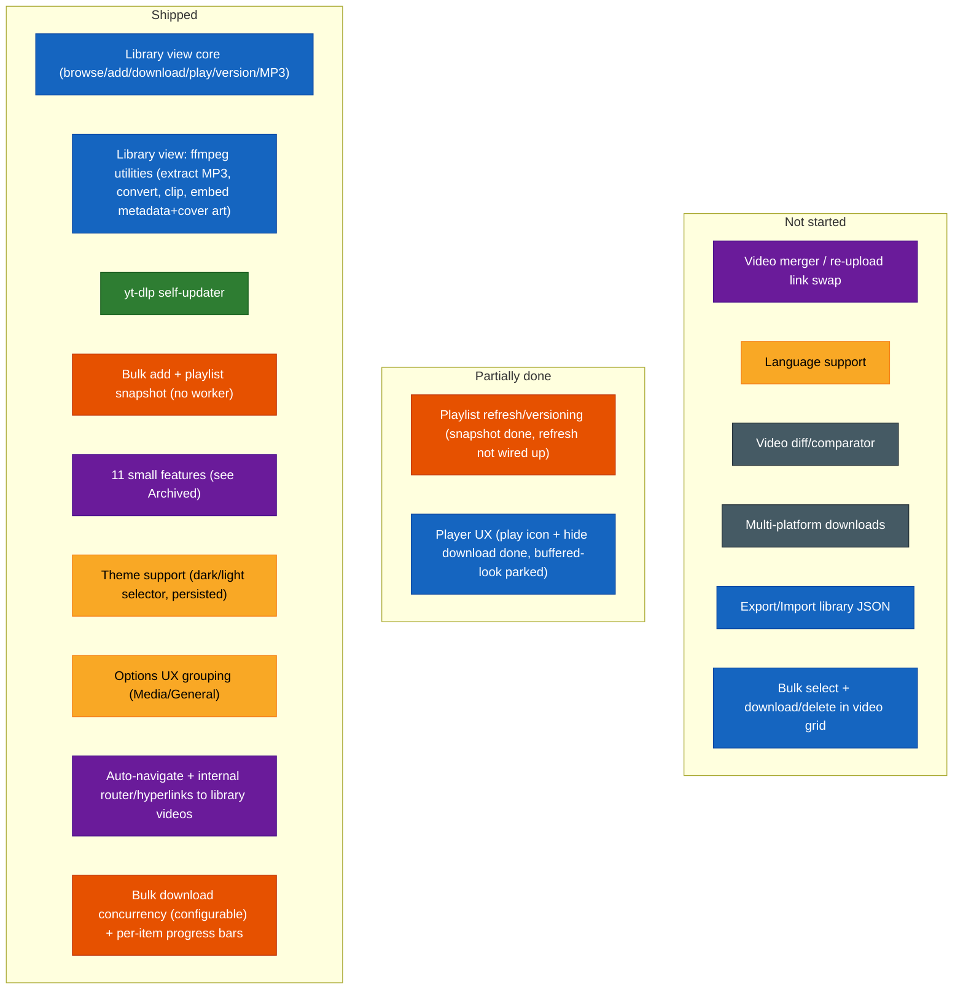

# Future Specs — Difficulty Feedback

Read-only assessment of the specs in `futureSpecs.md`, ranked against the current
state of the codebase. Doesn't modify that file — just notes here.

This file mirrors `futureSpecs.md`'s own section structure (Long shot ideas, Big
features, QoL features, Small features and corrections) so the two stay easy to
compare side by side. Items that are fully shipped get removed from `futureSpecs.md`
directly rather than kept there as a "done" marker — this file is where their
completion is recorded instead, down in [Archived](#archived), so that history isn't
lost when the backlog gets trimmed. The sections above Archived are meant to stay
short and scannable: only what's still actually open.

## Index
- [Status at a glance](#status-glance) (diagram)
- [Long shot ideas — need planning](#long-shot-ideas)
  - [Video diff/comparator](#video-diff-comparator)
  - [Multi-platform downloads](#multi-platform-downloads)
  - [Playlist refresh/versioning](#playlist-refresh)
- [Big features](#big-features)
  - [Export/Import library JSON](#export-import-json)
  - [Bulk select + download/delete](#bulk-select)
- [QoL features](#qol-features)
  - [Language support](#language-support)
- [Small features and corrections](#small-features)
  - [Video merger](#video-merger)
  - [Player UX](#player-ux)
- [Archived — shipped work, dated log](#archived)

## Status at a glance

Color = which section of `futureSpecs.md` an item belongs to (or belonged to,
before shipping). Position = status. Legend:
🔵 Library view · 🟢 yt-dlp updater · 🟠 Playlists/bulk-add · 🟣 Small features ·
🟡 QoL · ⚫ Long-shot ideas

## Long shot ideas — need planning

### Video diff/comparator

**Overall: Very High / exploratory** — a research problem before it's an engineering
one. Its prerequisite (multi-version tracking) is built, so nothing blocks starting
this, but the rating doesn't change: the hard part was always the comparison
mechanism itself, not the versioning scaffolding around it.

| Piece | Difficulty | Why |
|---|---|---|
| Transcript/caption-based diff | Medium | yt-dlp can already fetch auto-generated or manual captions (`--write-auto-sub`/`--write-subs`, VTT/SRT) where available, and a text diff (Myers algorithm — bounded, well-understood, no new dependency needed) over two transcripts is buildable. But it's a real approximation: not every video has captions, auto-generated ones vary between fetches even for identical audio, and it only ever detects *spoken/captioned wording* differences. |
| True content-level diff (frame/audio fingerprinting) | Very High | Needs frame extraction (ffmpeg, already bundled) plus perceptual hashing per interval, or audio fingerprinting (chromaprint/AcoustID-style) — none of which exist in this project today, and pulling them in means new dependencies this project has otherwise deliberately avoided. Genuinely open-ended multimedia-analysis territory. |
| Timestamped report UI | Low-Medium | Once *some* diff data exists in either form above, presenting it as a timestamped list is straightforward composition. |

**Recommendation if this ever gets picked up:** scope a v1 to transcript-only diffing and be explicit it's an approximation, rather than attempting true content-level comparison first.

### Multi-platform downloads (SoundCloud/TikTok/Instagram/Twitter)

**Overall: Medium-High mechanical, High end-to-end once per-platform reliability is factored in.** yt-dlp already supports all four sites natively — every download call already just shells out to yt-dlp with a URL — and `isValidUrl` is already a fully generic `new URL(...)` check, not YouTube-specific.

| Piece | Difficulty | Why |
|---|---|---|
| URL validation | None needed | Already generic. |
| Generalizing metadata reshaping | Medium | `reshapeVideoInfo` (`main.js`) currently assumes fields exist in the shapes yt-dlp's YouTube extractor happens to populate — needs defensive fallbacks for other extractors' thinner/different info-dicts, not a rewrite. |
| YouTube iframe embed fallback | Doesn't generalize | `YouTubeEmbed` is hardcoded to `youtube-nocookie.com/embed/{videoId}`; other platforms don't offer an equivalent simple embed-by-ID scheme. Realistic options: drop the live preview for non-YouTube platforms, or investigate each platform's own oEmbed support separately. |
| Bot-detection/auth reliability | High, and ongoing | TikTok/Instagram are known for aggressive, frequently-changing bot detection. The existing cookie support (paste or `--cookies-from-browser`) is framed entirely around YouTube's own detection message; other platforms need their own auth handling and continued maintenance. |
| Branding/scope | Not code | The app is named "yt-archiver"/"YouTube Archiver" throughout — broadening scope is a product decision as much as an engineering one. |

**Recommendation:** scope as "YouTube gets the full experience, other platforms get download-only with no live preview" rather than promising parity from day one.

### Playlist refresh/versioning

**Overall: Low-Medium** — the storage shape this needs already exists; what's
missing is a deliberate no-op guard, not new design.

| Piece | Difficulty | Why |
|---|---|---|
| Removing the current no-op guard | Low | `writePlaylistSnapshot` (`library.mjs`) already writes each snapshot into its own `<epoch>/metadata.json` (identical shape to how video versions are stored) — but returns `{ skipped: true }` without writing anything if the playlist's directory already contains any epoch. Allowing a new epoch to be written on a deliberate "refresh" action is close to just removing that guard. |
| Deciding what "refresh" means for existing entries | Medium | The real design question: does a refresh replace the old snapshot, or keep every past version (like video versioning already does) so the user can compare a playlist's membership/order over time? The spec text ("versioned or refreshed... for comparison or just refresh") reads like both should be options, which means the UI needs to expose the distinction, not just re-run the fetch. |
| Diffing what changed between versions | Medium | If "compare to the previous version" is in scope (not just "keep both"), needs a simple set/order diff (added/removed videoIds, reordering) over the two snapshots' `entries` arrays — no new dependency, just list comparison. |
| UI for "you have N saved versions of this playlist" | Low-Medium | Standard composition once the data model supports multiple epochs — comparable to the existing per-video version selector already built for videos. |

**Recommendation:** land "refresh creates a new epoch, old ones kept" first (matches how video versioning already works, no new concept to design), and treat an explicit diff view between playlist versions as a separate, later addition if it turns out to be wanted.

## Big features

Two new items since the last pass, both assessed below.

### Export/Import library JSON

**Overall: Medium** — export is a near-trivial reuse of what already exists; import's
mechanics are also mostly reuse, but importing into a library that already has data
raises real, unresolved design questions.

| Piece | Difficulty | Why |
|---|---|---|
| Export itself | Low | `scanLibrary()`/`getLibraryIndex()` (`library.mjs`) already walk the entire library tree and build exactly the JSON-serializable shape this needs (every channel → video → epoch → `metadata.json` contents). Export is "call that, write it to a file the user picks" — same save-dialog pattern already used for downloads. Including playlist snapshots too (`playlists/<id>/<epoch>/metadata.json`) is the same reuse, just a second tree walk. |
| Import — recreating the folder/metadata structure | Medium | Needs a new `library.mjs` write path that reconstructs `<channel>/<video>/<epoch>/metadata.json` directly from provided metadata, bypassing the normal "fetch from yt-dlp then write" flow every existing write path (`writeLibraryEntry`, `addLibraryVersion`, etc.) assumes. Not hard, but genuinely new code, not a reuse. |
| Import — local file paths don't transfer | Medium, real decision needed | `downloadedFilePath`/`downloadedAudioFilePath` in each `metadata.json` are absolute paths on the machine that downloaded them — meaningless (and possibly misleading, if a same-named path happens to exist) on the importing machine. These need to be explicitly nulled out on import so the UI correctly shows "not downloaded" and offers a real download button, rather than trying to preserve a reference to a file that was never actually transferred. This is a one-line fix once decided, but it's a decision, not an implementation detail — worth confirming "metadata-only, not a full file backup" is really the intent before building. |
| Import — collisions with an existing library | Medium-High | The real open question: importing into a library that already has some of the same videos. Skip duplicates by videoId? Overwrite? Add as a new version, same as the existing per-video versioning model? This is the same class of question already flagged unresolved for playlist refresh/versioning above, just applied to a whole-library import instead of one playlist. |
| Thumbnails/channel icons | Low | Not part of `metadata.json`, so not part of the export by default — but this is actually fine as-is: `ensureVideoThumbnail`/`ensureChannelIcon` (`main.js`) already fire-and-forget re-fetch any missing thumbnail/icon on the next scan, so an imported library just self-heals its images on first load rather than needing them bundled into the export. |

**Recommendation:** nail down the two open decisions first (local-path handling, collision policy) before writing any code — both are cheap to decide, expensive to redo after the fact. Once decided, land export alone first (it's genuinely low-risk and useful on its own as a backup/audit tool even before import exists), then import as a separate pass.

### Select bulk controllers and download/download all

**Overall: Medium** — most of the hard infrastructure this needs was *just* built
(bulk queue concurrency, per-item progress, retry/skip semantics) for an unrelated
reason; what's actually net-new is smaller than the spec text suggests.

| Piece | Difficulty | Why |
|---|---|---|
| Multi-select UI in the video grid | Medium | New state (a selection set keyed by `videoDir`), checkbox overlays on video cards, a "select mode" toggle, and a contextual action bar for the selection-specific buttons. Standard, well-understood pattern (file managers, email clients), just not built here yet. |
| "Download selected" → feeding the bulk queue | Low-Medium | The spec calls out needing "an identifier between a download job in the side panel and an add-to-library job that doesn't require a download" — this is already solved, not new: `useBulkAddQueue`'s `download: boolean` batch option already models exactly that distinction, and `getRetryStage`'s "resume straight at download" branch is already the precedent for seeding a queue item with a known `videoDir`/`epoch`/`resolution` and skipping the fetch/add phase entirely (since these videos are already in the library). Selected-but-undownloaded videos map onto that existing path almost directly. |
| "Download selected" visibility rule | Low | A derived boolean over the selection set (`every video in selection has no downloadedFilePath`) — plain composition, no new data needed. |
| "Delete all selected" | Low | Loops the existing single-video `deleteLibraryEntry` (already used by the per-video delete flow) over the selected `videoDir`s, behind a confirm dialog generalized from the existing single-delete one. |

**Recommendation:** build the multi-select UI first (it's the only genuinely new piece), then wire "download selected" through the bulk queue's existing `download: boolean` + resume-at-download path rather than inventing a second queue-feeding mechanism.

## QoL features

Only language support remains open here — theme support and Options UX grouping
both shipped (see [Archived](#archived)).

### Language support (i18n / "strings" file)

**Overall: Medium-High.** Not conceptually hard, but it's a wide pass over the UI,
not a contained module — and it's the first feature in this app that creates an
ongoing tax on every future PR that adds user-facing text.

| Piece | Difficulty | Why |
|---|---|---|
| Choosing a format/mechanism | Low | No need for a heavy library (`react-i18next` etc.) at this app's scale — a flat `{ key: string }` JSON file per language plus a small lookup hook (e.g. `useStrings()` returning a `t(key)` function) is enough, and matches this project's consistent preference for zero new dependencies where one can be avoided (see `copy-electron.mjs`'s own comment about dropping `cpx` for exactly this reason). |
| Extracting existing strings | Medium-High, mechanical but wide | Confirmed directly: user-facing text (`Typography`, `Button` labels, `Tooltip` titles, `placeholder`s) is hardcoded straight into JSX across at least 10 renderer files today — every screen, every dialog. Not hard per-string, but it's a real pass over most of the UI tree, not something that stays contained to one module. |
| Language switcher + persistence | Low | Same settings pattern as every other persisted option in this app — a new `settings:getLanguage`/`settings:setLanguage` pair and a dropdown in Options. |
| Ongoing maintenance cost | Real, ongoing, not a one-time cost | Every future PR that adds or changes user-facing text now needs a key added to the strings file(s) too — a standing discipline cost this project doesn't pay today, worth being explicit about before committing to it. |

**Recommendation:** scope v1 to English + exactly one second language, to prove the
extraction mechanism and lookup hook end-to-end without committing to full parity
across many languages immediately — expanding language coverage afterward is just
adding more JSON files, not more engineering.

## Small features and corrections

Only two items remain in `futureSpecs.md`'s "Small features and corrections" list —
everything else that used to live there shipped; see [Archived](#archived).

### 1. Video merger

Re-uploaded/re-edited video → swap the primary link, keep the old one as a legacy
version.

**Overall: Medium**, now that its prerequisite (version control) is built. The
remaining delta is small — a "link a replacement URL" dialog that fetches the new
video and adds it as a new epoch under the existing entry, plus a status label
distinguishing "current" from "legacy." Version control landed, so the schema this
item needed is no longer a blocker.

### 2. Player UX

Play-icon overlay and hiding the native "Download" option both shipped (see
[Archived](#archived)) — only one sub-item is still open in `futureSpecs.md`.

Remove the native "buffered" look from the scrub bar — **tried and reverted.**
Confirmed empirically: flattening `::-webkit-media-controls-timeline`'s background
didn't visibly change the buffered/played look at all — Chromium paints that
distinction natively, on top of whatever the track's own CSS background is, not as a
separate overridable layer. No further CSS-only attempts worth trying.

| Piece | Difficulty | Status |
|---|---|---|
| Remove the "buffered ahead" look on the scrub bar | Medium, and the CSS-only route is now ruled out | Tried, reverted |

**Recommendation, if this ever comes back:** the only route left is dropping native
`controls` entirely and building custom play/pause/seek/volume controls (a real,
standalone player-personalization task, not a quick follow-up) -- not worth doing
just for this one visual detail on its own, but worth revisiting together with any
future "personalize the player" push if one ever comes up.

## Archived — shipped work, dated log

Everything below this line is done. Kept as a durable record (not a full changelog —
see git history for line-by-line detail) so completed work doesn't need to be
re-researched or re-explained later, and so the sections above can stay focused on
what's actually still open.

### Shipped — no longer tracked in futureSpecs.md

| Feature | Landed |
|---|---|
| Auto-navigate to a video via an internal router + real hyperlinks (add-success toast, finished bulk-add items) | 2026-08-07 |
| Bulk download concurrency: configurable "Maximum Simultaneous Downloads" (Options), per-item progress bars in the side panel | 2026-08-08 |
| Library view (browse → add → download → play → delete → version → MP3-as-separate-download, channel-vs-video toggle, real channel icons, offline thumbnails) | 2026-08-02 → 2026-08-04 |
| Library view ffmpeg utilities (extract MP3, convert format, extract clip, embed metadata + cover art into video and/or audio) | 2026-08-05 |
| Theme support (dark/light selector, persisted) | 2026-08-05 |
| Options UX grouping (Media Options / General Options) | 2026-08-05 |
| yt-dlp self-updater (on-device PyInstaller rebuild, `userData`-relocated binary) | 2026-08-02 |
| Bulk add + playlist snapshot, no background worker | 2026-08-04 |
| Real, continuous postprocessing progress via direct ffmpeg pass (TD-004) | 2026-08-02 |
| Overwrite/resume choice on download (replaces hardcoded `--force-overwrites`) + resume-a-failed-download (TD-001) | 2026-08-02 |
| `--cookies-from-browser` support alongside paste-cookie-text (TD-006) | 2026-08-04 |
| Scoped per-download progress -- fixes a real stuck-spinner bug in bulk downloads (TD-008) | 2026-08-07 |
| Base download directory setting, video-file-only save dialog filters | pre-2026-08-03 |
| Video-info cache (7-day TTL) | pre-2026-08-03 |
| Error log dump/viewer for uncaught errors | pre-2026-08-03 |
| Library tab notification badge on new adds | pre-2026-08-03 |
| Download buttons ↔ progress-bar swap with error-state recovery | pre-2026-08-03 |
| Hide native "Download" option + play-icon overlay on the local player | 2026-08-05 |

### Recently shipped, dated log

**2026-08-08:**
- Bulk downloads can now run several at once instead of strictly one-at-a-time: a new "Maximum Simultaneous Downloads" setting (Options → Media Options, 1-5, with an explicit warning about the bot-flagging risk of setting it too high) backs a fixed pool of 5 `useDownloadVideo()` "slots" in `useBulkAddQueue.tsx` (hooks can't be called a variable number of times, so unused slots beyond the configured max just sit idle). `fillFreeSlots()` hands pending items to however many slots the current setting allows, and each slot independently frees and refills itself as its own item finishes -- this only worked cleanly because of the TD-008 fix below (each slot's progress is genuinely its own, not shared/global state).
- Added a real per-item progress bar to the bulk-add side panel (previously just a spinner) -- each download slot now also reports its `downloadProgress`/`postprocessProgress` up to its assigned item, rendered as a compact `LinearProgress variant="buffer"` + percentage, same value/valueBuffer semantics as the existing Library-view download progress bar.

**2026-08-07:**
- Diagnosed and fixed a real bug: bulk downloads got permanently stuck showing "downloading" forever. Root cause (TD-008, already logged as a theoretical limitation, now a real reproduced bug): `useDownloadVideo.tsx`'s cleanup called `ipcRenderer.removeAllListeners('progressUpdate')` -- global, not scoped to its own listener -- so any *other* component using the same hook (`VideoDetailCard.tsx`, `LibraryVideoDetail.tsx`) unmounting during a bulk run silently killed the permanently-mounted bulk queue's own listener too. Fixed by tagging every download with a `requestId` (renderer-generated, echoed on every progress/done/error message, filtered on before touching state) and by having `preload.mjs` return the actual listener reference so it can be removed with the scoped `ipcRenderer.removeListener` instead of the global one.
- Added an internal navigation system: `react-router` (already an unused dependency, `HashRouter` already wrapping the app) now actually does something. A toast/button click can navigate to `/library/video/:videoId`, which `LibraryScreen.tsx` reads via `useMatch` and resolves straight to that video's detail screen (skipping the channel grid), consuming the link once (`navigate(..., { replace: true })`). Wired into the add-success toast (`DownloaderScreen.tsx`, all three add paths) and finished bulk-add items (`BulkAddSidePanel.tsx`). Scoped deliberately to one-directional deep links only (manual browsing still doesn't push URLs) -- confirmed with the user as sufficient, since a future playlist-autoplay feature would just reuse the same "navigate to video X" mechanism regardless.
- Polish pass on the ffmpeg utilities from real-usage feedback: clip start/end fields are now digit-only, auto-formatting into `HH:MM:SS` as you type, with up/down spinner arrows nudging by 1 second; a client-side check blocks extraction unless the end timestamp is at least 1 second past the start (previously reached ffmpeg and produced a crash-length raw error); and ffmpeg failure messages are now summarized (`summarizeFfmpegError()`: strips banner/build-config noise, extracts the first real-error line as the root cause, translates known causes into plain language) instead of dumped raw.

**2026-08-06:**
- Dependency-freshness pass, prompted by bumping the dev Node version to 24.19.0 LTS for the new Vitest suite. Applied every safe bump within existing semver ranges, each verified with lint + `tsc -b` + `npm test` + build before keeping it -- including two full majors (`vite` 6→8, `@vitejs/plugin-react` 4→6) that turned out clean. Caught and fixed one real regression along the way: MUI's `Switch` component's rendered ARIA role changed from `checkbox` to `switch` in a *minor* version bump, breaking one test -- found by diffing test results before/after via `git stash`, not by trusting the version bump was safe just because semver said so.
- Individually tried and reverted three further major bumps (`@mui/material`/`@mui/icons-material` v9, `typescript` 7, `eslint` 10) after each produced real, reproduced breakage -- logged in full with exact evidence as **TD-009** (`reports/TechnicalDebt.md`), including the specific re-check command to use before trying again later rather than trusting the changelog alone.

**2026-08-05:**
- Options UX grouping: `OptionsScreen.tsx`'s sections split under two headers, "Media Options" and "General Options", matching the spec's own grouping exactly.
- Theme support: dark/light selector in Options, persisted via `settings:getThemeMode`/`setThemeMode`, `App.tsx`'s `ThemeProvider` driven by a `useMemo`'d theme.
- Library view ffmpeg utilities shipped end-to-end (visual pass → wiring → polish): Extract MP3 (save-dialog export or one-click local extraction into the library's own audio slot), Convert to a different format, Extract clip, Embed metadata (including thumbnail-as-cover-art, applies to whichever of video/audio are downloaded, with a success toast). Save-dialog default location changed to the source file's own folder.
- Play-icon overlay + hidden native "Download" option on the local player (`LibraryVideoPlayer.tsx`).

**2026-08-04:**
- Bulk add and playlist detection: a renderer-side sequential queue (`useBulkAddQueue.tsx`) fed by a playlist link or a comma/newline list, an always-available side panel with per-item status/retry/skip/cancel, closest-available-quality matching, dedup against the existing library, and a system notification when the queue empties.
- Playlist saving in a one-time-snapshot scope: `library.mjs`'s `writePlaylistSnapshot`/`enrichPlaylistEntry` persist a playlist's id/title/uploader/order on fetch, backfilled with real per-video data as the queue processes it. Re-fetching an already-saved playlist is still a no-op -- see [Playlist refresh/versioning](#playlist-refresh) above.
- TD-006 resolved: `--cookies-from-browser` wired up alongside paste-cookie-text.
- Fixed a real-world bug pair: `getVideoInfoPython` silently saving degraded metadata on an empty-formats bot-check response (now hard-errors), and downloads landing in a non-MP4 container the player couldn't play (now forces `--merge-output-format mp4`, with a clear in-player error if it still happens).

**2026-08-03:**
- MP3 downloads became a separate, coexisting artifact per video version (own file slot, own metadata field, own instrument-panel controls/player).
- Video thumbnails cached locally (video-level, shared across every version), used as the player's poster and every thumbnail spot, so they work offline.
- Fixed three tester-reported bugs: MP3 downloads failing outright in the Library view, MP3 sometimes saving with a wrong file extension (Windows), and inaccurate filesize estimates (duration-math bug, MP3 bitrate mismatch, missing audio-track size on video estimates, a dead estimate function).
- Fixed a channel-icon/thumbnail staleness gap: an already-open Library tab now resyncs on its own once a fire-and-forget background fetch finishes, instead of only picking it up on next manual refresh.
- Library-view UI polish: instrument panel restructured into one grouped Card, version selector relocated there with a per-version downloaded-file indicator, description moved into a bounded/scrollable container, upload date moved into the header as a Chip.

**Pre-2026-08-03:** Base download directory setting, video-file-only save dialog filters, video-info cache (7-day TTL), error log dump/viewer, library tab notification badge, download buttons ↔ progress-bar swap with error-state recovery.

**Housekeeping note:** finished work is dropped down to a one-line mention in this
dated log instead of keeping its full original write-up around forever. The detailed
reasoning for anything marked done still lives in git history/commit messages if it's
ever needed again.
