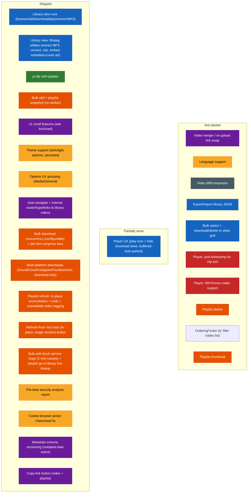

# Future Specs — Difficulty Feedback

Read-only assessment of the specs in `futureSpecs.md`, ranked against the current
state of the codebase. Doesn't modify that file — just notes here.

This file mirrors `futureSpecs.md`'s own section structure (Long shot ideas, Big
features, QoL features, Small features and corrections) so the two stay easy to
compare side by side. Items that are fully shipped get removed from `futureSpecs.md`
directly rather than kept there as a "done" marker — this file is where their
completion is recorded instead, down in [Archived](#archived), so that history isn't
lost when the backlog gets trimmed. The sections above Archived are meant to stay
short and scannable: only what's still actually open.

**2026-08-12 reassessment note:** `futureSpecs.md` currently still lists several
items this pass found are already shipped or already fixed in the codebase —
**Multi-platform downloads**, **Playlist refresh/versioning**, and all three entries
under **Bugs found**. None of those `futureSpecs.md` edits were made as part of this
pass (per this file's own stated scope, and because the user's request this round
was specifically "write it in the feedback file"). They're written up in
[Archived](#archived) below with what actually shipped and where, and flagged inline
at their old spot so it's obvious at a glance — pruning `futureSpecs.md` itself is a
follow-up, not done here.

**2026-08-12 same-day update:** three of the quick items from this same reassessment
— [Cookie browser-picker "Clear" quirk](#cookie-picker-quirk),
[Metadata schema versioning](#schema-versioning), and
[Copy-link button](#copy-link) — were picked up and shipped later the same day.
Unlike the note above, these *were* removed from `futureSpecs.md` directly (the
user's explicit request that round), matching this file's normal convention — see
[Archived](#archived) for what shipped.

## Index
- [Status at a glance](#status-glance) (diagram)
- [Long shot ideas — need planning](#long-shot-ideas)
  - [Video diff/comparator](#video-diff-comparator)
  - [~~Multi-platform downloads~~ — shipped](#multi-platform-downloads)
  - [~~Playlist refresh/versioning~~ — shipped](#playlist-refresh)
- [Big features](#big-features)
  - [Export/Import library JSON](#export-import-json)
  - [Bulk select + download/delete](#bulk-select)
  - [Player customization (pick timestamp)](#player-customization)
  - [More resilient embedded player / MKV support](#resilient-player)
- [QoL features](#qol-features)
  - [Language support](#language-support)
  - [~~Cookie browser-picker "Clear" quirk~~ — shipped](#cookie-picker-quirk)
  - [Delete feature for playlists](#playlist-delete)
- [Small features and corrections](#small-features)
  - [Video merger](#video-merger)
  - [Player UX](#player-ux)
  - [~~Metadata schema versioning~~ — shipped](#schema-versioning)
  - [~~Copy-link button~~ — shipped](#copy-link)
  - [Ordering/"order by" filter](#ordering-filter)
  - [Playlist thumbnail](#playlist-thumbnail)
- [Bugs found — reassessed](#bugs-found)
- [Archived — shipped work, dated log](#archived)

## Status at a glance

Color = which section of `futureSpecs.md` an item belongs to (or belonged to,
before shipping). Position = status. Legend:
🔵 Library view · 🟢 yt-dlp updater · 🟠 Playlists/bulk-add · 🟣 Small features ·
🟡 QoL · ⚫ Long-shot ideas · 🔴 Big features (player)

## Long shot ideas — need planning

### Video diff/comparator

**Overall: Very High / exploratory** — a research problem before it's an engineering
one. Its prerequisite (multi-version tracking) is built, so nothing blocks starting
this, but the rating doesn't change: the hard part was always the comparison
mechanism itself, not the versioning scaffolding around it. **Unchanged this pass** —
no code in this area since the last assessment.

| Piece | Difficulty | Why |
|---|---|---|
| Transcript/caption-based diff | Medium | yt-dlp can already fetch auto-generated or manual captions (`--write-auto-sub`/`--write-subs`, VTT/SRT) where available, and a text diff (Myers algorithm — bounded, well-understood, no new dependency needed) over two transcripts is buildable. But it's a real approximation: not every video has captions, auto-generated ones vary between fetches even for identical audio, and it only ever detects *spoken/captioned wording* differences. |
| True content-level diff (frame/audio fingerprinting) | Very High | Needs frame extraction (ffmpeg, already bundled) plus perceptual hashing per interval, or audio fingerprinting (chromaprint/AcoustID-style) — none of which exist in this project today, and pulling them in means new dependencies this project has otherwise deliberately avoided. Genuinely open-ended multimedia-analysis territory. |
| Timestamped report UI | Low-Medium | Once *some* diff data exists in either form above, presenting it as a timestamped list is straightforward composition. |

**Recommendation if this ever gets picked up:** scope a v1 to transcript-only diffing and be explicit it's an approximation, rather than attempting true content-level comparison first.

### ~~Multi-platform downloads (SoundCloud/TikTok/Instagram/Twitter)~~ — SHIPPED

Landed 2026-08-08 (single commit) as scoped, matching the prior assessment's own
recommendation almost exactly: YouTube keeps the full experience, other platforms
get a simplified download-only card, no live preview. See
[Archived](#archived) for what actually shipped, incl. two follow-up refinements
(platform tag, SoundCloud MP3-default + embed-metadata) done the same pass.
**Still present in `futureSpecs.md` under "Long shot ideas" #2 — safe to remove.**

### ~~Playlist refresh/versioning~~ — SHIPPED (different shape than assessed)

Landed 2026-08-08. Worth flagging that the *actual* design diverged from this file's
prior recommendation ("land refresh creates a new epoch, old ones kept, matches how
video versioning already works") — the real implementation instead reconciles
**in place** with a single undo step (`reconcilePlaylistSnapshot` backs up the prior
`metadata.json` to a sibling `previousMetadata.json` before overwriting, and
`undoPlaylistRefresh` reverts once). This was a deliberate scope call made during
that session (documented directly in `reconcilePlaylistSnapshot`'s own comment:
"versioning was explicitly ruled out in favor of reconciling in place with a single
undo step"), not an oversight — multi-epoch playlist versioning (the "compare a
playlist's membership/order over time" idea from the original assessment) is still
genuinely not built, so treat that specific sub-idea as still open if it ever comes
back up, distinct from "refresh" itself which is done. See
[Archived](#archived) for the full shipped scope (added/removed/updated counts,
per-entry "Not on YouTube" tagging on top of the reconciliation itself).
**Still present in `futureSpecs.md` under "Long shot ideas" #3 — safe to remove.**

## Big features

Four items now (two new since the last pass, both un-assessed until this round —
[Player customization](#player-customization) and
[Resilient player/MKV support](#resilient-player)).

### Export/Import library JSON

**Overall: Medium** — export is a near-trivial reuse of what already exists; import's
mechanics are also mostly reuse, but importing into a library that already has data
raises real, unresolved design questions. **Unchanged this pass.**

| Piece | Difficulty | Why |
|---|---|---|
| Export itself | Low | `scanLibrary()`/`getLibraryIndex()` (`library.mjs`) already walk the entire library tree and build exactly the JSON-serializable shape this needs (every channel → video → epoch → `metadata.json` contents). Export is "call that, write it to a file the user picks" — same save-dialog pattern already used for downloads. Including playlist snapshots too (`playlists/<id>/<epoch>/metadata.json`) is the same reuse, just a second tree walk. |
| Import — recreating the folder/metadata structure | Medium | Needs a new `library.mjs` write path that reconstructs `<channel>/<video>/<epoch>/metadata.json` directly from provided metadata, bypassing the normal "fetch from yt-dlp then write" flow every existing write path (`writeLibraryEntry`, `addLibraryVersion`, etc.) assumes. Not hard, but genuinely new code, not a reuse. |
| Import — local file paths don't transfer | Medium, real decision needed | `downloadedFilePath`/`downloadedAudioFilePath` in each `metadata.json` are absolute paths on the machine that downloaded them — meaningless (and possibly misleading, if a same-named path happens to exist) on the importing machine. These need to be explicitly nulled out on import so the UI correctly shows "not downloaded" and offers a real download button, rather than trying to preserve a reference to a file that was never actually transferred. This is a one-line fix once decided, but it's a decision, not an implementation detail — worth confirming "metadata-only, not a full file backup" is really the intent before building. |
| Import — collisions with an existing library | Medium-High | The real open question: importing into a library that already has some of the same videos. Skip duplicates by videoId? Overwrite? Add as a new version, same as the existing per-video versioning model? This is the same class of question already resolved for playlist refresh (in-place reconciliation, see above) — worth deciding whether whole-library import should follow that same "reconcile in place" precedent or a different one. |
| Thumbnails/channel icons | Low | Not part of `metadata.json`, so not part of the export by default — but this is actually fine as-is: `ensureVideoThumbnail`/`ensureChannelIcon` (`main.js`) already fire-and-forget re-fetch any missing thumbnail/icon on the next scan, so an imported library just self-heals its images on first load rather than needing them bundled into the export. |

**Recommendation:** nail down the two open decisions first (local-path handling, collision policy — the playlist-refresh precedent above is a reasonable default to point to for the second one) before writing any code. Once decided, land export alone first (it's genuinely low-risk and useful on its own as a backup/audit tool even before import exists), then import as a separate pass.

### Select bulk controllers and download/download all

**Overall: Medium** — most of the hard infrastructure this needs was built (bulk
queue concurrency, per-item progress, retry/skip semantics) for an unrelated reason;
what's actually net-new is smaller than the spec text suggests. **Unchanged this
pass**, though the bulk queue itself is now more battle-tested (two real bugs fixed
in it since — see [Archived](#archived)), which lowers integration risk slightly.

| Piece | Difficulty | Why |
|---|---|---|
| Multi-select UI in the video grid | Medium | New state (a selection set keyed by `videoDir`), checkbox overlays on video cards, a "select mode" toggle, and a contextual action bar for the selection-specific buttons. Standard, well-understood pattern (file managers, email clients), just not built here yet. |
| "Download selected" → feeding the bulk queue | Low-Medium | The spec calls out needing "an identifier between a download job in the side panel and an add-to-library job that doesn't require a download" — this is already solved, not new: `useBulkAddQueue`'s `download: boolean` batch option already models exactly that distinction, and `getRetryStage`'s "resume straight at download" branch is already the precedent for seeding a queue item with a known `videoDir`/`epoch`/`resolution` and skipping the fetch/add phase entirely (since these videos are already in the library). Selected-but-undownloaded videos map onto that existing path almost directly. |
| "Download selected" visibility rule | Low | A derived boolean over the selection set (`every video in selection has no downloadedFilePath`) — plain composition, no new data needed. |
| "Delete all selected" | Low | Loops the existing single-video `deleteLibraryEntry` (already used by the per-video delete flow) over the selected `videoDir`s, behind a confirm dialog generalized from the existing single-delete one. |

**Recommendation:** build the multi-select UI first (it's the only genuinely new piece), then wire "download selected" through the bulk queue's existing `download: boolean` + resume-at-download path rather than inventing a second queue-feeding mechanism.

### Player customization (pick-timestamp for the clip tool)

**New this pass.** **Overall: Low-Medium** for the "pick timestamp" half; **Medium,
and scope-dependent** for full click-to-select start/end.

| Piece | Difficulty | Why |
|---|---|---|
| "Set as start"/"Set as end" buttons next to the clip fields | Low-Medium | `LibraryVideoPlayer.tsx` already holds a `videoRef` (`useRef<HTMLVideoElement>`, line 57) with the real `currentTime`, but it's local to that component — `LibraryVideoDetail.tsx` (where the clip start/end `TextField`s already live, already digit-only/auto-formatting `HH:MM:SS`) has no access to it today. Needs `LibraryVideoPlayer` to expose current playback time upward — either `forwardRef` + `useImperativeHandle` (a `getCurrentTime()` method) or a simple `onTimeUpdate` callback prop threaded from the parent. Either is a standard, well-contained React pattern; no new dependency. |
| Drag/click-to-select start and end directly on the scrub bar | Medium | Native `<video controls>` doesn't expose a customizable range-selection UI at all — this would mean either overlaying a custom range-select control on top of (or instead of) the native scrub bar, which overlaps directly with [Player UX](#player-ux)'s already-parked "remove native controls, build a custom player" conclusion below. Worth deciding these two together rather than separately, since building custom controls for one and not the other would be wasted, divergent work. |
| Wiring "set as start/end" into the existing clip extractor | Low | The clip fields already exist, already validate (`extractClip`'s handler), and already accept a formatted `HH:MM:SS` string — the new buttons just need to call the existing `setClipStart`/`setClipEnd`-equivalent setters with a formatted value derived from the picked time (`formatSecondsAsClipTimestamp`, already exists in `LibraryVideoDetail.tsx`). |

**Recommendation:** ship the "Set as start/end" button pair first (cheap, high value, reuses everything that already exists) and treat true click-to-select-on-the-scrub-bar as the same future "personalize the player" push [Player UX](#player-ux) already flags as the only real path left there — don't build custom scrub-bar controls twice for two different features.

### More resilient embedded player / MKV support

**New this pass.** **Overall: Medium-High** — not blocked on anything missing, but
every real option costs something (new dependency, extra disk/CPU work, or scope
narrowing), and this project has a consistent, deliberate preference for avoiding
new dependencies where possible.

**Confirmed directly:** `LibraryVideoPlayer.tsx`'s `PLAYABLE_VIDEO_EXTENSIONS` is
already just `{'mp4', 'webm'}` (line 19) — everything else (MKV included) already
falls into the existing "can't preview, download only" path (`isKnownUnplayable`),
so this isn't a bug to fix, it's a real gap to close.

| Piece | Difficulty | Why |
|---|---|---|
| Why MKV doesn't just work today | — (context) | Chromium's `<video>` element has no MKV **container** demuxer at all, regardless of the codecs inside it (H.264/AAC in an MKV still won't play) — this is a browser-engine limitation, not something fixable from this app's own code. |
| Option A: on-the-fly remux to MP4/WebM for preview only | Medium | Reuses the exact ffmpeg pipeline the "Convert to a different format" tool already has (`runFfmpegWithProgress`, bundled ffmpeg) — a fast `-c copy` remux (no re-encode) works whenever the MKV's internal codecs are already MP4/WebM-compatible (common case: H.264+AAC → MP4 remux is typically sub-second). Needs a decision on *when* this runs (on first play, cached alongside the original? on download-complete, always?) and a fallback for the case where the codecs genuinely aren't remux-compatible (VP9-in-MKV missing an MP4-safe profile, some obscure codec) — that case still needs a real re-encode, which is slow and not truly "instant preview" anymore. |
| Option B: in-browser demux/decode (ffmpeg.wasm or similar) | High, and a real new-dependency cost | Would let literally any container/codec play without any server-side preprocessing, but pulls in a large (multi-MB) WASM dependency this project has consistently avoided elsewhere (see `copy-electron.mjs`'s own comment about dropping `cpx` for the same reason, cited in the language-support assessment too) — real bundle-size and maintenance cost for a feature that Option A can mostly cover already. |
| Option C: narrow the ask — just detect+remux MKV specifically, not "any codec" | Low-Medium | A scoped version of Option A: MKV is explicitly named in the spec, not "arbitrary future containers" — if the real goal is "my MKV downloads preview like everything else," a targeted `if (ext === 'mkv') remux-then-play` path is meaningfully smaller than a general "more resilient player" effort. |

**Recommendation:** scope this to Option C (MKV specifically, via the existing ffmpeg remux pipeline) rather than the more open-ended "more codecs" framing in the spec text — it reuses infrastructure that already exists and ships the concrete, named pain point (MKV) without taking on a new dependency or an open-ended "support everything" commitment.

## QoL features

Language support carries over unchanged; playlist delete is still open. The cookie
browser-picker quirk shipped the same day it was assessed — see below.

### Language support (i18n / "strings" file)

**Overall: Medium-High.** Not conceptually hard, but it's a wide pass over the UI,
not a contained module — and it's the first feature in this app that creates an
ongoing tax on every future PR that adds user-facing text. **Unchanged this pass.**

| Piece | Difficulty | Why |
|---|---|---|
| Choosing a format/mechanism | Low | No need for a heavy library (`react-i18next` etc.) at this app's scale — a flat `{ key: string }` JSON file per language plus a small lookup hook (e.g. `useStrings()` returning a `t(key)` function) is enough, and matches this project's consistent preference for zero new dependencies where one can be avoided (see `copy-electron.mjs`'s own comment about dropping `cpx` for exactly this reason). |
| Extracting existing strings | Medium-High, mechanical but wide | User-facing text (`Typography`, `Button` labels, `Tooltip` titles, `placeholder`s) is hardcoded straight into JSX across every screen and dialog today. Not hard per-string, but it's a real pass over most of the UI tree, not something that stays contained to one module — and the UI surface has only grown since the last assessment (multi-platform download card, playlist view, "Not on YouTube" tags, etc.), so the pass is wider now than it was last time this was scored. |
| Language switcher + persistence | Low | Same settings pattern as every other persisted option in this app — a new `settings:getLanguage`/`settings:setLanguage` pair and a dropdown in Options. |
| Ongoing maintenance cost | Real, ongoing, not a one-time cost | Every future PR that adds or changes user-facing text now needs a key added to the strings file(s) too — a standing discipline cost this project doesn't pay today, worth being explicit about before committing to it. |

**Recommendation:** scope v1 to English + exactly one second language, to prove the
extraction mechanism and lookup hook end-to-end without committing to full parity
across many languages immediately — expanding language coverage afterward is just
adding more JSON files, not more engineering.

### ~~Cookie browser-picker "Clear" quirk~~ — SHIPPED

Landed 2026-08-12, same day it was assessed — exactly as scoped: `handleModeChange`
now clears `cookiesBrowser` (state + persisted config) when switching away from
browser mode, and a new "Clear" button reverts the selection to none without leaving
browser mode. See [Archived](#archived) for the one real backend wrinkle this
surfaced (`cookies:setConfig`'s validation had to allow an empty `cookiesBrowser` as
the explicit "cleared" state). Removed from `futureSpecs.md` directly.

### Delete feature for playlists

**New this pass.** **Overall: Low.** The exact same containment-checked delete
pattern this codebase already uses for videos (`deleteLibraryEntry`, `library.mjs`)
applies directly; playlists just don't have their own delete path yet.

| Piece | Difficulty | Why |
|---|---|---|
| Backend delete function | Low | A new `deletePlaylistSnapshot({ libraryDir, playlistId })` in `library.mjs`, mirroring `deleteLibraryEntry`'s existing `path.resolve` + `path.relative` containment check (the exact pattern `reports/SecurityAnalysis.md`'s SEC-003 recommends extending everywhere) — `fs.rmSync` the playlist's directory, done. The spec is explicit that videos themselves aren't touched, which matches: nothing in `writeLibraryEntry`'s video storage is coupled to a playlist snapshot existing. |
| IPC handler | Low | A new `library:deletePlaylist` handler, same shape as the existing `library:deleteEntry`. |
| UI: delete button + confirm dialog + "videos aren't removed" notice | Low | `PlaylistsSection.tsx` already has the exact confirm-dialog/notice pattern this needs precedent for (its own Undo tooltip already explains a consequence before the user commits) — this is composition, not new design. |

**Recommendation:** small, self-contained, no open design questions — a good "next small PR" candidate.

## Small features and corrections

Two items (Video merger, Player UX) carry over unchanged. Metadata schema
versioning and the copy-link button shipped the same day they were assessed — see
below. Ordering/"order by" filter and playlist thumbnail are still open.

### 1. Video merger

Re-uploaded/re-edited video → swap the primary link, keep the old one as a legacy
version. **Overall: Medium**, now that its prerequisite (version control) is built.
**Unchanged this pass.**

The remaining delta is small — a "link a replacement URL" dialog that fetches the new
video and adds it as a new epoch under the existing entry, plus a status label
distinguishing "current" from "legacy." Version control landed, so the schema this
item needed is no longer a blocker. One new, relevant precedent since the last
assessment: `refreshLibraryEntryMetadata` (shipped 2026-08-08, see
[Archived](#archived)) already demonstrates the "re-fetch and write into a specific
epoch" mechanics this feature would reuse, just for the same URL rather than a
replacement one.

### 2. Player UX

Play-icon overlay and hiding the native "Download" option both shipped (see
[Archived](#archived)) — only one sub-item is still open in `futureSpecs.md`.
**Unchanged this pass** — see also [Player customization](#player-customization)
above, which explicitly points back here for the "build custom controls" option.

Remove the native "buffered" look from the scrub bar — **tried and reverted.**
Confirmed empirically: flattening `::-webkit-media-controls-timeline`'s background
didn't visibly change the buffered/played look at all — Chromium paints that
distinction natively, on top of whatever the track's own CSS background is, not as a
separate overridable layer. No further CSS-only attempts worth trying.

| Piece | Difficulty | Status |
|---|---|---|
| Remove the "buffered ahead" look on the scrub bar | Medium, and the CSS-only route is now ruled out | Tried, reverted |

**Recommendation, if this ever comes back:** the only route left is dropping native
`controls` entirely and building custom play/pause/seek/volume controls (a real,
standalone player-personalization task, not a quick follow-up) — and now that
[Player customization](#player-customization) and [MKV support](#resilient-player)
have both separately arrived at "a custom player might be needed," this is worth
scoping as one combined "personalize the player" effort rather than three separate
partial attempts.

### ~~3. Metadata schema versioning~~ — SHIPPED

Landed 2026-08-12, same day it was assessed. `CURRENT_VIDEO_SCHEMA_VERSION`/
`CURRENT_PLAYLIST_SCHEMA_VERSION` constants added in `library.mjs` (replacing the
hardcoded `3`/`1` literals `buildEpochMetadata`/`writePlaylistSnapshot` already had),
with a duplicated copy in the renderer per this codebase's usual main/renderer
no-cross-import convention. `LibraryVideoDetail.tsx` and `PlaylistsSection.tsx` both
now show an "Outdated data" warning `Chip` (tooltip pointing at "Refresh from
YouTube") whenever an entry's stored `schemaVersion` is behind current — detection +
notice only, exactly as scoped, no migration machinery added. Removed from
`futureSpecs.md` directly.

### ~~4. Copy-link button~~ — SHIPPED

Landed 2026-08-12, same day it was assessed. A `Link`-icon (MUI's `@mui/icons-material/Link`,
swapped in from an initial `ContentCopy` icon per a same-day follow-up request)
`IconButton` added to both `LibraryVideoDetail.tsx` and `PlaylistsSection.tsx`,
positioned to the left of the title (grouped with the basic video/playlist info)
rather than in the right-aligned action-button cluster, per a same-day layout
follow-up — `navigator.clipboard.writeText(originalUrl)` plus a "Link copied"
`Snackbar`, exactly as scoped. Removed from `futureSpecs.md` directly.

### 5. Ordering / "order by" filter (video list view)

**New this pass.** **Overall: Low-Medium.** Every field the spec asks to sort by is
already present in the data the video-list view already has in memory.

| Piece | Difficulty | Why |
|---|---|---|
| Sort by date published / date added / channel / title | Low | All already present per-video: `uploadDate` (`metadata.uploadDate`), `addedEpoch` (the epoch folder name itself, already a sortable timestamp), `channel`, `title`. The flat by-video list (`LibraryScreen.tsx`'s "switch to flat view" mode, already shipped) already builds exactly the flat array a sort would apply to — this is a `.sort()` call plus a dropdown/toggle for the active field and direction, no new data fetching. |
| Sort by downloaded status | Low | Already derivable — `!!metadata.downloadedFilePath` (or the audio equivalent) is already read elsewhere in this codebase for exactly this kind of boolean state. |
| Sort by quality | Medium, and inherently approximate | Flagged as "depending on how easy it is to filter for" in the spec text itself, correctly — a video can have multiple downloaded qualities tracked over its version history (`downloadedResolution` is per-epoch, not per-video), and an *undownloaded* video only has a list of *available* resolutions (`resolutions[]`), not a single scalar to sort by. Would need a defined rule (e.g. "sort by the latest epoch's downloaded resolution, falling back to the highest available resolution if nothing's downloaded yet") rather than a natural single field — a real, small design decision, not just an implementation detail. |
| UI: the sort control itself | Low | A single `Select`/toggle-group in the flat-view toolbar, next to the existing search bar (`LibrarySearchBar`, already there) — same composition pattern already used for the channel/video view toggle. |

**Recommendation:** ship date/channel/title/downloaded-status sorting first (all trivial, all already-available data) and treat quality-sorting as a separate follow-up once its exact rule is decided — don't let the one genuinely ambiguous sub-item block the four easy ones.

### 6. Playlist thumbnail

**New this pass.** **Overall: Low-Medium.** The mechanics this needs (image
download-and-cache-locally) are an exact, direct reuse of an existing helper; the
only real design question is *which* video's thumbnail counts as "first."

| Piece | Difficulty | Why |
|---|---|---|
| Caching a thumbnail locally, with a fallback | Low | `downloadImageToFile()` (`main.js`) already does exactly this — it's the same helper `ensureChannelIcon`/`ensureVideoThumbnail` already use, fetch-once-then-skip semantics and all. A new `ensurePlaylistThumbnail(playlistDir, thumbnailUrl)` following the identical pattern is close to a copy-paste, not new design. |
| "Dynamically update to the first video's thumbnail" | Medium | The playlist's own `entries[]` array already carries each entry's `thumbnailUrl` (`writePlaylistSnapshot`/`reconcilePlaylistSnapshot` already populate it) — "first video" just means `entries[0].thumbnailUrl`, already available with zero new fetching. The "dynamic" part (re-checking whether entry 0 changed) is exactly what a playlist refresh already recomputes (`reconcilePlaylistSnapshot`'s reordering/reconciliation, shipped 2026-08-08) — piggybacking the thumbnail re-check onto that existing refresh path, rather than inventing a separate polling mechanism, is the natural fit. |
| Fallback thumbnail if the first entry has none (e.g. it's the dead/"Not on YouTube" placeholder) | Low | Already has a natural answer: fall through to the next entry with a real `thumbnailUrl`, same idea `isDeadTitle`-adjacent code already applies elsewhere in `library.mjs` for skipping placeholder data. |
| UI: rendering it | Low | `PlaylistsSection.tsx`'s list already renders each *entry's* thumbnail via `Avatar` — the playlist-level thumbnail in the summary list is the same `Avatar`/`CardMedia` pattern one level up. |

**Recommendation:** straightforward reuse of existing infrastructure end to end — the only real decision is the fallback-chain rule above, which is small enough to just decide inline while building rather than needing a separate planning pass.

## Bugs found — reassessed

All three items currently listed under `futureSpecs.md`'s "Bugs found" section were
checked directly against the current codebase (not from memory of what was
requested) — **all three are already fixed**, landed across two commits on
2026-08-08. None of these needed re-diagnosis; they were confirmed by reading the
actual fix and, for the two encountered live during this session's own work, by the
test suite passing clean afterward.

| Bug (as written in `futureSpecs.md`) | Status | Where it was actually fixed |
|---|---|---|
| "Stop after current item" spinner never stops, Resume buttons never reappear | **Fixed — two separate root causes** | (1) `recordLibraryDownload`'s IPC call could reject uncaught, throwing out of `handleSlotDone` before `freeSlot`/`sleep` ever ran — permanently wedging that slot busy, which meant `isRunning`/`stopRequested` could never reset (fixed in commit `0353b7e`, wrapped in try/catch). (2) Independently, `fillFreeSlots()` returned early on `stopRequestedRef.current` *before* ever calling `maybeFinishRun()` — so even once every slot legitimately freed up after a stop, nothing ever flipped `isRunning`/`stopRequested` back. Found and fixed directly in this project's own test-repair pass (verified via a full `useBulkAddQueue.test.tsx` run, 16/16 passing) — present in the current `fillFreeSlots` as a `stopRequestedRef.current` branch that still calls `maybeFinishRun()` before returning. |
| Bulk-added videos' "go to library" playlist icon doesn't appear until a manual playlist-view refresh | **Fixed** | `getPlaylistSnapshot` (`library.mjs`) used to trust whatever `localFiles` mapping was last written to disk by the bulk-add loop — stale by construction, since the playlist snapshot is written *before* the bulk-add loop has actually added anything. Commit `0353b7e` changed it to recompute `localFiles` fresh against the live library index on every read (`findVideoInIndex` per entry), a cheap, purely local lookup — no more dependency on an explicit refresh to notice videos that were already added. |
| No way to refresh a single video's metadata in place (only "add as new version" existed) | **Fixed** | Commit `0353b7e` added `refreshLibraryEntryMetadata` (`library.mjs`) — re-fetches live yt-dlp data and writes it into the *same* epoch (preserving `downloadedFilePath`/`downloadedResolution`/etc., unlike a brand-new epoch which would reset them to null) — plus a "Refresh from YouTube" button in `LibraryVideoDetail.tsx` (`handleRefreshFromYouTube`), exactly the reverted-then-re-added feature the spec asked for. |

**Recommendation:** safe to delete all three lines from `futureSpecs.md`'s "Bugs
found" section — there's nothing left to plan or scope here, this is pure backlog
cleanup once someone's ready to edit that file.

## Archived — shipped work, dated log

Everything below this line is done. Kept as a durable record (not a full changelog —
see git history for line-by-line detail) so completed work doesn't need to be
re-researched or re-explained later, and so the sections above can stay focused on
what's actually still open.

### Shipped — no longer tracked in futureSpecs.md

| Feature | Landed |
|---|---|
| Auto-navigate to a video via an internal router + real hyperlinks (add-success toast, finished bulk-add items) | 2026-08-07 |
| Bulk download concurrency: configurable "Maximum Simultaneous Downloads" (Options), per-item progress bars in the side panel | 2026-08-08 |
| Library view (browse → add → download → play → delete → version → MP3-as-separate-download, channel-vs-video toggle, real channel icons, offline thumbnails) | 2026-08-02 → 2026-08-04 |
| Library view ffmpeg utilities (extract MP3, convert format, extract clip, embed metadata + cover art into video and/or audio) | 2026-08-05 |
| Theme support (dark/light selector, persisted) | 2026-08-05 |
| Options UX grouping (Media Options / General Options) | 2026-08-05 |
| yt-dlp self-updater (on-device PyInstaller rebuild, `userData`-relocated binary) | 2026-08-02 |
| Bulk add + playlist snapshot, no background worker | 2026-08-04 |
| Real, continuous postprocessing progress via direct ffmpeg pass (TD-004) | 2026-08-02 |
| Overwrite/resume choice on download (replaces hardcoded `--force-overwrites`) + resume-a-failed-download (TD-001) | 2026-08-02 |
| `--cookies-from-browser` support alongside paste-cookie-text (TD-006) | 2026-08-04 |
| Scoped per-download progress -- fixes a real stuck-spinner bug in bulk downloads (TD-008) | 2026-08-07 |
| Base download directory setting, video-file-only save dialog filters | pre-2026-08-03 |
| Video-info cache (7-day TTL) | pre-2026-08-03 |
| Error log dump/viewer for uncaught errors | pre-2026-08-03 |
| Library tab notification badge on new adds | pre-2026-08-03 |
| Download buttons ↔ progress-bar swap with error-state recovery | pre-2026-08-03 |
| Hide native "Download" option + play-icon overlay on the local player | 2026-08-05 |
| Multi-platform downloads (SoundCloud/TikTok/Instagram/Facebook/etc.), download-only, no live preview | 2026-08-08 |
| Playlist refresh: in-place reconciliation (added/removed/updated counts) + one-step undo | 2026-08-08 |
| Playlist "Not on YouTube" tagging for entries a refresh finds dead (private/deleted) | 2026-08-08 |
| SoundCloud-specific polish: platform-name tag/Chip, always-MP3 default (no video-quality picker), "Embed metadata" (incl. remote-thumbnail-as-cover-art) offered post-download | 2026-08-08 |
| Private/deleted-video detection distinguished from generic bot-check failures, for both new-video fetches and "Download new version" (which now also rolls back a partially-created version on a dead/failed re-fetch) | 2026-08-08 |
| Bulk-add "stuck stop spinner" bug fixed (two independent root causes) | 2026-08-08 |
| Playlist "go to library" icon now appears immediately for bulk-added videos, no manual refresh needed | 2026-08-08 |
| "Refresh from YouTube" (in-place, single-version metadata refresh, distinct from "add as new version") re-added to the video detail view | 2026-08-08 |
| Pre-public-beta security analysis (`reports/SecurityAnalysis.md`, 16 findings, prioritized P0/P1/P2) | 2026-08-10 |
| Cookie browser-picker "Clear" quirk fixed (stale label on mode switch + explicit Clear button) | 2026-08-12 |
| Metadata schema versioning: "Outdated data" notice on video/playlist entries whose stored `schemaVersion` predates current | 2026-08-12 |
| Copy-link button (video + playlist detail views) | 2026-08-12 |

### Recently shipped, dated log

**2026-08-12:**
- Three of the same-day reassessment's own "quick" items shipped: **Metadata schema versioning** — `CURRENT_VIDEO_SCHEMA_VERSION`/`CURRENT_PLAYLIST_SCHEMA_VERSION` constants (`library.mjs`, replacing the previously-hardcoded `3`/`1` literals), plus an "Outdated data" warning `Chip` in `LibraryVideoDetail.tsx`/`PlaylistsSection.tsx` for any entry whose stored `schemaVersion` is behind current. **Copy-link button** — a `Link`-icon button (video + playlist detail views, `navigator.clipboard.writeText` + a "Link copied" toast), positioned to the left of the title alongside the basic info rather than in the right-aligned action-button group, so it doesn't crowd that cluster. **Cookie browser-picker "Clear" quirk** — `handleModeChange` (`OptionsScreen.tsx`) now clears `cookiesBrowser` (both component state and persisted config) when switching away from browser mode, plus a new explicit "Clear" button; required loosening `cookies:setConfig`'s validation in `main.js` to allow an empty `cookiesBrowser` as the deliberate "cleared" state (`cookiesArgs()` already handled that gracefully, falling back to file-mode cookies). All three removed from `futureSpecs.md` directly. Full lint/typecheck/test/build pass clean after each.
- Also assessed (not built): confirmed producing a working Linux dist isn't currently possible from this macOS dev machine — `electron-builder` itself can emit a Linux package fine, but the bundled yt-dlp (PyInstaller-frozen)/ffmpeg/ffprobe/deno binaries are all resolved for whatever OS runs the build scripts, so a Mac-built "Linux" package would embed non-executable macOS binaries. Logged as **TD-011** (`reports/TechnicalDebt.md`) with the discussed fix (a Mac-only Docker-based driver script, not an npm script) — flagged as important before a public release that ships Linux, not yet built.

**2026-08-08:**
- Multi-platform downloads shipped end-to-end: `isYouTubeUrl`/`getPlatformLabel` (`utils/utils.ts`) drive a Downloader-tab branch between the full `VideoDetailCard` (YouTube) and a new, deliberately simplified `OtherPlatformDownloadCard` (everything else) — basic info, one Download button, no resolution picker, no add-to-library, matching the prior assessment's own recommended scope exactly. Along the way, fixed a real backend bug found during testing: `isDeadVideoInfo` used to wrongly hard-reject every SoundCloud fetch (it has zero height-having formats, being audio-only — that's normal, not a dead-video signal), live-verified against a real SoundCloud track. Two same-day follow-ups from the user's own manual testing: a platform-name `Chip` shown during download, and SoundCloud specifically defaulting to MP3-highest-quality (there's no sensible "video" download for an audio-only source) plus an "Embed metadata" option reusing the existing (already-generic) `library:embedMetadata` IPC handler, extended to fetch a remote thumbnail URL to a temp file first when no local one exists (Downloader-tab flows never have a cached library thumbnail the way Library-view flows do).
- Playlist versioning shipped as "refresh in place, single undo step" rather than the multi-epoch model originally scoped — a deliberate call made mid-session, documented directly in `reconcilePlaylistSnapshot`'s own comment. Reconciliation rules: a fresh dead placeholder never clobbers already-saved real data; real fresh data always wins over stale saved data; an entry entirely absent from a fresh fetch (not just dead-but-present) is treated as removed by the playlist owner and dropped. Backed by a real, explicit `unavailable` flag per entry (not just an inferred null title) so the UI can show a "Not on YouTube" tag — set on refresh, cleared automatically once an entry's data comes back real again.
- Diagnosed and fixed a real, user-reported flow: "Download new version" showed a misleading "YouTube blocked the request" message for a private/deleted video, because the bot-check-swallowing `--ignore-no-formats-error` flag also swallows the *real* yt-dlp error for a genuinely dead video, and both cases look identical from the primary fetch's own output. Added a second, short-lived classification call (only fires on the already-rare "empty formats" path) that reads yt-dlp's real error string and pattern-matches known dead-video phrasing ("Private video", "has been removed", etc.) to pick the accurate message. Also hardened "Download new version" itself: a defense-in-depth dead-check before ever writing a new version, and a rollback (deleting the just-created epoch) if anything fails after that point — so a failed re-fetch can never leave a broken/orphaned version behind.
- Fixed the two bulk-add bugs and re-added the missing refresh button from `futureSpecs.md`'s "Bugs found" list (see the [Bugs found](#bugs-found) table above for the detailed before/after on each) — `recordLibraryDownload`'s uncaught-rejection wedge, `getPlaylistSnapshot`'s stale `localFiles` lookup, and a new `refreshLibraryEntryMetadata` + "Refresh from YouTube" button.
- Bulk downloads can now run several at once instead of strictly one-at-a-time: a new "Maximum Simultaneous Downloads" setting (Options → Media Options, 1-5, with an explicit warning about the bot-flagging risk of setting it too high) backs a fixed pool of 5 `useDownloadVideo()` "slots" in `useBulkAddQueue.tsx` (hooks can't be called a variable number of times, so unused slots beyond the configured max just sit idle). `fillFreeSlots()` hands pending items to however many slots the current setting allows, and each slot independently frees and refills itself as its own item finishes -- this only worked cleanly because of the TD-008 fix below (each slot's progress is genuinely its own, not shared/global state).
- Added a real per-item progress bar to the bulk-add side panel (previously just a spinner) -- each download slot now also reports its `downloadProgress`/`postprocessProgress` up to its assigned item, rendered as a compact `LinearProgress variant="buffer"` + percentage, same value/valueBuffer semantics as the existing Library-view download progress bar.

**2026-08-10:**
- Full-codebase security analysis ahead of the public beta (`reports/SecurityAnalysis.md`) — 16 findings, threat-modeled around an untrusted renderer. Two flagged as P0-before-public: no `--` end-of-options separator before URLs passed to yt-dlp (SEC-001), and the yt-dlp self-updater fetching/executing unpinned, unverified code (SEC-012). Also documents what's already done right (contextIsolation/nodeIntegration correctly configured, no shell:true anywhere, no eval/innerHTML, an existing reusable path-containment pattern, cookie contents never exposed back over IPC).

**2026-08-07:**
- Diagnosed and fixed a real bug: bulk downloads got permanently stuck showing "downloading" forever. Root cause (TD-008, already logged as a theoretical limitation, now a real reproduced bug): `useDownloadVideo.tsx`'s cleanup called `ipcRenderer.removeAllListeners('progressUpdate')` -- global, not scoped to its own listener -- so any *other* component using the same hook (`VideoDetailCard.tsx`, `LibraryVideoDetail.tsx`) unmounting during a bulk run silently killed the permanently-mounted bulk queue's own listener too. Fixed by tagging every download with a `requestId` (renderer-generated, echoed on every progress/done/error message, filtered on before touching state) and by having `preload.mjs` return the actual listener reference so it can be removed with the scoped `ipcRenderer.removeListener` instead of the global one.
- Added an internal navigation system: `react-router` (already an unused dependency, `HashRouter` already wrapping the app) now actually does something. A toast/button click can navigate to `/library/video/:videoId`, which `LibraryScreen.tsx` reads via `useMatch` and resolves straight to that video's detail screen (skipping the channel grid), consuming the link once (`navigate(..., { replace: true })`). Wired into the add-success toast (`DownloaderScreen.tsx`, all three add paths) and finished bulk-add items (`BulkAddSidePanel.tsx`). Scoped deliberately to one-directional deep links only (manual browsing still doesn't push URLs) -- confirmed with the user as sufficient, since a future playlist-autoplay feature would just reuse the same "navigate to video X" mechanism regardless.
- Polish pass on the ffmpeg utilities from real-usage feedback: clip start/end fields are now digit-only, auto-formatting into `HH:MM:SS` as you type, with up/down spinner arrows nudging by 1 second; a client-side check blocks extraction unless the end timestamp is at least 1 second past the start (previously reached ffmpeg and produced a crash-length raw error); and ffmpeg failure messages are now summarized (`summarizeFfmpegError()`: strips banner/build-config noise, extracts the first real-error line as the root cause, translates known causes into plain language) instead of dumped raw.

**2026-08-06:**
- Dependency-freshness pass, prompted by bumping the dev Node version to 24.19.0 LTS for the new Vitest suite. Applied every safe bump within existing semver ranges, each verified with lint + `tsc -b` + `npm test` + build before keeping it -- including two full majors (`vite` 6→8, `@vitejs/plugin-react` 4→6) that turned out clean. Caught and fixed one real regression along the way: MUI's `Switch` component's rendered ARIA role changed from `checkbox` to `switch` in a *minor* version bump, breaking one test -- found by diffing test results before/after via `git stash`, not by trusting the version bump was safe just because semver said so.
- Individually tried and reverted three further major bumps (`@mui/material`/`@mui/icons-material` v9, `typescript` 7, `eslint` 10) after each produced real, reproduced breakage -- logged in full with exact evidence as **TD-009** (`reports/TechnicalDebt.md`), including the specific re-check command to use before trying again later rather than trusting the changelog alone.

**2026-08-05:**
- Options UX grouping: `OptionsScreen.tsx`'s sections split under two headers, "Media Options" and "General Options", matching the spec's own grouping exactly.
- Theme support: dark/light selector in Options, persisted via `settings:getThemeMode`/`setThemeMode`, `App.tsx`'s `ThemeProvider` driven by a `useMemo`'d theme.
- Library view ffmpeg utilities shipped end-to-end (visual pass → wiring → polish): Extract MP3 (save-dialog export or one-click local extraction into the library's own audio slot), Convert to a different format, Extract clip, Embed metadata (including thumbnail-as-cover-art, applies to whichever of video/audio are downloaded, with a success toast). Save-dialog default location changed to the source file's own folder.
- Play-icon overlay + hidden native "Download" option on the local player (`LibraryVideoPlayer.tsx`).

**2026-08-04:**
- Bulk add and playlist detection: a renderer-side sequential queue (`useBulkAddQueue.tsx`) fed by a playlist link or a comma/newline list, an always-available side panel with per-item status/retry/skip/cancel, closest-available-quality matching, dedup against the existing library, and a system notification when the queue empties.
- Playlist saving in a one-time-snapshot scope: `library.mjs`'s `writePlaylistSnapshot`/`enrichPlaylistEntry` persist a playlist's id/title/uploader/order on fetch, backfilled with real per-video data as the queue processes it. Re-fetching an already-saved playlist is still a no-op at this point -- see the 2026-08-08 entry above for when this stopped being a no-op.
- TD-006 resolved: `--cookies-from-browser` wired up alongside paste-cookie-text.
- Fixed a real-world bug pair: `getVideoInfoPython` silently saving degraded metadata on an empty-formats bot-check response (now hard-errors), and downloads landing in a non-MP4 container the player couldn't play (now forces `--merge-output-format mp4`, with a clear in-player error if it still happens).

**2026-08-03:**
- MP3 downloads became a separate, coexisting artifact per video version (own file slot, own metadata field, own instrument-panel controls/player).
- Video thumbnails cached locally (video-level, shared across every version), used as the player's poster and every thumbnail spot, so they work offline.
- Fixed three tester-reported bugs: MP3 downloads failing outright in the Library view, MP3 sometimes saving with a wrong file extension (Windows), and inaccurate filesize estimates (duration-math bug, MP3 bitrate mismatch, missing audio-track size on video estimates, a dead estimate function).
- Fixed a channel-icon/thumbnail staleness gap: an already-open Library tab now resyncs on its own once a fire-and-forget background fetch finishes, instead of only picking it up on next manual refresh.
- Library-view UI polish: instrument panel restructured into one grouped Card, version selector relocated there with a per-version downloaded-file indicator, description moved into a bounded/scrollable container, upload date moved into the header as a Chip.

**Pre-2026-08-03:** Base download directory setting, video-file-only save dialog filters, video-info cache (7-day TTL), error log dump/viewer, library tab notification badge, download buttons ↔ progress-bar swap with error-state recovery.

**Housekeeping note:** finished work is dropped down to a one-line mention in this
dated log instead of keeping its full original write-up around forever. The detailed
reasoning for anything marked done still lives in git history/commit messages if it's
ever needed again.
