# Future Specs — Difficulty Feedback

Read-only assessment of the specs in `futureSpecs.md`, ranked against the current
state of the codebase. Doesn't modify that file — just notes here.

This file mirrors `futureSpecs.md`'s own section structure (Long shot ideas, Big
features, QoL features, Small features and corrections) so the two stay easy to
compare side by side. Items that are fully shipped get removed from `futureSpecs.md`
directly rather than kept there as a "done" marker — this file is where their
completion is recorded instead, in "Shipped" below and the dated "Recently shipped"
log, so that history isn't lost when the backlog gets trimmed.

## Index
- [Status at a glance](#status-glance) (diagram + recently shipped)
- [Shipped — no longer tracked in futureSpecs.md](#shipped)
- [Long shot ideas — need planning](#long-shot-ideas)
  - [Video diff/comparator](#video-diff-comparator)
  - [Multi-platform downloads](#multi-platform-downloads)
  - [Playlist refresh/versioning](#playlist-refresh)
- [Big features](#big-features)
- [QoL features](#qol-features)
  - [Language support](#language-support)
- [Small features and corrections](#small-features)
  - [Video merger](#video-merger)
  - [Player UX](#player-ux)

## Status at a glance

Color = which section of `futureSpecs.md` an item belongs to (or belonged to,
before shipping). Position = status. Legend:
🔵 Library view · 🟢 yt-dlp updater · 🟠 Playlists/bulk-add · 🟣 Small features ·
🟡 QoL · ⚫ Long-shot ideas

```mermaid
flowchart LR
    classDef library fill:#1565c0,stroke:#0d47a1,color:#fff
    classDef updater fill:#2e7d32,stroke:#1b5e20,color:#fff
    classDef playlist fill:#e65100,stroke:#bf360c,color:#fff
    classDef smallfeat fill:#6a1b9a,stroke:#4a148c,color:#fff
    classDef qol fill:#f9a825,stroke:#f57f17,color:#000
    classDef longshot fill:#455a64,stroke:#263238,color:#fff

    subgraph DONE["Shipped"]
        direction LR
        d1["Library view core (browse/add/download/play/version/MP3)"]
        d1b["Library view: ffmpeg utilities (extract MP3, convert, clip, embed metadata+cover art)"]
        d2["yt-dlp self-updater"]
        d3["Bulk add + playlist snapshot (no worker)"]
        d4["10 small features (see Shipped section)"]
        d5["Theme support (dark/light selector, persisted)"]
    end

    subgraph PARTIAL["Partially done"]
        direction LR
        p1["Auto-navigate to newly added video"]
        p2["Playlist refresh/versioning (snapshot done, refresh not wired up)"]
        p3["Player UX (play icon + hide download done, buffered-look parked)"]
    end

    subgraph TODO["Not started"]
        direction LR
        t1["Video merger / re-upload link swap"]
        t6["Language support"]
        t7["Video diff/comparator"]
        t8["Multi-platform downloads"]
    end

    DONE ~~~ PARTIAL ~~~ TODO

    class d1,d1b,p1,p3 library
    class d2 updater
    class d3,p2 playlist
    class d4,t1 smallfeat
    class d5,t6 qol
    class t7,t8 longshot
```

**Recently shipped (2026-08-05):**
- Theme support shipped: a dark/light selector in Options, persisted via a `settings:getThemeMode`/`setThemeMode` IPC pair (same `readSettings`/`writeSettings` pattern as `libraryViewMode`/`cookiesMode`), with `App.tsx`'s `ThemeProvider` now driven by a `useMemo`'d theme instead of a static import (`useThemeMode.tsx`) — closes out `futureSpecs.md`'s QoL item 1.
- Library view ffmpeg utilities shipped end-to-end (visual pass → wiring → polish), closing out `futureSpecs.md`'s Big features item 1: Extract MP3 (both a save-dialog export and a one-click local extraction straight into the library's own audio slot, playable immediately), Convert to a different format (popular + custom-muxer list from Options, plus a freeform "Other" muxer name), Extract clip (`-ss`/`-to` output-side trim, `-c copy`), and Embed metadata -- which now also embeds the local video-thumbnail file as cover art (always re-encoded to MJPEG regardless of source jpg/png/webp, replacing rather than stacking on repeated runs) and, per follow-up feedback, now applies to whichever of the video/audio files are actually downloaded (previously video-only) with a success toast since the operation is fast enough to otherwise look like nothing happened. The save-dialog default location for exports was also changed to the source file's own folder instead of the configured download dir.
- (2026-08-04 shipped items retained below.)

**Recently shipped (2026-08-04):**
- Bulk add and playlist detection shipped, matching the "no background worker" spec scope exactly: a renderer-side sequential queue (`useBulkAddQueue.tsx`) fed by either a single playlist link (`--flat-playlist` via `fetchPlaylistEntries`) or a comma/newline-separated list of individual video links, an always-available side panel with per-item status/retry/skip/cancel, closest-available-quality matching, dedup against the existing library, and a system notification when the queue empties.
- Playlist saving shipped in a one-time-snapshot scope: `library.mjs`'s `writePlaylistSnapshot`/`enrichPlaylistEntry` persist a playlist's id/title/uploader/order the moment it's fetched via bulk-add, then get backfilled with each video's real title/upload-date/thumbnail as the queue actually fetches it. Re-fetching an already-saved playlist to version/refresh it is *not* built yet — `writePlaylistSnapshot` no-ops if that playlist already has a saved epoch — see [Playlist refresh/versioning](#playlist-refresh) below.
- TD-006 (`reports/TechnicalDebt.md`) resolved: `--cookies-from-browser` is wired up as a mode alongside the existing paste-cookie-text flow in Options.
- Fixed a real-world bug pair: `getVideoInfoPython` was silently saving degraded metadata when YouTube's bot-check returned an empty formats list with exit code 0 (now hard-errors instead), and downloads could land in a non-MP4 container the Library view's embedded `<video>` player couldn't actually play (now forces `--merge-output-format mp4`, and the player surfaces a clear "can't play this format" message naming the format if it still happens).

**Recently shipped (2026-08-03):**
- MP3 downloads are now a separate, coexisting artifact per video version (own file slot, own metadata field, own instrument-panel controls/player) instead of replacing the video-quality slot.
- Video thumbnails are now cached locally (video-level, shared across every version) and used as the local `<video>` element's poster plus every thumbnail-display spot in the Library view, so they work offline.
- Fixed three tester-reported bugs: MP3 downloads failing outright in the Library view, MP3 sometimes saving with a wrong file extension (seen on Windows), and inaccurate filesize estimates (a duration-math bug, an MP3 bitrate mismatch against the real encoder setting, a missing audio-track size on video estimates, and a dead/unwired estimate function).
- Fixed a channel-icon/thumbnail staleness gap: the background fetch after "add to library" is fire-and-forget by design, and previously only got picked up on the next manual refresh or re-navigation — an already-open Library tab now gets notified and resyncs on its own once the fetch finishes.
- Library-view UI polish: instrument panel restructured into one grouped Card, version selector relocated there with a per-version downloaded-file indicator, description moved into a bounded/scrollable container, upload date moved into the header as a Chip.

**Housekeeping note** *(2026-08-03, still in effect)*: finished work is dropped down
to a one-line mention in "Recently shipped" instead of keeping its full original
write-up around forever. The detailed reasoning for anything marked done still lives
in git history/commit messages if it's ever needed again.

## Shipped — no longer tracked in futureSpecs.md

Kept here as a durable record, since `futureSpecs.md` itself only tracks what's
still open. Not a full changelog — see git history for line-by-line detail.

| Feature | Landed |
|---|---|
| Library view (browse → add → download → play → delete → version → MP3-as-separate-download, channel-vs-video toggle, real channel icons, offline thumbnails) | 2026-08-02 → 2026-08-04 |
| Library view ffmpeg utilities (extract MP3, convert format, extract clip, embed metadata + cover art into video and/or audio) | 2026-08-05 |
| Theme support (dark/light selector, persisted) | 2026-08-05 |
| yt-dlp self-updater (on-device PyInstaller rebuild, `userData`-relocated binary) | 2026-08-02 |
| Bulk add + playlist snapshot, no background worker (see Recently shipped above) | 2026-08-04 |
| Real, continuous postprocessing progress via direct ffmpeg pass (TD-004) | 2026-08-02 |
| Overwrite/resume choice on download (replaces hardcoded `--force-overwrites`) + resume-a-failed-download (TD-001) | 2026-08-02 |
| `--cookies-from-browser` support alongside paste-cookie-text (TD-006) | 2026-08-04 |
| Base download directory setting, video-file-only save dialog filters | pre-2026-08-03 |
| Video-info cache (7-day TTL) | pre-2026-08-03 |
| Error log dump/viewer for uncaught errors | pre-2026-08-03 |
| Library tab notification badge on new adds | pre-2026-08-03 |
| Download buttons ↔ progress-bar swap with error-state recovery | pre-2026-08-03 |

## Long shot ideas — need planning

### Video diff/comparator

**Overall: Very High / exploratory** — a research problem before it's an engineering
one. Its prerequisite (multi-version tracking) is built, so nothing blocks starting
this, but the rating doesn't change: the hard part was always the comparison
mechanism itself, not the versioning scaffolding around it.

| Piece | Difficulty | Why |
|---|---|---|
| Transcript/caption-based diff | Medium | yt-dlp can already fetch auto-generated or manual captions (`--write-auto-sub`/`--write-subs`, VTT/SRT) where available, and a text diff (Myers algorithm — bounded, well-understood, no new dependency needed) over two transcripts is buildable. But it's a real approximation: not every video has captions, auto-generated ones vary between fetches even for identical audio, and it only ever detects *spoken/captioned wording* differences. |
| True content-level diff (frame/audio fingerprinting) | Very High | Needs frame extraction (ffmpeg, already bundled) plus perceptual hashing per interval, or audio fingerprinting (chromaprint/AcoustID-style) — none of which exist in this project today, and pulling them in means new dependencies this project has otherwise deliberately avoided. Genuinely open-ended multimedia-analysis territory. |
| Timestamped report UI | Low-Medium | Once *some* diff data exists in either form above, presenting it as a timestamped list is straightforward composition. |

**Recommendation if this ever gets picked up:** scope a v1 to transcript-only diffing and be explicit it's an approximation, rather than attempting true content-level comparison first.

### Multi-platform downloads (SoundCloud/TikTok/Instagram/Twitter)

**Overall: Medium-High mechanical, High end-to-end once per-platform reliability is factored in.** yt-dlp already supports all four sites natively — every download call already just shells out to yt-dlp with a URL — and `isValidUrl` is already a fully generic `new URL(...)` check, not YouTube-specific.

| Piece | Difficulty | Why |
|---|---|---|
| URL validation | None needed | Already generic. |
| Generalizing metadata reshaping | Medium | `reshapeVideoInfo` (`main.js`) currently assumes fields exist in the shapes yt-dlp's YouTube extractor happens to populate — needs defensive fallbacks for other extractors' thinner/different info-dicts, not a rewrite. |
| YouTube iframe embed fallback | Doesn't generalize | `YouTubeEmbed` is hardcoded to `youtube-nocookie.com/embed/{videoId}`; other platforms don't offer an equivalent simple embed-by-ID scheme. Realistic options: drop the live preview for non-YouTube platforms, or investigate each platform's own oEmbed support separately. |
| Bot-detection/auth reliability | High, and ongoing | TikTok/Instagram are known for aggressive, frequently-changing bot detection. The existing cookie support (paste or `--cookies-from-browser`, see Shipped above) is framed entirely around YouTube's own detection message; other platforms need their own auth handling and continued maintenance. |
| Branding/scope | Not code | The app is named "yt-archiver"/"YouTube Archiver" throughout — broadening scope is a product decision as much as an engineering one. |

**Recommendation:** scope as "YouTube gets the full experience, other platforms get download-only with no live preview" rather than promising parity from day one.

### Playlist refresh/versioning

**Overall: Low-Medium** — the storage shape this needs already exists; what's
missing is a deliberate no-op guard, not new design.

| Piece | Difficulty | Why |
|---|---|---|
| Removing the current no-op guard | Low | `writePlaylistSnapshot` (`library.mjs`) already writes each snapshot into its own `<epoch>/metadata.json` (identical shape to how video versions are stored) — but returns `{ skipped: true }` without writing anything if the playlist's directory already contains any epoch. Allowing a new epoch to be written on a deliberate "refresh" action is close to just removing that guard. |
| Deciding what "refresh" means for existing entries | Medium | The real design question: does a refresh replace the old snapshot, or keep every past version (like video versioning already does) so the user can compare a playlist's membership/order over time? The spec text ("versioned or refreshed... for comparison or just refresh") reads like both should be options, which means the UI needs to expose the distinction, not just re-run the fetch. |
| Diffing what changed between versions | Medium | If "compare to the previous version" is in scope (not just "keep both"), needs a simple set/order diff (added/removed videoIds, reordering) over the two snapshots' `entries` arrays — no new dependency, just list comparison. |
| UI for "you have N saved versions of this playlist" | Low-Medium | Standard composition once the data model supports multiple epochs — comparable to the existing per-video version selector already built for videos. |

**Recommendation:** land "refresh creates a new epoch, old ones kept" first (matches how video versioning already works, no new concept to design), and treat an explicit diff view between playlist versions as a separate, later addition if it turns out to be wanted.

## Big features

Nothing open here right now — Library view's ffmpeg utilities (the only item this
section tracked) shipped 2026-08-05, see [Shipped](#shipped).

**One related, smaller gap:** auto-navigate to the newly added video after a
successful "add to library" — today a successful add just clears the Downloader
form and shows a success toast; the notification badge is the interim substitute,
not a replacement. Not itemized in `futureSpecs.md` currently, flagged here in case
it's still wanted.

## QoL features

Theme support (dark/light selector) shipped 2026-08-05 — see [Shipped](#shipped)
and Recently shipped above. Only language support remains open here.

### Language support (i18n / "strings" file)

**Overall: Medium-High.** Not conceptually hard, but it's a wide pass over the UI,
not a contained module — and it's the first feature in this app that creates an
ongoing tax on every future PR that adds user-facing text.

| Piece | Difficulty | Why |
|---|---|---|
| Choosing a format/mechanism | Low | No need for a heavy library (`react-i18next` etc.) at this app's scale — a flat `{ key: string }` JSON file per language plus a small lookup hook (e.g. `useStrings()` returning a `t(key)` function) is enough, and matches this project's consistent preference for zero new dependencies where one can be avoided (see `copy-electron.mjs`'s own comment about dropping `cpx` for exactly this reason). |
| Extracting existing strings | Medium-High, mechanical but wide | Confirmed directly: user-facing text (`Typography`, `Button` labels, `Tooltip` titles, `placeholder`s) is hardcoded straight into JSX across at least 10 renderer files today — every screen, every dialog. Not hard per-string, but it's a real pass over most of the UI tree, not something that stays contained to one module. |
| Language switcher + persistence | Low | Same settings pattern as theme support above — a new `settings:getLanguage`/`settings:setLanguage` pair and a dropdown in Options. |
| Ongoing maintenance cost | Real, ongoing, not a one-time cost | Every future PR that adds or changes user-facing text now needs a key added to the strings file(s) too — a standing discipline cost this project doesn't pay today, worth being explicit about before committing to it. |

**Recommendation:** scope v1 to English + exactly one second language, to prove the
extraction mechanism and lookup hook end-to-end without committing to full parity
across many languages immediately — expanding language coverage afterward is just
adding more JSON files, not more engineering.

## Small features and corrections

Only two items remain in `futureSpecs.md`'s "Small features and corrections" list —
everything else that used to live there (base download dir, video-file filters,
overwrite/resume dialog, the download-buttons↔progress-bar swap, the video-info
cache, the error-log dump, the library notification badge, real channel icons,
cached YouTube thumbnails, MP3-as-coexisting-artifact) shipped; see
[Shipped](#shipped) above.

### 1. Video merger

Re-uploaded/re-edited video → swap the primary link, keep the old one as a legacy
version.

**Overall: Medium**, now that its prerequisite (version control) is built. | The
remaining delta is small — a "link a replacement URL" dialog that fetches the new
video and adds it as a new epoch under the existing entry, plus a status label
distinguishing "current" from "legacy." Version control landed, so the schema this
item needed is no longer a blocker.

### 2. Player UX

Play-icon overlay on the embedded local player, hide the native "Download" option —
✅ both done, 2026-08-05 (`controlsList="nodownload"` + a centered play button that
disappears for good once playback starts, `LibraryVideoPlayer.tsx`).

Remove the native "buffered" look from the scrub bar — **tried and reverted,
2026-08-05.** Confirmed empirically what the difficulty note below only suspected:
flattening `::-webkit-media-controls-timeline`'s background didn't visibly change
the buffered/played look at all — Chromium paints that distinction natively, on top
of whatever the track's own CSS background is, not as a separate overridable layer.
No further CSS-only attempts worth trying. Left open as a "maybe later" — see below.

| Piece | Difficulty | Status |
|---|---|---|
| Hide the native "Download" option | Low | ✅ Done |
| Play-icon overlay | Low | ✅ Done |
| Remove the "buffered ahead" look on the scrub bar | Medium, and the CSS-only route is now ruled out | Tried, reverted -- see above |

**Recommendation, if this ever comes back:** the only route left is dropping native
`controls` entirely and building custom play/pause/seek/volume controls (a real,
standalone player-personalization task, not a quick follow-up) -- not worth doing
just for this one visual detail on its own, but worth revisiting together with any
future "personalize the player" push if one ever comes up.
