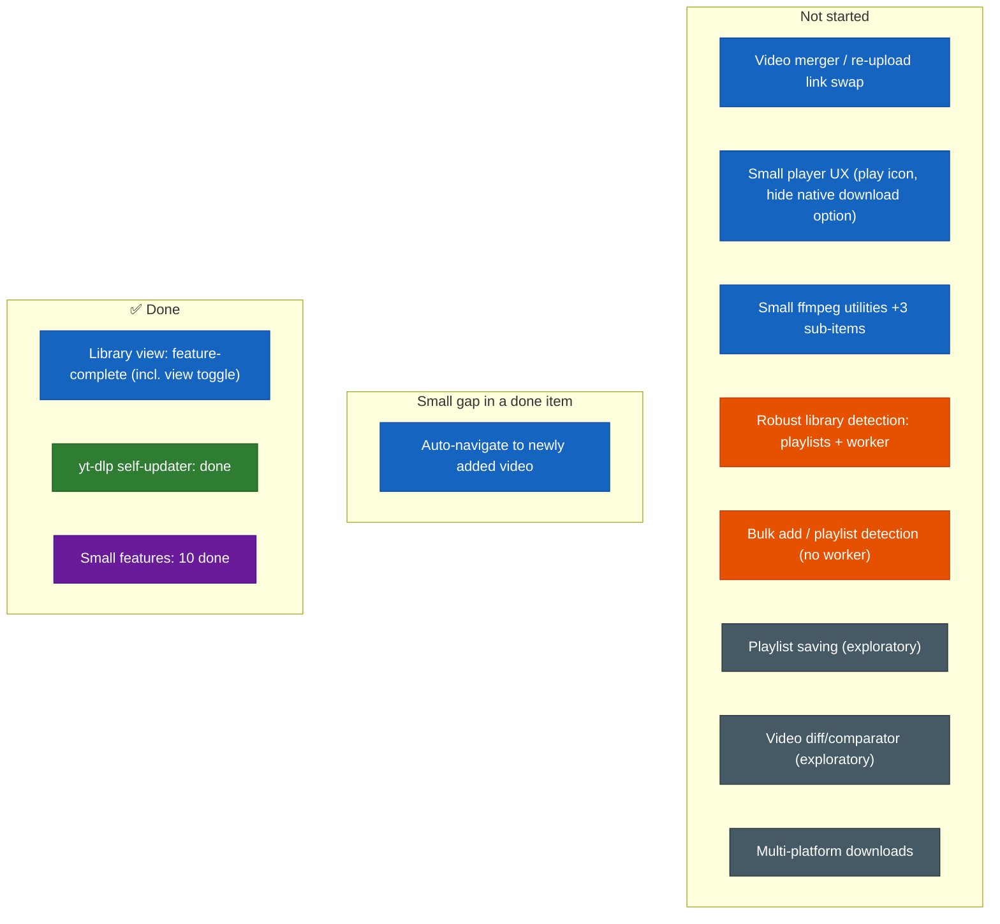

# Future Specs — Difficulty Feedback

Read-only assessment of the specs in `futureSpecs.md`, ranked against the current
state of the codebase. Doesn't modify that file — just notes here.

Housekeeping note *(2026-08-03)*: this file was pruned to stop it from growing
without bound — finished work is dropped down to a one-line mention (see
"Recently shipped" below) instead of keeping its full original write-up
around forever. The detailed reasoning for anything marked done still lives
in git history/commit messages if it's ever needed again.

## Index
- [Status at a glance](#status-glance) (the diagram + recently shipped)
- [Long shot ideas — need planning](#long-shot-ideas)
  - [Video diff/comparator](#video-diff-comparator)
  - [Multi-platform downloads](#multi-platform-downloads)
  - [Playlist saving](#playlist-saving)
- [1. Library view](#library-view)
- [2. yt-dlp updater](#ytdlp-updater) — ✅ done
- [3. Robust library detection](#robust-library-detection) (playlist bulk-add + background worker)
- [4. Bulk add and playlist detection (no worker)](#bulk-add)
- [Small features and corrections](#small-features)

## Status at a glance

Color = which spec an item belongs to (same color wherever it shows up, regardless
of status); position = status (done/partial/todo/deferred). Legend:
🔵 Library view · 🟢 yt-dlp updater · 🟠 Robust library detection (playlists) ·
🟣 App-wide small features · ⚫ Long-shot ideas

**Recently shipped (2026-08-03):**
- MP3 downloads are now a separate, coexisting artifact per video version (own file slot, own metadata field, own instrument-panel controls/player) instead of replacing the video-quality slot — `futureSpecs.md` item 12.
- Video thumbnails are now cached locally (video-level, shared across every version) and used as the local `<video>` element's poster plus every thumbnail-display spot in the Library view, so they work offline — `futureSpecs.md` item 10.
- Fixed three tester-reported bugs: MP3 downloads failing outright in the Library view, MP3 sometimes saving with a wrong file extension (seen on Windows), and inaccurate filesize estimates (a duration-math bug, an MP3 bitrate mismatch against the real encoder setting, a missing audio-track size on video estimates, and a dead/unwired estimate function).
- Fixed a channel-icon/thumbnail staleness gap: the background fetch after "add to library" is fire-and-forget by design, and previously only got picked up on the next manual refresh or re-navigation — an already-open Library tab now gets notified and resyncs on its own once the fetch finishes.
- Library-view UI polish: instrument panel restructured into one grouped Card, version selector relocated there with a per-version downloaded-file indicator, description moved into a bounded/scrollable container, upload date moved into the header as a Chip.

## Long shot ideas — need planning

### Video diff/comparator

**Overall: Very High / exploratory** — a research problem before it's an engineering
one. Its prerequisite (multi-version tracking) is built, so nothing blocks starting
this, but the rating doesn't change: the hard part was always the comparison
mechanism itself, not the versioning scaffolding around it.

| Piece | Difficulty | Why |
|---|---|---|
| Transcript/caption-based diff | Medium | yt-dlp can already fetch auto-generated or manual captions (`--write-auto-sub`/`--write-subs`, VTT/SRT) where available, and a text diff (Myers algorithm — bounded, well-understood, no new dependency needed) over two transcripts is buildable. But it's a real approximation: not every video has captions, auto-generated ones vary between fetches even for identical audio, and it only ever detects *spoken/captioned wording* differences. |
| True content-level diff (frame/audio fingerprinting) | Very High | Needs frame extraction (ffmpeg, already bundled) plus perceptual hashing per interval, or audio fingerprinting (chromaprint/AcoustID-style) — none of which exist in this project today, and pulling them in means new dependencies this project has otherwise deliberately avoided. Genuinely open-ended multimedia-analysis territory. |
| Timestamped report UI | Low-Medium | Once *some* diff data exists in either form above, presenting it as a timestamped list is straightforward composition. |

**Recommendation if this ever gets picked up:** scope a v1 to transcript-only diffing and be explicit it's an approximation, rather than attempting true content-level comparison first.

### Multi-platform downloads (SoundCloud/TikTok/Instagram/Twitter)

**Overall: Medium-High mechanical, High end-to-end once per-platform reliability is factored in.** yt-dlp already supports all four sites natively — every download call already just shells out to yt-dlp with a URL — and `isValidUrl` is already a fully generic `new URL(...)` check, not YouTube-specific.

| Piece | Difficulty | Why |
|---|---|---|
| URL validation | None needed | Already generic. |
| Generalizing metadata reshaping | Medium | `reshapeVideoInfo` (`main.js`) currently assumes fields exist in the shapes yt-dlp's YouTube extractor happens to populate — needs defensive fallbacks for other extractors' thinner/different info-dicts, not a rewrite. |
| YouTube iframe embed fallback | Doesn't generalize | `YouTubeEmbed` is hardcoded to `youtube-nocookie.com/embed/{videoId}`; other platforms don't offer an equivalent simple embed-by-ID scheme. Realistic options: drop the live preview for non-YouTube platforms, or investigate each platform's own oEmbed support separately. |
| Bot-detection/auth reliability | High, and ongoing | TikTok/Instagram are known for aggressive, frequently-changing bot detection. The existing cookie-paste feature (and TD-006) is framed entirely around YouTube's own detection message; other platforms need their own auth handling and continued maintenance. |
| Branding/scope | Not code | The app is named "yt-archiver"/"YouTube Archiver" throughout — broadening scope is a product decision as much as an engineering one. |

**Recommendation:** scope as "YouTube gets the full experience, other platforms get download-only with no live preview" rather than promising parity from day one.

### Playlist saving

**Overall: Medium-High** — the mechanical pieces are cheap reuse of things this
codebase already does; what makes this "need planning" rather than a normal feature
is that a *playlist* would be a genuinely new first-class concept. Today the library
only models channel → video → epoch — there's nowhere for "an ordered list of videos,
kept in sync with what YouTube says the order is" to live.

| Piece | Difficulty | Why |
|---|---|---|
| Fetching a playlist's video list + order | Low | Exact same `--flat-playlist` yt-dlp pattern already used for the channel-avatar lookup (`fetchChannelAvatarUrl`, `main.js`) and for the bulk-add item below — just without the `--playlist-end 1` cap, so every entry (and its order) comes back in one call. |
| Dedup against the existing library | Low | `findVideoInIndex`/`findLibraryVideo` already match purely by `videoId` — reusable as-is, no change needed. |
| Persisting the playlist itself (order, membership, a name) | Medium | A real new storage shape, not an extension of the existing one — something like `<libraryDir>/.playlists/<playlistId>/metadata.json` holding an ordered `videoId[]` plus the playlist's own title, alongside a new `scanPlaylists()`-style read path and its own IPC surface. Small in isolation, but it's new plumbing, not reuse. |
| Staying in sync with YouTube over time | **The actual open design question** | The spec doesn't say whether this is a one-time snapshot (saved once, never touched again even if the real playlist changes) or something that re-syncs later (video added/removed/reordered upstream). Those are very different amounts of work — a snapshot is just "fetch once, write once"; live sync means re-fetching, diffing against the saved order, and deciding what to do about videos that disappeared from the source playlist but are still in the local library. Worth deciding before building, since it changes the shape of the stored data too. |

**Recommendation:** scope v1 as a one-time snapshot (matches "saved in the exact order
they came from YouTube" in the spec text literally) and treat live re-sync as a
separate, later decision rather than assuming it up front.

## 1. Library view

**Status: feature-complete** for the core single-video loop (browse → add → download
→ play → delete → version → MP3-as-separate-download), including offline-capable
thumbnails (see Recently shipped above). The channel-vs-video view toggle is also
done now (built directly, not itemized further per the no-bloat rule — `viewMode`/
`setLibraryViewMode` in `LibraryScreen.tsx`/`main.js`). Everything from the original
spec is done except the item below.

| Piece | Difficulty | Why |
|---|---|---|
| Small player UX (item 11: play-icon overlay, hide the native "Download" option) | Low | The "3 dot menu" is Chromium's own native `<video>` controls overlay, not custom UI — suppressing its Download entry is a one-line `controlsList="nodownload"` attribute on the `<video>` element (`LibraryVideoPlayer.tsx`), no new component needed. The play-icon overlay is a small composition addition over the same element (a centered `IconButton`, hidden once playback starts). |
| Small ffmpeg utilities on already-downloaded library files (extract MP3, convert format, embed thumbnail, embed metadata, extract clip) | Low, per original two items — see below for the three sub-items | The infrastructure it needs already exists and is proven: `runFfmpegWithProgress()` and the ffprobe-duration helper (`main.js`) already do "run ffmpeg on a local file with real progress." Pointing that same helper at an *already-downloaded* library file instead of a fresh raw one is a small, low-risk reuse. Where the output lives has a real precedent now too: "download different quality" landed on delete-old-and-rename-into-the-deterministic-slot. |

**The three ffmpeg sub-items**, assessed individually:
- **Embed metadata** (title/channel/date/description via ffmpeg's `-metadata` flags): **Low** — a pure remux, no re-encode needed, all the data's already sitting in `metadata.json`.
- **Embed thumbnail into MP3**: **Low-Medium** — now genuinely cheaper than when this was first assessed, since thumbnails are already downloaded and cached locally (see Recently shipped) — no new "fetch the image" step needed, just attach the already-local file as MP3 cover art.
- **Extract clip** (start/stop trim): **Medium** — needs a start/end-timestamp picker UI (could reuse the player's own scrubber via "mark in"/"mark out" buttons) plus a real UX tradeoff: fast stream-copy trimming (`-c copy`) snaps to the nearest keyframe rather than an exact frame, versus a slower full re-encode for frame-accurate cuts.

**One small gap inside otherwise-done work, not yet closed:** auto-navigate to the
newly added video after a successful "add to library" — today a successful add just
clears the Downloader form and shows a success toast; the notification badge is the
interim substitute, not a replacement.

**On the metadata-format question** (files vs. something else): still the right call
— no new dependency, human-readable, greppable, trivially portable. The in-memory
index (scan once, refresh on demand) is what keeps this from getting expensive as
the library grows; whether to also persist that index to a single cache file
(`<base>/.index.json`) for very large libraries is the one open question left, not
needed at current scale.

## 2. yt-dlp updater — ✅ done

**Resolved — 2026-08-02.** On-device PyInstaller rebuild triggered by the updater
(fetches a standalone Python runtime lazily on first actual update, pip-installs the
latest yt-dlp from PyPI, re-runs the same freeze recipe locally); `ytdlp-bin`
relocated to `userData` so the result is writable/swappable without elevation. See
git history for the original three-option difficulty analysis and the full shipped
design.

## 3. Robust library detection (playlist bulk-add + background worker)

**Overall: Very High** — comparable in scope to the original Library view estimate,
not an incremental feature on top of it. The reason isn't any single hard algorithm,
it's that this is the first feature in the app that needs a job that keeps running
and reporting progress *independent of whichever tab/screen happens to be mounted* —
nothing built so far does that. Today's "live progress" patterns (`progressUpdate`
for a single download, `ytdlpUpdateProgress` for the updater) are all one-shot
broadcasts tied to a component that's on-screen while it happens.

| Piece | Difficulty | Why |
|---|---|---|
| Playlist link → flat entry listing | Medium | A genuinely new yt-dlp invocation (`--flat-playlist`), separate from the existing single-video `getVideoInfoPython` path — a much thinner JSON shape, needs its own parsing. |
| Add-playlist dialog (link, "download on load" toggle, quality picker) | Low | Standard composition, same pattern as the existing cookie/duplicate-match dialogs. |
| Background job manager (queue state, sequential processing, survives tab navigation) | Very High | The architectural core, and the piece everything else depends on. Needs to live in the main process, with the renderer subscribing via IPC events to a queue snapshot — new territory, not an extension of an existing pattern. |
| Per-video metadata fetch inside the worker loop | Medium | Can reuse `getVideoInfoPython`'s fetch logic and the video-info cache, but needs to run sequentially/throttled with per-item error isolation. |
| Quality-matching (hardcoded preferred quality → closest available per video) | Low-Medium | Sort a video's `resolutions` list, pick the closest to the requested target. Only real open question is tie-breaking direction. |
| Add-to-library + download orchestration per queue item | Low | Reuses `writeLibraryEntry`, the download pipeline, `recordLibraryDownload` — the worker just calls them in a loop. |
| Cancel an in-flight yt-dlp process | High | Doesn't exist anywhere today — `downloadVideoWithProgressUpdates` never retains a reference to the child process for later killing, and TD-008 (`reports/TechnicalDebt.md`) means progress isn't even scoped per-download yet either, worth fixing alongside this. |
| Post-stop cleanup ("delete everything this run created?") | Medium | Builds on `deleteLibraryEntry`'s existing guard-railed recursive delete — the worker keeps an in-memory list of `videoDir`s created *this run* and offers to delete exactly those. |
| Side panel UI (queue list, per-item progress bars, stop button) | Medium | Composition work once the job manager's IPC events exist to drive it. |
| System notification on completion | Low | Electron's built-in `Notification` API, no new dependency. |
| Bot-detection/rate-limiting risk while looping over many videos | Cross-cutting risk | Fetching a whole playlist's metadata back-to-back is exactly the burst pattern that trips detection. The video-info cache and cookie auth help, but the worker likely needs an explicit delay/backoff parameter between per-video fetches. |

**Open questions worth deciding before building:**
1. Per-item failure handling — skip-and-continue, or abort the whole batch?
2. Rate-limiting parameter — an actual delay/backoff number, not "be careful."
3. Cancel semantics — kill the in-flight process immediately, or finish the current video first? The spec's wording reads like an immediate kill, the harder of the two.
4. Quality tie-breaking — round up or down when the exact requested quality isn't available.

**Suggested build order:** playlist flat-listing → add-playlist dialog (metadata-only,
no auto-download yet) → job manager skeleton (queue + sequential add-to-library only)
→ wire in download-on-load → quality-matching → side panel UI → cancellation plumbing
→ stop+cleanup flow → system notification.

## 4. Bulk add and playlist detection (no background worker)

**Overall: Medium-High — meaningfully cheaper than item 3 above, on purpose.**
This overlaps a lot with "Robust library detection," but the spec text explicitly
opts out of the one piece that made that item Very High: a job that survives tab
navigation and app lifecycle from the main process. Here, "always interactable"
just means the sidepanel is a persistent, always-mounted layout element (not tied
to the Library tab specifically) — which means its queue state can live in a plain
renderer-side React Context, the same `useLibraryNotifications`/`useYtdlpUpdaterState`
provider pattern already used twice in this codebase, instead of new main-process
job-manager infrastructure. Sequential-by-design also means this never runs into
**TD-008** (`reports/TechnicalDebt.md`, the shared-progress-channel limitation) —
that only bites two *simultaneous* downloads, and nothing here asks for that.

| Piece | Difficulty | Why |
|---|---|---|
| Parsing bulk input (playlist link vs. comma/newline-separated list) | Low | Detect a playlist URL vs. a delimiter-separated list, split accordingly. Playlist URLs reuse the same `--flat-playlist` yt-dlp pattern already established (`fetchChannelAvatarUrl`, `main.js`) to list every entry in one call. |
| YouTube Data API investigation (instead of yt-dlp) for playlist listing | Medium research, real new territory | The real API for this is YouTube Data API v3's `playlistItems.list` — but it needs an API key tied to a Google Cloud project (this app currently has zero external API credentials to manage — cookies and yt-dlp itself are the only "auth" surfaces today) and is subject to a daily quota (free tier: 10,000 units/day, listing calls are cheap and paginated 50-at-a-time, so feasible at personal scale). Worth being honest about the actual payoff too: a single `yt-dlp --flat-playlist` call already lists an entire playlist in one request, so the marginal win is specifically about *not* triggering yt-dlp-flavored bot detection on that call, not about raw call count. Real tradeoff to decide deliberately, not a given. |
| Persistent, always-visible sidepanel (new layout-level UI, not tied to one tab) | Medium | A genuinely new structural pattern — nothing in this app today renders outside the tab-switching area in `MainPage.tsx`. Composition-heavy once decided (a permanently-mounted `Drawer`/`Collapse`), not deeply technical. |
| Per-item queue state (pending/downloading/failed/done), retry/delete per entry | Low-Medium | Ordinary list-state management once the sidepanel exists — comparable complexity to the existing grid-card list UI, nothing new architecturally. |
| Sequential add-to-library + download orchestration, in source order | Low | Reuses the exact same primitives the original Robust-library-detection assessment already identified — `writeLibraryEntry`, the download pipeline, `recordLibraryDownload` — just called in a loop from the renderer instead of a main-process worker. |
| Dedup against the existing library | Low | Same `findVideoInIndex`/`findLibraryVideo` reuse as Playlist saving above. |
| Per-item retry / stop | Low | No process-kill tracking needed (unlike item 3's cancellation piece) — "stop" here just means "don't start the next queued item," and a retry is just re-running that one item's own fetch+download. |

**Relationship to item 3 (Robust library detection):** these read as two different
answers to the same underlying want (bulk/playlist ingestion), not sequential
phases of one feature. This lighter version could reasonably ship first and either
turn out sufficient on its own, or double as a stepping stone if the heavier
background-worker version (survives app restart, works from any tab without the
panel open) still ends up wanted later.

**Open question:** same "per-item failure handling" and "quality tie-breaking"
questions item 3 already raised apply here too — worth deciding once, not twice,
if both ever get built.

### Small features and corrections

| Item | Difficulty | Why |
|---|---|---|
| 9. Video merger (re-uploaded/re-edited video → swap primary link, keep the old one as a legacy version) | Medium, now that its prerequisite is built | Version control landed, so the schema this item needed is no longer a blocker. The remaining delta is small — a "link a replacement URL" dialog that fetches the new video and adds it as a new epoch under the existing entry, plus a status label distinguishing "current" from "legacy." |

Items 1-8 and the "resume a failed download" nice-to-have are all done — see Recently
shipped above / git history for how.
