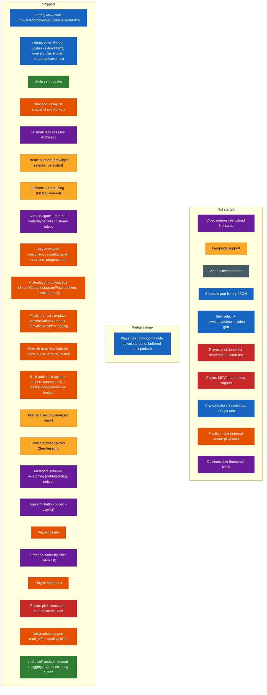

# Future Specs — Difficulty Feedback

Read-only assessment of the specs in `futureSpecs.md`, ranked against the current
state of the codebase. Doesn't modify that file — just notes here.

This file mirrors `futureSpecs.md`'s own section structure (Long shot ideas, Big
features, QoL features, Small features and corrections) so the two stay easy to
compare side by side. Items that are fully shipped get removed from `futureSpecs.md`
directly rather than kept there as a "done" marker — this file is where their
completion is recorded instead, down in [Archived](#archived), so that history isn't
lost when the backlog gets trimmed. The sections above Archived are meant to stay
short and scannable: only what's still actually open.

**2026-08-20 pass:** three new `futureSpecs.md` items assessed this pass — **Clip
collection** and **Playlist mode** (both Big features), and **Customizable thumbnail
sizes** (Small features). None have any code behind them yet; see their own sections
below. Also logged (not a tracked spec item, came up as a direct bug report):
**yt-dlp self-update reliability** — the update flow had no timeout anywhere and
never wrote to `main.log`, so a real reported hang ("stuck at Setting up build
tools") left zero trail on either the working or non-working machine. Fixed with a
bounded timeout on every network/subprocess step plus logging threaded through all
of them, and an "Open error log" button added directly to the update-failed screen.
See [Archived](#archived) for the full writeup.

**2026-08-15 cleanup:** `futureSpecs.md` was carrying five stale entries this file
had already flagged shipped across earlier passes — **Multi-platform downloads**,
**Playlist refresh/versioning**, and all three **Bugs found** entries. All five are
now removed from `futureSpecs.md` directly (this pass, per the user's explicit
"review and keep it lean" request). Their write-ups stay below/in
[Archived](#archived) as the durable record; the "still present, safe to remove"
caveats that used to sit on them are gone now that the removal actually happened.
Also logged this pass: Dailymotion download support (`curl_cffi` impersonation
bundled into the frozen yt-dlp binary) and a per-resolution quality picker for it —
neither was ever a tracked `futureSpecs.md` item (came up as a direct question, not
a backlog pick), but it's real shipped work worth the same durable record — see
[Archived](#archived).

**Prior updates, for context:** 2026-08-12 shipped the cookie-picker "Clear" quirk,
metadata schema versioning, and the copy-link button (all removed from
`futureSpecs.md` that same day). 2026-08-13/14 shipped playlist delete, playlist
thumbnail, the ordering/"order by" filter, and the "pick timestamp" half of
[Player customization](#player-customization) (the other half, click-to-select
directly on the scrub bar, is still genuinely open — see that section). All of
these are detailed in the dated log under [Archived](#archived).

## Index
- [Status at a glance](#status-glance) (diagram)
- [Long shot ideas — need planning](#long-shot-ideas)
  - [Video diff/comparator](#video-diff-comparator)
  - [~~Multi-platform downloads~~ — shipped](#multi-platform-downloads)
  - [~~Playlist refresh/versioning~~ — shipped](#playlist-refresh)
- [Big features](#big-features)
  - [Export/Import library JSON](#export-import-json)
  - [Bulk select + download/delete](#bulk-select)
  - [Player customization (pick timestamp) — partially shipped](#player-customization)
  - [More resilient embedded player / MKV support](#resilient-player)
  - [Clip collection](#clip-collection)
  - [Playlist mode (internal queue playback)](#playlist-mode)
- [QoL features](#qol-features)
  - [Language support](#language-support)
  - [~~Cookie browser-picker "Clear" quirk~~ — shipped](#cookie-picker-quirk)
  - [~~Delete feature for playlists~~ — shipped](#playlist-delete)
- [Small features and corrections](#small-features)
  - [Video merger](#video-merger)
  - [Player UX](#player-ux)
  - [Customizable thumbnail sizes](#thumbnail-sizes)
  - [~~Metadata schema versioning~~ — shipped](#schema-versioning)
  - [~~Copy-link button~~ — shipped](#copy-link)
  - [~~Ordering/"order by" filter~~ — shipped](#ordering-filter)
  - [~~Playlist thumbnail~~ — shipped](#playlist-thumbnail)
- [Archived — shipped work, dated log](#archived)

## Status at a glance

Color = which section of `futureSpecs.md` an item belongs to (or belonged to,
before shipping). Position = status. Legend:
🔵 Library view · 🟢 yt-dlp updater · 🟠 Playlists/bulk-add · 🟣 Small features ·
🟡 QoL · ⚫ Long-shot ideas · 🔴 Big features (player)

## Long shot ideas — need planning

### Video diff/comparator

**Overall: Very High / exploratory** — a research problem before it's an engineering
one. Its prerequisite (multi-version tracking) is built, so nothing blocks starting
this, but the rating doesn't change: the hard part was always the comparison
mechanism itself, not the versioning scaffolding around it. **Unchanged this pass** —
no code in this area since the last assessment.

| Piece | Difficulty | Why |
|---|---|---|
| Transcript/caption-based diff | Medium | yt-dlp can already fetch auto-generated or manual captions (`--write-auto-sub`/`--write-subs`, VTT/SRT) where available, and a text diff (Myers algorithm — bounded, well-understood, no new dependency needed) over two transcripts is buildable. But it's a real approximation: not every video has captions, auto-generated ones vary between fetches even for identical audio, and it only ever detects *spoken/captioned wording* differences. |
| True content-level diff (frame/audio fingerprinting) | Very High | Needs frame extraction (ffmpeg, already bundled) plus perceptual hashing per interval, or audio fingerprinting (chromaprint/AcoustID-style) — none of which exist in this project today, and pulling them in means new dependencies this project has otherwise deliberately avoided. Genuinely open-ended multimedia-analysis territory. |
| Timestamped report UI | Low-Medium | Once *some* diff data exists in either form above, presenting it as a timestamped list is straightforward composition. |

**Recommendation if this ever gets picked up:** scope a v1 to transcript-only diffing and be explicit it's an approximation, rather than attempting true content-level comparison first.

### ~~Multi-platform downloads (SoundCloud/TikTok/Instagram/Twitter)~~ — SHIPPED

Landed 2026-08-08 (single commit) as scoped, matching the prior assessment's own
recommendation almost exactly: YouTube keeps the full experience, other platforms
get a simplified download-only card, no live preview. See
[Archived](#archived) for what actually shipped, incl. two follow-up refinements
(platform tag, SoundCloud MP3-default + embed-metadata) done the same pass, and
Dailymotion added as a fifth supported platform on 2026-08-15. Removed from
`futureSpecs.md` directly 2026-08-15.

### ~~Playlist refresh/versioning~~ — SHIPPED (different shape than assessed)

Landed 2026-08-08. Worth flagging that the *actual* design diverged from this file's
prior recommendation ("land refresh creates a new epoch, old ones kept, matches how
video versioning already works") — the real implementation instead reconciles
**in place** with a single undo step (`reconcilePlaylistSnapshot` backs up the prior
`metadata.json` to a sibling `previousMetadata.json` before overwriting, and
`undoPlaylistRefresh` reverts once). This was a deliberate scope call made during
that session (documented directly in `reconcilePlaylistSnapshot`'s own comment:
"versioning was explicitly ruled out in favor of reconciling in place with a single
undo step"), not an oversight — multi-epoch playlist versioning (the "compare a
playlist's membership/order over time" idea from the original assessment) is still
genuinely not built, so treat that specific sub-idea as still open if it ever comes
back up, distinct from "refresh" itself which is done. See
[Archived](#archived) for the full shipped scope (added/removed/updated counts,
per-entry "Not on YouTube" tagging on top of the reconciliation itself). Removed
from `futureSpecs.md` directly 2026-08-15.

## Big features

Export/Import JSON and Bulk select are unchanged. Player customization's
"pick timestamp" half shipped 2026-08-14 — see below for what's still open there.
Resilient player/MKV support is unchanged. Two brand new items this pass — Clip
collection and Playlist mode — assessed below.

### Export/Import library JSON

**Overall: Medium** — export is a near-trivial reuse of what already exists; import's
mechanics are also mostly reuse, but importing into a library that already has data
raises real, unresolved design questions. **Unchanged this pass.**

| Piece | Difficulty | Why |
|---|---|---|
| Export itself | Low | `scanLibrary()`/`getLibraryIndex()` (`library.mjs`) already walk the entire library tree and build exactly the JSON-serializable shape this needs (every channel → video → epoch → `metadata.json` contents). Export is "call that, write it to a file the user picks" — same save-dialog pattern already used for downloads. Including playlist snapshots too (`playlists/<id>/<epoch>/metadata.json`) is the same reuse, just a second tree walk. |
| Import — recreating the folder/metadata structure | Medium | Needs a new `library.mjs` write path that reconstructs `<channel>/<video>/<epoch>/metadata.json` directly from provided metadata, bypassing the normal "fetch from yt-dlp then write" flow every existing write path (`writeLibraryEntry`, `addLibraryVersion`, etc.) assumes. Not hard, but genuinely new code, not a reuse. |
| Import — local file paths don't transfer | Medium, real decision needed | `downloadedFilePath`/`downloadedAudioFilePath` in each `metadata.json` are absolute paths on the machine that downloaded them — meaningless (and possibly misleading, if a same-named path happens to exist) on the importing machine. These need to be explicitly nulled out on import so the UI correctly shows "not downloaded" and offers a real download button, rather than trying to preserve a reference to a file that was never actually transferred. This is a one-line fix once decided, but it's a decision, not an implementation detail — worth confirming "metadata-only, not a full file backup" is really the intent before building. |
| Import — collisions with an existing library | Medium-High | The real open question: importing into a library that already has some of the same videos. Skip duplicates by videoId? Overwrite? Add as a new version, same as the existing per-video versioning model? This is the same class of question already resolved for playlist refresh (in-place reconciliation, see above) — worth deciding whether whole-library import should follow that same "reconcile in place" precedent or a different one. |
| Thumbnails/channel icons | Low | Not part of `metadata.json`, so not part of the export by default — but this is actually fine as-is: `ensureVideoThumbnail`/`ensureChannelIcon` (`main.js`) already fire-and-forget re-fetch any missing thumbnail/icon on the next scan, so an imported library just self-heals its images on first load rather than needing them bundled into the export. |

**Recommendation:** nail down the two open decisions first (local-path handling, collision policy — the playlist-refresh precedent above is a reasonable default to point to for the second one) before writing any code. Once decided, land export alone first (it's genuinely low-risk and useful on its own as a backup/audit tool even before import exists), then import as a separate pass.

### Select bulk controllers and download/download all

**Overall: Medium** — most of the hard infrastructure this needs was built (bulk
queue concurrency, per-item progress, retry/skip semantics) for an unrelated reason;
what's actually net-new is smaller than the spec text suggests. **Unchanged this
pass**, though the bulk queue itself is now more battle-tested (two real bugs fixed
in it since — see [Archived](#archived)), which lowers integration risk slightly.

| Piece | Difficulty | Why |
|---|---|---|
| Multi-select UI in the video grid | Medium | New state (a selection set keyed by `videoDir`), checkbox overlays on video cards, a "select mode" toggle, and a contextual action bar for the selection-specific buttons. Standard, well-understood pattern (file managers, email clients), just not built here yet. |
| "Download selected" → feeding the bulk queue | Low-Medium | The spec calls out needing "an identifier between a download job in the side panel and an add-to-library job that doesn't require a download" — this is already solved, not new: `useBulkAddQueue`'s `download: boolean` batch option already models exactly that distinction, and `getRetryStage`'s "resume straight at download" branch is already the precedent for seeding a queue item with a known `videoDir`/`epoch`/`resolution` and skipping the fetch/add phase entirely (since these videos are already in the library). Selected-but-undownloaded videos map onto that existing path almost directly. |
| "Download selected" visibility rule | Low | A derived boolean over the selection set (`every video in selection has no downloadedFilePath`) — plain composition, no new data needed. |
| "Delete all selected" | Low | Loops the existing single-video `deleteLibraryEntry` (already used by the per-video delete flow) over the selected `videoDir`s, behind a confirm dialog generalized from the existing single-delete one. |

**Recommendation:** build the multi-select UI first (it's the only genuinely new piece), then wire "download selected" through the bulk queue's existing `download: boolean` + resume-at-download path rather than inventing a second queue-feeding mechanism.

### Player customization (pick-timestamp for the clip tool) — PARTIALLY SHIPPED

The "Set as start/end" half landed 2026-08-14, exactly as scoped below: `LibraryVideoPlayer.tsx`
is now a `forwardRef` component exposing `getCurrentTime(): number | null` (null when
there's no active local `<video>` element mounted — nothing downloaded yet, or an
unplayable container), and `LibraryVideoDetail.tsx` added a small clock-icon button
before each of the clip Start/End fields that reads that handle and drops the
(whole-second-rounded) result straight into the field via the existing
`formatSecondsAsClipTimestamp` helper. Both buttons share the clip fields' own
`ffmpegControlsDisabled` gate. `futureSpecs.md`'s Big-features item 3 was reworded
(not removed) to reflect that only the remaining half is still open.

**Still open — Overall: Medium, scope-dependent.**

| Piece | Difficulty | Why |
|---|---|---|
| Drag/click-to-select start and end directly on the scrub bar | Medium | Native `<video controls>` doesn't expose a customizable range-selection UI at all — this would mean either overlaying a custom range-select control on top of (or instead of) the native scrub bar, which overlaps directly with [Player UX](#player-ux)'s already-parked "remove native controls, build a custom player" conclusion below. Worth deciding these two together rather than separately, since building custom controls for one and not the other would be wasted, divergent work. |

**Recommendation:** treat this as the same future "personalize the player" push
[Player UX](#player-ux) already flags as the only real path left there — don't build
custom scrub-bar controls for this alone.

### More resilient embedded player / MKV support

**New this pass.** **Overall: Medium-High** — not blocked on anything missing, but
every real option costs something (new dependency, extra disk/CPU work, or scope
narrowing), and this project has a consistent, deliberate preference for avoiding
new dependencies where possible.

**Confirmed directly:** `LibraryVideoPlayer.tsx`'s `PLAYABLE_VIDEO_EXTENSIONS` is
already just `{'mp4', 'webm'}` (line 19) — everything else (MKV included) already
falls into the existing "can't preview, download only" path (`isKnownUnplayable`),
so this isn't a bug to fix, it's a real gap to close.

| Piece | Difficulty | Why |
|---|---|---|
| Why MKV doesn't just work today | — (context) | Chromium's `<video>` element has no MKV **container** demuxer at all, regardless of the codecs inside it (H.264/AAC in an MKV still won't play) — this is a browser-engine limitation, not something fixable from this app's own code. |
| Option A: on-the-fly remux to MP4/WebM for preview only | Medium | Reuses the exact ffmpeg pipeline the "Convert to a different format" tool already has (`runFfmpegWithProgress`, bundled ffmpeg) — a fast `-c copy` remux (no re-encode) works whenever the MKV's internal codecs are already MP4/WebM-compatible (common case: H.264+AAC → MP4 remux is typically sub-second). Needs a decision on *when* this runs (on first play, cached alongside the original? on download-complete, always?) and a fallback for the case where the codecs genuinely aren't remux-compatible (VP9-in-MKV missing an MP4-safe profile, some obscure codec) — that case still needs a real re-encode, which is slow and not truly "instant preview" anymore. |
| Option B: in-browser demux/decode (ffmpeg.wasm or similar) | High, and a real new-dependency cost | Would let literally any container/codec play without any server-side preprocessing, but pulls in a large (multi-MB) WASM dependency this project has consistently avoided elsewhere (see `copy-electron.mjs`'s own comment about dropping `cpx` for the same reason, cited in the language-support assessment too) — real bundle-size and maintenance cost for a feature that Option A can mostly cover already. |
| Option C: narrow the ask — just detect+remux MKV specifically, not "any codec" | Low-Medium | A scoped version of Option A: MKV is explicitly named in the spec, not "arbitrary future containers" — if the real goal is "my MKV downloads preview like everything else," a targeted `if (ext === 'mkv') remux-then-play` path is meaningfully smaller than a general "more resilient player" effort. |

**Recommendation:** scope this to Option C (MKV specifically, via the existing ffmpeg remux pipeline) rather than the more open-ended "more codecs" framing in the spec text — it reuses infrastructure that already exists and ships the concrete, named pain point (MKV) without taking on a new dependency or an open-ended "support everything" commitment.

### Clip collection

**New this pass.** **Overall: Medium** — the ffmpeg mechanics are a pure reuse of
what already exists; what's actually new is a storage location one level up from
anything else in this app, plus a whole new list/detail UI to browse the result.

**Confirmed directly against the current code:** "Extract clip" today
(`handleExtractClip`, `LibraryVideoDetail.tsx`) is a pure one-shot export — it always
goes through a save-file dialog (`saveExportedFile`) to a location the user picks
outside the library entirely, and the app never records that a clip was made at all.
There is no clip tracking, storage, or listing anywhere in the codebase today; this
is a genuinely new capability, not an extension of an existing one.

| Piece | Difficulty | Why |
|---|---|---|
| Saving a clip into the library instead of exporting it | Low-Medium | `runFfmpegWithProgress`/the extract-clip ffmpeg invocation (`main.js`) is unchanged — only the output path changes, from a user-picked save-dialog path to a deterministic `<videoDir>/clips/<clipId>.<ext>` path. `videoDir` (channel/videoId level) is already exactly the right unit, per the spec's own "videoID level, not inside the epoch folder" framing — every version of a video shares one clip collection, which matches how a clip is conceptually "of the video," not of one specific downloaded quality. |
| A metadata record per clip | Low | New, small — a `clips/<clipId>.json` (or one `clips/index.json` covering all of a video's clips) holding at minimum source epoch, start/end timestamps, created-at epoch, and the output filename. Same shape of work as any other `library.mjs` metadata write, just a new file convention. |
| A "Clips" tab/view | Medium | New UI surface: could be a new top-level tab (sibling to Downloader/Library/Options) showing every clip across the whole library, or a per-video sub-section inside the existing video detail view (simpler, avoids a new cross-video aggregation read). The spec text ("collected in a clips tab where the user can see the list of clips") reads more like the former (library-wide), which needs a new `scanClips()`-style read path over every video's `clips/` folder, similar in shape to how `scanLibrary()` already walks channel/video/epoch. |
| Playback of a saved clip | Low | Reuses `LibraryVideoPlayer.tsx` as-is (it's already just a `<video>`/`<audio>` element pointed at a local file path) — a saved clip is just another local media file to hand it. |
| Deleting a saved clip | Low | Same `path.relative`-containment-checked delete pattern every other destructive library operation (`deleteLibraryEntry`, `deletePlaylistSnapshot`) already uses, scoped to the one clip file + its metadata record. |

**Open question worth deciding before building:** is "the Clips tab" library-wide
(every clip from every video, one flat list) or scoped per-video (a section within
each video's own detail view)? That decision changes whether this needs a new
top-level tab + a new whole-library scan, or stays entirely local to a video already
being viewed — the spec text leans library-wide, but a per-video section is
meaningfully cheaper and may satisfy the actual want just as well.

**Recommendation:** land the storage change first (clips saved into `<videoDir>/clips/`
instead of exported away) — that alone is useful even before any listing UI exists,
since the clip is now at least kept. Then decide the scope question above before
building the Clips tab itself.

### Playlist mode (internal queue playback)

**New this pass.** **Overall: Medium-High** — no genuinely hard algorithmic piece,
but it's a new cross-cutting concept (an ordered "now playing" queue) that today's
video detail view has no notion of at all, plus real UX design work (autoplay
timing, what "next" means when the next video isn't downloaded yet).

**Confirmed directly:** `LibraryVideoPlayer.tsx` has no `onEnded`/playback-completion
callback today (its `useImperativeHandle` only exposes `getCurrentTime()`), and
`LibraryScreen.tsx`'s `selectedVideo` is plain local component state with no
surrounding "queue" concept — navigating to a different video today always means
returning to the grid and picking again (or a one-directional deep link from
elsewhere in the app). There is nothing to build on here directly, but two of the
spec's own sub-features each point at data that already exists in the right shape:

| Piece | Difficulty | Why |
|---|---|---|
| Queue data structure + next/prev navigation UI | Medium | A new piece of state (an ordered `videoId[]` + current index) held somewhere above the video detail view, plus small arrow-button UI on that screen to move through it. Standard, well-understood pattern, just net-new here. |
| Autoplay-next once a video finishes | Medium | Needs `LibraryVideoPlayer.tsx` to actually expose an `onEnded` callback (it exposes nothing playback-lifecycle-related today) — a real, if small, addition to that component's own ref API. The harder part is UX, not code: what "autoplay next" means when the next queued video *isn't downloaded yet* needs a decision (skip it? prompt to download? block autoplay until it's local?) — the spec's own toggle ("enable/disable autoplay") only covers whether it happens at all, not what happens when the next item isn't ready. |
| "Play" playlist button (queue a whole saved playlist back-to-back) | Low, once the queue mechanism exists | A saved playlist snapshot's `entries` array (`library.mjs`) is already an ordered `videoId` list, produced by `--flat-playlist` in the exact order YouTube returns — this is already the right shape for a queue source, no new data needed. The only real gap: not every entry in a saved playlist is necessarily *in the library* yet (`localFiles[videoId]` can be null, per the earlier playlist-linking fix) — queuing needs to skip or otherwise handle entries with nothing local to play. |
| Context-based playlist from the current search/filter view | Low, once the queue mechanism exists | `LibraryScreen.tsx`'s flat video list already computes a `filtered`/sorted array reflecting exactly whatever's currently on screen (search query + sort field/direction) — handing that same ordered list to the queue as "play this search as a playlist" is direct reuse of state that already exists, not a new computation. |

**Open questions worth deciding before building:**
1. Where does "now playing" state live — global (survives navigating away and back, visible from anywhere) or scoped to the video detail view (reset if you leave it)? This affects whether next/prev controls need to be reachable from outside the detail screen itself.
2. Autoplay-next's behavior when the next item isn't downloaded, per above — this is a real product decision, not an implementation detail.
3. Does skipping to the next video re-navigate via the existing `/library/video/:videoId` route (consistent with how deep-linking already works, but changes the URL/back-button history on every "next" click) or update in place without touching the router?

**Recommendation:** decide the three questions above first — this is a case where the
"what should this actually do" design work is bigger than the mechanical
implementation once decided. The two sub-features (Play-playlist, context-playlist)
are both cheap once the core queue+next/prev mechanism exists, since both already
have their ordered-list data sitting ready to reuse.

## QoL features

Language support carries over unchanged. Both other items — the cookie
browser-picker quirk and playlist delete — have now shipped, see below.

### Language support (i18n / "strings" file)

**Overall: Medium-High.** Not conceptually hard, but it's a wide pass over the UI,
not a contained module — and it's the first feature in this app that creates an
ongoing tax on every future PR that adds user-facing text. **Unchanged this pass.**

| Piece | Difficulty | Why |
|---|---|---|
| Choosing a format/mechanism | Low | No need for a heavy library (`react-i18next` etc.) at this app's scale — a flat `{ key: string }` JSON file per language plus a small lookup hook (e.g. `useStrings()` returning a `t(key)` function) is enough, and matches this project's consistent preference for zero new dependencies where one can be avoided (see `copy-electron.mjs`'s own comment about dropping `cpx` for exactly this reason). |
| Extracting existing strings | Medium-High, mechanical but wide | User-facing text (`Typography`, `Button` labels, `Tooltip` titles, `placeholder`s) is hardcoded straight into JSX across every screen and dialog today. Not hard per-string, but it's a real pass over most of the UI tree, not something that stays contained to one module — and the UI surface has only grown since the last assessment (multi-platform download card, playlist view, "Not on YouTube" tags, etc.), so the pass is wider now than it was last time this was scored. |
| Language switcher + persistence | Low | Same settings pattern as every other persisted option in this app — a new `settings:getLanguage`/`settings:setLanguage` pair and a dropdown in Options. |
| Ongoing maintenance cost | Real, ongoing, not a one-time cost | Every future PR that adds or changes user-facing text now needs a key added to the strings file(s) too — a standing discipline cost this project doesn't pay today, worth being explicit about before committing to it. |

**Recommendation:** scope v1 to English + exactly one second language, to prove the
extraction mechanism and lookup hook end-to-end without committing to full parity
across many languages immediately — expanding language coverage afterward is just
adding more JSON files, not more engineering.

### ~~Cookie browser-picker "Clear" quirk~~ — SHIPPED

Landed 2026-08-12, same day it was assessed — exactly as scoped: `handleModeChange`
now clears `cookiesBrowser` (state + persisted config) when switching away from
browser mode, and a new "Clear" button reverts the selection to none without leaving
browser mode. See [Archived](#archived) for the one real backend wrinkle this
surfaced (`cookies:setConfig`'s validation had to allow an empty `cookiesBrowser` as
the explicit "cleared" state). Removed from `futureSpecs.md` directly.

### ~~Delete feature for playlists~~ — SHIPPED

Landed 2026-08-13/14, exactly as scoped: `deletePlaylistSnapshot({ libraryDir, playlistId })`
in `library.mjs` (the same `path.resolve`/`path.relative` containment check every
other destructive library operation uses), a `library:deletePlaylist` IPC round-trip,
and a delete button + confirm dialog in `PlaylistsSection.tsx`'s detail header
stating the videos themselves aren't removed. Removed from `futureSpecs.md` directly.

## Small features and corrections

Two items (Video merger, Player UX) carry over unchanged. The other four — metadata
schema versioning, copy-link button, ordering/"order by" filter, and playlist
thumbnail — have all shipped, see below. One brand new item this pass —
Customizable thumbnail sizes — assessed below.

### 1. Video merger

Re-uploaded/re-edited video → swap the primary link, keep the old one as a legacy
version. **Overall: Medium**, now that its prerequisite (version control) is built.
**Unchanged this pass.**

The remaining delta is small — a "link a replacement URL" dialog that fetches the new
video and adds it as a new epoch under the existing entry, plus a status label
distinguishing "current" from "legacy." Version control landed, so the schema this
item needed is no longer a blocker. One new, relevant precedent since the last
assessment: `refreshLibraryEntryMetadata` (shipped 2026-08-08, see
[Archived](#archived)) already demonstrates the "re-fetch and write into a specific
epoch" mechanics this feature would reuse, just for the same URL rather than a
replacement one.

### 2. Player UX

Play-icon overlay and hiding the native "Download" option both shipped (see
[Archived](#archived)) — only one sub-item is still open in `futureSpecs.md`.
**Unchanged this pass** — see also [Player customization](#player-customization)
above, which explicitly points back here for the "build custom controls" option.

Remove the native "buffered" look from the scrub bar — **tried and reverted.**
Confirmed empirically: flattening `::-webkit-media-controls-timeline`'s background
didn't visibly change the buffered/played look at all — Chromium paints that
distinction natively, on top of whatever the track's own CSS background is, not as a
separate overridable layer. No further CSS-only attempts worth trying.

| Piece | Difficulty | Status |
|---|---|---|
| Remove the "buffered ahead" look on the scrub bar | Medium, and the CSS-only route is now ruled out | Tried, reverted |

**Recommendation, if this ever comes back:** the only route left is dropping native
`controls` entirely and building custom play/pause/seek/volume controls (a real,
standalone player-personalization task, not a quick follow-up) — and now that
[Player customization](#player-customization) and [MKV support](#resilient-player)
have both separately arrived at "a custom player might be needed," this is worth
scoping as one combined "personalize the player" effort rather than three separate
partial attempts.

### 3. Customizable thumbnail sizes

**New this pass.** **Overall: Low-Medium** — mechanically simple (MUI's own grid
breakpoint system already does most of the work); the only real decision is UI
placement, since the spec asks for a specific new layout element, not just a control
dropped into an existing toolbar.

**Confirmed directly:** `VideoCard` (`LibraryScreen.tsx`) has no fixed pixel size of
its own today — it's rendered inside a MUI `Grid size={{ xs: 12, sm: 6, md: 4 }}`
(a fixed 1/2/3-column layout depending on viewport width, not user-adjustable), used
identically in both the flat by-video list and the per-channel drill-in view. Card
size is entirely a function of how many columns the grid is told to use per row, via
CSS Grid — a well-understood lever to expose as a size setting.

| Piece | Difficulty | Why |
|---|---|---|
| Mapping "4 sizes" onto the grid | Low | Each size level is just a different `Grid size={...}` breakpoint object — Large keeps today's `{xs:12, sm:6, md:4}` (~3 columns) as the spec asks; Medium/Small/Miniature are progressively smaller-fraction/more-columns variants of the same prop. No new layout mechanism needed, just a variable instead of the current hardcoded object. |
| Persisted setting | Low | Same settings pattern used everywhere else in this app (`settings:getLibraryThumbnailSize`/`setLibraryThumbnailSize`, mirroring `libraryViewMode`) — a `main.js` IPC pair plus a bit of `readSettings`/`writeSettings` plumbing, all existing precedent. |
| The slider control itself | Low | A plain MUI `Slider` with 4 discrete marked steps (`step={null}`, a `marks` array) — no new component, no new dependency. |
| Where it lives: a new bottom-of-viewport bar | Medium | This is the one genuinely new piece — the spec explicitly asks for a persistent bottom bar (like Word's zoom control), not a control folded into the existing top toolbar (which already holds search + sort, per the ordering-filter work). Nothing in this app today renders outside the tab-switching content area (`MainPage.tsx`) except the always-mounted bulk-add side panel — a new bottom bar would be a similar structural sibling to that, not a per-screen addition, if it's meant to persist across the whole app rather than just the Library tab. |

**Open question worth deciding before building:** does the size setting apply only to
the flat by-video grid, or also to the per-channel video grid (both currently render
the same `VideoCard`, so this is a scope decision, not a technical constraint either
way) — and is the bottom bar Library-tab-only or app-wide chrome? The spec's own
Word-zoom-bar comparison suggests something closer to persistent app chrome, but
it's only ever mentioned in the context of "the video view."

**Recommendation:** land the setting + `VideoCard` size variants first (useful and
testable even via a temporary dropdown in the existing toolbar), then decide the
bottom-bar placement question separately — the two are independent pieces of work
and the visual-chrome decision shouldn't block the underlying resize capability.

### ~~3. Metadata schema versioning~~ — SHIPPED

Landed 2026-08-12, same day it was assessed. `CURRENT_VIDEO_SCHEMA_VERSION`/
`CURRENT_PLAYLIST_SCHEMA_VERSION` constants added in `library.mjs` (replacing the
hardcoded `3`/`1` literals `buildEpochMetadata`/`writePlaylistSnapshot` already had),
with a duplicated copy in the renderer per this codebase's usual main/renderer
no-cross-import convention. `LibraryVideoDetail.tsx` and `PlaylistsSection.tsx` both
now show an "Outdated data" warning `Chip` (tooltip pointing at "Refresh from
YouTube") whenever an entry's stored `schemaVersion` is behind current — detection +
notice only, exactly as scoped, no migration machinery added. Removed from
`futureSpecs.md` directly.

### ~~4. Copy-link button~~ — SHIPPED

Landed 2026-08-12, same day it was assessed. A `Link`-icon (MUI's `@mui/icons-material/Link`,
swapped in from an initial `ContentCopy` icon per a same-day follow-up request)
`IconButton` added to both `LibraryVideoDetail.tsx` and `PlaylistsSection.tsx`,
positioned to the left of the title (grouped with the basic video/playlist info)
rather than in the right-aligned action-button cluster, per a same-day layout
follow-up — `navigator.clipboard.writeText(originalUrl)` plus a "Link copied"
`Snackbar`, exactly as scoped. Removed from `futureSpecs.md` directly.

### ~~5. Ordering / "order by" filter (video list view)~~ — SHIPPED

Landed 2026-08-13, close to exactly as scoped: an "Order by" dropdown (Title, Date
published, Date added, Channel, Downloaded status, Quality) plus a direction-toggle
button, in the flat by-video list's toolbar. Default stays Title/ascending (the
prior always-alphabetical behavior), so nothing changes unless the control is
touched. Two field definitions worth recording since they weren't fully obvious from
the spec text: **Date added** uses the *earliest* epoch's timestamp (when a video was
first tracked), not the latest version's, so re-downloading a new version doesn't
bump a video up the "recently added" order; **Quality** reuses the exact same
"best downloaded so far across all versions" rank the grid's own quality badge
already computes (`getBestDownloadedQuality`), resolving the ambiguity the original
assessment flagged. A same-day follow-up regrouped the header: the search bar now
sits left-aligned next to the "Library" title, and the sort field + direction toggle
are wrapped in one outlined `Paper` so they read as a single instrument rather than
two loose controls. Removed from `futureSpecs.md` directly.

### ~~6. Playlist thumbnail~~ — SHIPPED

Landed 2026-08-13, exactly as scoped, including the two-tier fallback design this
file recommended: display always prefers the **live** first entry's `thumbnailUrl`
(zero extra fetch, always current); `ensurePlaylistThumbnail(playlistDir, thumbnailUrl)`
(`main.js`) caches a local fallback copy — force-refetching on every playlist
save/refresh (unlike the video/channel thumbnail helpers, which fetch once and skip)
since "the playlist's thumbnail" is explicitly whichever video is first *right now*,
not a fixed image chosen once. That fallback only actually matters once there's no
live one to show, i.e. the "playlist went empty, later filled back up" case the spec
called out. Rendered as an `Avatar` in both the playlist list rows and the detail
header. Removed from `futureSpecs.md` directly.

## Archived — shipped work, dated log

Everything below this line is done. Kept as a durable record (not a full changelog —
see git history for line-by-line detail) so completed work doesn't need to be
re-researched or re-explained later, and so the sections above can stay focused on
what's actually still open.

### Bugs found — all fixed, kept for reference

Originally `futureSpecs.md`'s "Bugs found" section; all three checked directly
against the codebase and confirmed fixed, landed across two commits on 2026-08-08.
Removed from `futureSpecs.md` directly 2026-08-15.

| Bug (as written in `futureSpecs.md`) | Status | Where it was actually fixed |
|---|---|---|
| "Stop after current item" spinner never stops, Resume buttons never reappear | **Fixed — two separate root causes** | (1) `recordLibraryDownload`'s IPC call could reject uncaught, throwing out of `handleSlotDone` before `freeSlot`/`sleep` ever ran — permanently wedging that slot busy, which meant `isRunning`/`stopRequested` could never reset (fixed in commit `0353b7e`, wrapped in try/catch). (2) Independently, `fillFreeSlots()` returned early on `stopRequestedRef.current` *before* ever calling `maybeFinishRun()` — so even once every slot legitimately freed up after a stop, nothing ever flipped `isRunning`/`stopRequested` back. Found and fixed directly in this project's own test-repair pass — present in the current `fillFreeSlots` as a `stopRequestedRef.current` branch that still calls `maybeFinishRun()` before returning. |
| Bulk-added videos' "go to library" playlist icon doesn't appear until a manual playlist-view refresh | **Fixed** | `getPlaylistSnapshot` (`library.mjs`) used to trust whatever `localFiles` mapping was last written to disk by the bulk-add loop — stale by construction, since the playlist snapshot is written *before* the bulk-add loop has actually added anything. Commit `0353b7e` changed it to recompute `localFiles` fresh against the live library index on every read (`findVideoInIndex` per entry), a cheap, purely local lookup — no more dependency on an explicit refresh to notice videos that were already added. |
| No way to refresh a single video's metadata in place (only "add as new version" existed) | **Fixed** | Commit `0353b7e` added `refreshLibraryEntryMetadata` (`library.mjs`) — re-fetches live yt-dlp data and writes it into the *same* epoch (preserving `downloadedFilePath`/`downloadedResolution`/etc., unlike a brand-new epoch which would reset them to null) — plus a "Refresh from YouTube" button in `LibraryVideoDetail.tsx` (`handleRefreshFromYouTube`), exactly the reverted-then-re-added feature the spec asked for. |

### Shipped — no longer tracked in futureSpecs.md

| Feature | Landed |
|---|---|
| Auto-navigate to a video via an internal router + real hyperlinks (add-success toast, finished bulk-add items) | 2026-08-07 |
| Bulk download concurrency: configurable "Maximum Simultaneous Downloads" (Options), per-item progress bars in the side panel | 2026-08-08 |
| Library view (browse → add → download → play → delete → version → MP3-as-separate-download, channel-vs-video toggle, real channel icons, offline thumbnails) | 2026-08-02 → 2026-08-04 |
| Library view ffmpeg utilities (extract MP3, convert format, extract clip, embed metadata + cover art into video and/or audio) | 2026-08-05 |
| Theme support (dark/light selector, persisted) | 2026-08-05 |
| Options UX grouping (Media Options / General Options) | 2026-08-05 |
| yt-dlp self-updater (on-device PyInstaller rebuild, `userData`-relocated binary) | 2026-08-02 |
| Bulk add + playlist snapshot, no background worker | 2026-08-04 |
| Real, continuous postprocessing progress via direct ffmpeg pass (TD-004) | 2026-08-02 |
| Overwrite/resume choice on download (replaces hardcoded `--force-overwrites`) + resume-a-failed-download (TD-001) | 2026-08-02 |
| `--cookies-from-browser` support alongside paste-cookie-text (TD-006) | 2026-08-04 |
| Scoped per-download progress -- fixes a real stuck-spinner bug in bulk downloads (TD-008) | 2026-08-07 |
| Base download directory setting, video-file-only save dialog filters | pre-2026-08-03 |
| Video-info cache (7-day TTL) | pre-2026-08-03 |
| Error log dump/viewer for uncaught errors | pre-2026-08-03 |
| Library tab notification badge on new adds | pre-2026-08-03 |
| Download buttons ↔ progress-bar swap with error-state recovery | pre-2026-08-03 |
| Hide native "Download" option + play-icon overlay on the local player | 2026-08-05 |
| Multi-platform downloads (SoundCloud/TikTok/Instagram/Facebook/etc.), download-only, no live preview | 2026-08-08 |
| Playlist refresh: in-place reconciliation (added/removed/updated counts) + one-step undo | 2026-08-08 |
| Playlist "Not on YouTube" tagging for entries a refresh finds dead (private/deleted) | 2026-08-08 |
| SoundCloud-specific polish: platform-name tag/Chip, always-MP3 default (no video-quality picker), "Embed metadata" (incl. remote-thumbnail-as-cover-art) offered post-download | 2026-08-08 |
| Private/deleted-video detection distinguished from generic bot-check failures, for both new-video fetches and "Download new version" (which now also rolls back a partially-created version on a dead/failed re-fetch) | 2026-08-08 |
| Bulk-add "stuck stop spinner" bug fixed (two independent root causes) | 2026-08-08 |
| Playlist "go to library" icon now appears immediately for bulk-added videos, no manual refresh needed | 2026-08-08 |
| "Refresh from YouTube" (in-place, single-version metadata refresh, distinct from "add as new version") re-added to the video detail view | 2026-08-08 |
| Pre-public-beta security analysis (`reports/SecurityAnalysis.md`, 16 findings, prioritized P0/P1/P2) | 2026-08-10 |
| Cookie browser-picker "Clear" quirk fixed (stale label on mode switch + explicit Clear button) | 2026-08-12 |
| Metadata schema versioning: "Outdated data" notice on video/playlist entries whose stored `schemaVersion` predates current | 2026-08-12 |
| Copy-link button (video + playlist detail views) | 2026-08-12 |
| Playlist delete (snapshot only, videos untouched, with notice) | 2026-08-13 |
| Playlist thumbnail (live first-entry preferred, locally-cached fallback) | 2026-08-13 |
| Ordering/"order by" filter for the flat video list (Title/Date published/Date added/Channel/Downloaded status/Quality) | 2026-08-13 |
| Player "pick timestamp" -- Set-as-start/Set-as-end buttons next to the clip fields | 2026-08-14 |
| Dailymotion added as a supported download platform (bundled `curl_cffi` browser-impersonation) + a per-resolution quality picker for it | 2026-08-15 |
| yt-dlp self-update reliability: bounded timeout on every step (was previously unbounded, could hang forever) + logging threaded through the whole flow to `main.log` + an "Open error log" button on the update-failed screen | 2026-08-20 |

### Recently shipped, dated log

**2026-08-20:**
- **yt-dlp self-update reliability**, from a real bug report: the installed app got stuck at "Setting up build tools..." during a self-update while the same update ran fine via `dev:electron` on the same machine, and there was no way to tell why on either one. Confirmed directly: `updater.mjs`'s `run()`/`probe()` (subprocess) and `fetchJson()`/`downloadFile()` (HTTPS) had no timeout at all — a stalled connection or wedged process left the promise pending forever, no resolve/reject, nothing logged, and the update overlay has no cancel button by design (yt-dlp is a required dependency). Fixed: every one of those four helpers now takes a bounded `timeoutMs` (10 minutes, generous on purpose — meant to catch "actually stuck," not "slower than usual") and kills/destroys the stalled operation, turning a silent hang into a real, retryable error. Also threaded an optional `onLog` through the entire call chain (`performYtdlpUpdate` → `ensurePythonRuntime`/`ensurePyinstaller`/`rebuildYtdlp`/`verifyAndSwap` → every `run`/`probe`/`fetchJson`/`downloadFile` call), wired to `main.js`'s existing `log()` (`userData/main.log`) — every step now logs what it's running and how it ended (success, failure with stderr, or an explicit `TIMED OUT` line). Separately, added an "Open error log" button directly to `YtdlpUpdateDialog.tsx`'s "Update failed" screen (reuses the exact same `openErrorLog`/`shell.openPath` handler Options' own button already used) — previously the only options there were Quit or Retry, with no way to see why without leaving the app. Verified with lint + `tsc -b` only, per explicit instruction not to run the test suite this pass.

**2026-08-15:**
- **Dailymotion support**: wasn't a tracked `futureSpecs.md` item, came up as a direct question ("how difficult would it be to add Dailymotion?"). The app's multi-platform architecture already handled it generically (`isYouTubeUrl`/`getPlatformLabel` already routed any non-YouTube URL through `OtherPlatformDownloadCard`, and `getPlatformLabel` already fell back to "Dailymotion" from the hostname) — but a live test against the real bundled yt-dlp binary found Dailymotion now requires browser-TLS-fingerprint "impersonation" (`curl_cffi`) to get past bot detection, which wasn't bundled. Fixed by pinning `curl_cffi>=0.10,<0.16` in `src/python/requirements-build.txt` (yt-dlp's own compat shim hard-rejects anything outside `0.5.10`/`0.10.x`-`0.15.x` — confirmed live, 0.16.0 is explicitly rejected) and adding `--collect-all curl_cffi` to both PyInstaller invocations (`scripts/build-ytdlp-bin.mjs` and `updater.mjs`'s self-update rebuild, so a self-updated binary doesn't regress). Verified end-to-end against the actual rebuilt frozen binary, not a throwaway venv: a real Dailymotion video went from 0 formats to 6 (up to 4K), and a full real download completed through the app's own format selector. Also checked (from yt-dlp's own source, not a live test) that this same dependency is used unconditionally in Instagram's and TikTok's real request paths too — likely a reliability improvement for those, not just a Dailymotion fix.
- **Dailymotion quality picker**: since `buildResolutions`/`reshapeVideoInfo` (`main.js`) already compute a real per-height resolution list generically for every platform (not YouTube-specific), this needed zero backend changes — `OtherPlatformDownloadCard.tsx` now renders the same resolution-grid pattern `VideoDetailCard.tsx` uses for YouTube, gated to `isDailymotion && resolutions.length > 0`; every other platform keeps the single "Download" button unchanged. One bug caught and fixed same-day: the MP3 entry `buildResolutions` always appends (for the "download audio instead" option) was rendering as "MP3p" with default button styling — fixed to render as bare "MP3" with the same `color="secondary"`/`variant="contained"` treatment the YouTube grid already gives its own MP3 button, in both the button label and the "Downloading (…)" status text.
- Per explicit user instruction this pass, the test suite was **not** run for either change — verification was lint + `tsc -b` + build + live manual testing only. Noted here since every entry before this one in this log includes a passing-test-suite claim; this is a deliberate change in verification approach going forward, not an oversight.

**2026-08-13/14:**
- **Playlist delete**: `deletePlaylistSnapshot({ libraryDir, playlistId })` (`library.mjs`, same containment-check pattern as every other destructive library operation) + `library:deletePlaylist` IPC + a delete button/confirm dialog in `PlaylistsSection.tsx` stating the videos themselves are untouched.
- **Playlist thumbnail**: display prefers the live first entry's `thumbnailUrl`; `ensurePlaylistThumbnail()` (`main.js`) force-refetches a local fallback copy on every playlist save/refresh (tracks "whichever video is first right now," not a fixed image), used only once there's no live one to show. `listPlaylistSnapshots`/`getPlaylistSnapshot` (`library.mjs`) now expose `thumbnailUrl`/`thumbnailPath`; rendered via `Avatar` in both the list and detail views.
- **Ordering/"order by" filter**: a sort-field dropdown (Title/Date published/Date added/Channel/Downloaded status/Quality) + direction toggle in the flat by-video list. Date added uses each video's *earliest* epoch, not its latest; Quality reuses the grid card's own existing `getBestDownloadedQuality` ranking. Same-day follow-up: search bar moved left-aligned next to the "Library" title, and the sort controls grouped into one outlined `Paper` container.
- **Player "pick timestamp"**: `LibraryVideoPlayer.tsx` converted to `forwardRef`, exposing `getCurrentTime(): number | null` off the underlying `<video>` element; `LibraryVideoDetail.tsx` added a clock-icon button before each clip Start/End field that reads it and formats it in via the existing `formatSecondsAsClipTimestamp` helper. The other half of that spec item (click-to-select directly on the scrub bar) is deliberately still open — see [Player customization](#player-customization).
- All four shipped the same short sequence each time: implement → lint/`tsc -b`/`npm test` (289 passing throughout)/`npm run build:nolint` → user manual-tested and confirmed → move on to the next.

**2026-08-12:**
- Three of the same-day reassessment's own "quick" items shipped: **Metadata schema versioning** — `CURRENT_VIDEO_SCHEMA_VERSION`/`CURRENT_PLAYLIST_SCHEMA_VERSION` constants (`library.mjs`, replacing the previously-hardcoded `3`/`1` literals), plus an "Outdated data" warning `Chip` in `LibraryVideoDetail.tsx`/`PlaylistsSection.tsx` for any entry whose stored `schemaVersion` is behind current. **Copy-link button** — a `Link`-icon button (video + playlist detail views, `navigator.clipboard.writeText` + a "Link copied" toast), positioned to the left of the title alongside the basic info rather than in the right-aligned action-button group, so it doesn't crowd that cluster. **Cookie browser-picker "Clear" quirk** — `handleModeChange` (`OptionsScreen.tsx`) now clears `cookiesBrowser` (both component state and persisted config) when switching away from browser mode, plus a new explicit "Clear" button; required loosening `cookies:setConfig`'s validation in `main.js` to allow an empty `cookiesBrowser` as the deliberate "cleared" state (`cookiesArgs()` already handled that gracefully, falling back to file-mode cookies). All three removed from `futureSpecs.md` directly. Full lint/typecheck/test/build pass clean after each.
- Also assessed (not built): confirmed producing a working Linux dist isn't currently possible from this macOS dev machine — `electron-builder` itself can emit a Linux package fine, but the bundled yt-dlp (PyInstaller-frozen)/ffmpeg/ffprobe/deno binaries are all resolved for whatever OS runs the build scripts, so a Mac-built "Linux" package would embed non-executable macOS binaries. Logged as **TD-011** (`reports/TechnicalDebt.md`) with the discussed fix (a Mac-only Docker-based driver script, not an npm script) — flagged as important before a public release that ships Linux, not yet built.

**2026-08-08:**
- Multi-platform downloads shipped end-to-end: `isYouTubeUrl`/`getPlatformLabel` (`utils/utils.ts`) drive a Downloader-tab branch between the full `VideoDetailCard` (YouTube) and a new, deliberately simplified `OtherPlatformDownloadCard` (everything else) — basic info, one Download button, no resolution picker, no add-to-library, matching the prior assessment's own recommended scope exactly. Along the way, fixed a real backend bug found during testing: `isDeadVideoInfo` used to wrongly hard-reject every SoundCloud fetch (it has zero height-having formats, being audio-only — that's normal, not a dead-video signal), live-verified against a real SoundCloud track. Two same-day follow-ups from the user's own manual testing: a platform-name `Chip` shown during download, and SoundCloud specifically defaulting to MP3-highest-quality (there's no sensible "video" download for an audio-only source) plus an "Embed metadata" option reusing the existing (already-generic) `library:embedMetadata` IPC handler, extended to fetch a remote thumbnail URL to a temp file first when no local one exists (Downloader-tab flows never have a cached library thumbnail the way Library-view flows do).
- Playlist versioning shipped as "refresh in place, single undo step" rather than the multi-epoch model originally scoped — a deliberate call made mid-session, documented directly in `reconcilePlaylistSnapshot`'s own comment. Reconciliation rules: a fresh dead placeholder never clobbers already-saved real data; real fresh data always wins over stale saved data; an entry entirely absent from a fresh fetch (not just dead-but-present) is treated as removed by the playlist owner and dropped. Backed by a real, explicit `unavailable` flag per entry (not just an inferred null title) so the UI can show a "Not on YouTube" tag — set on refresh, cleared automatically once an entry's data comes back real again.
- Diagnosed and fixed a real, user-reported flow: "Download new version" showed a misleading "YouTube blocked the request" message for a private/deleted video, because the bot-check-swallowing `--ignore-no-formats-error` flag also swallows the *real* yt-dlp error for a genuinely dead video, and both cases look identical from the primary fetch's own output. Added a second, short-lived classification call (only fires on the already-rare "empty formats" path) that reads yt-dlp's real error string and pattern-matches known dead-video phrasing ("Private video", "has been removed", etc.) to pick the accurate message. Also hardened "Download new version" itself: a defense-in-depth dead-check before ever writing a new version, and a rollback (deleting the just-created epoch) if anything fails after that point — so a failed re-fetch can never leave a broken/orphaned version behind.
- Fixed the two bulk-add bugs and re-added the missing refresh button from `futureSpecs.md`'s "Bugs found" list (see [Bugs found — all fixed, kept for reference](#archived) for the detailed before/after on each) — `recordLibraryDownload`'s uncaught-rejection wedge, `getPlaylistSnapshot`'s stale `localFiles` lookup, and a new `refreshLibraryEntryMetadata` + "Refresh from YouTube" button.
- Bulk downloads can now run several at once instead of strictly one-at-a-time: a new "Maximum Simultaneous Downloads" setting (Options → Media Options, 1-5, with an explicit warning about the bot-flagging risk of setting it too high) backs a fixed pool of 5 `useDownloadVideo()` "slots" in `useBulkAddQueue.tsx` (hooks can't be called a variable number of times, so unused slots beyond the configured max just sit idle). `fillFreeSlots()` hands pending items to however many slots the current setting allows, and each slot independently frees and refills itself as its own item finishes -- this only worked cleanly because of the TD-008 fix below (each slot's progress is genuinely its own, not shared/global state).
- Added a real per-item progress bar to the bulk-add side panel (previously just a spinner) -- each download slot now also reports its `downloadProgress`/`postprocessProgress` up to its assigned item, rendered as a compact `LinearProgress variant="buffer"` + percentage, same value/valueBuffer semantics as the existing Library-view download progress bar.

**2026-08-10:**
- Full-codebase security analysis ahead of the public beta (`reports/SecurityAnalysis.md`) — 16 findings, threat-modeled around an untrusted renderer. Two flagged as P0-before-public: no `--` end-of-options separator before URLs passed to yt-dlp (SEC-001), and the yt-dlp self-updater fetching/executing unpinned, unverified code (SEC-012). Also documents what's already done right (contextIsolation/nodeIntegration correctly configured, no shell:true anywhere, no eval/innerHTML, an existing reusable path-containment pattern, cookie contents never exposed back over IPC).

**2026-08-07:**
- Diagnosed and fixed a real bug: bulk downloads got permanently stuck showing "downloading" forever. Root cause (TD-008, already logged as a theoretical limitation, now a real reproduced bug): `useDownloadVideo.tsx`'s cleanup called `ipcRenderer.removeAllListeners('progressUpdate')` -- global, not scoped to its own listener -- so any *other* component using the same hook (`VideoDetailCard.tsx`, `LibraryVideoDetail.tsx`) unmounting during a bulk run silently killed the permanently-mounted bulk queue's own listener too. Fixed by tagging every download with a `requestId` (renderer-generated, echoed on every progress/done/error message, filtered on before touching state) and by having `preload.mjs` return the actual listener reference so it can be removed with the scoped `ipcRenderer.removeListener` instead of the global one.
- Added an internal navigation system: `react-router` (already an unused dependency, `HashRouter` already wrapping the app) now actually does something. A toast/button click can navigate to `/library/video/:videoId`, which `LibraryScreen.tsx` reads via `useMatch` and resolves straight to that video's detail screen (skipping the channel grid), consuming the link once (`navigate(..., { replace: true })`). Wired into the add-success toast (`DownloaderScreen.tsx`, all three add paths) and finished bulk-add items (`BulkAddSidePanel.tsx`). Scoped deliberately to one-directional deep links only (manual browsing still doesn't push URLs) -- confirmed with the user as sufficient, since a future playlist-autoplay feature would just reuse the same "navigate to video X" mechanism regardless.
- Polish pass on the ffmpeg utilities from real-usage feedback: clip start/end fields are now digit-only, auto-formatting into `HH:MM:SS` as you type, with up/down spinner arrows nudging by 1 second; a client-side check blocks extraction unless the end timestamp is at least 1 second past the start (previously reached ffmpeg and produced a crash-length raw error); and ffmpeg failure messages are now summarized (`summarizeFfmpegError()`: strips banner/build-config noise, extracts the first real-error line as the root cause, translates known causes into plain language) instead of dumped raw.

**2026-08-06:**
- Dependency-freshness pass, prompted by bumping the dev Node version to 24.19.0 LTS for the new Vitest suite. Applied every safe bump within existing semver ranges, each verified with lint + `tsc -b` + `npm test` + build before keeping it -- including two full majors (`vite` 6→8, `@vitejs/plugin-react` 4→6) that turned out clean. Caught and fixed one real regression along the way: MUI's `Switch` component's rendered ARIA role changed from `checkbox` to `switch` in a *minor* version bump, breaking one test -- found by diffing test results before/after via `git stash`, not by trusting the version bump was safe just because semver said so.
- Individually tried and reverted three further major bumps (`@mui/material`/`@mui/icons-material` v9, `typescript` 7, `eslint` 10) after each produced real, reproduced breakage -- logged in full with exact evidence as **TD-009** (`reports/TechnicalDebt.md`), including the specific re-check command to use before trying again later rather than trusting the changelog alone.

**2026-08-05:**
- Options UX grouping: `OptionsScreen.tsx`'s sections split under two headers, "Media Options" and "General Options", matching the spec's own grouping exactly.
- Theme support: dark/light selector in Options, persisted via `settings:getThemeMode`/`setThemeMode`, `App.tsx`'s `ThemeProvider` driven by a `useMemo`'d theme.
- Library view ffmpeg utilities shipped end-to-end (visual pass → wiring → polish): Extract MP3 (save-dialog export or one-click local extraction into the library's own audio slot), Convert to a different format, Extract clip, Embed metadata (including thumbnail-as-cover-art, applies to whichever of video/audio are downloaded, with a success toast). Save-dialog default location changed to the source file's own folder.
- Play-icon overlay + hidden native "Download" option on the local player (`LibraryVideoPlayer.tsx`).

**2026-08-04:**
- Bulk add and playlist detection: a renderer-side sequential queue (`useBulkAddQueue.tsx`) fed by a playlist link or a comma/newline list, an always-available side panel with per-item status/retry/skip/cancel, closest-available-quality matching, dedup against the existing library, and a system notification when the queue empties.
- Playlist saving in a one-time-snapshot scope: `library.mjs`'s `writePlaylistSnapshot`/`enrichPlaylistEntry` persist a playlist's id/title/uploader/order on fetch, backfilled with real per-video data as the queue processes it. Re-fetching an already-saved playlist is still a no-op at this point -- see the 2026-08-08 entry above for when this stopped being a no-op.
- TD-006 resolved: `--cookies-from-browser` wired up alongside paste-cookie-text.
- Fixed a real-world bug pair: `getVideoInfoPython` silently saving degraded metadata on an empty-formats bot-check response (now hard-errors), and downloads landing in a non-MP4 container the player couldn't play (now forces `--merge-output-format mp4`, with a clear in-player error if it still happens).

**2026-08-03:**
- MP3 downloads became a separate, coexisting artifact per video version (own file slot, own metadata field, own instrument-panel controls/player).
- Video thumbnails cached locally (video-level, shared across every version), used as the player's poster and every thumbnail spot, so they work offline.
- Fixed three tester-reported bugs: MP3 downloads failing outright in the Library view, MP3 sometimes saving with a wrong file extension (Windows), and inaccurate filesize estimates (duration-math bug, MP3 bitrate mismatch, missing audio-track size on video estimates, a dead estimate function).
- Fixed a channel-icon/thumbnail staleness gap: an already-open Library tab now resyncs on its own once a fire-and-forget background fetch finishes, instead of only picking it up on next manual refresh.
- Library-view UI polish: instrument panel restructured into one grouped Card, version selector relocated there with a per-version downloaded-file indicator, description moved into a bounded/scrollable container, upload date moved into the header as a Chip.

**Pre-2026-08-03:** Base download directory setting, video-file-only save dialog filters, video-info cache (7-day TTL), error log dump/viewer, library tab notification badge, download buttons ↔ progress-bar swap with error-state recovery.

**Housekeeping note:** finished work is dropped down to a one-line mention in this
dated log instead of keeping its full original write-up around forever. The detailed
reasoning for anything marked done still lives in git history/commit messages if it's
ever needed again.
